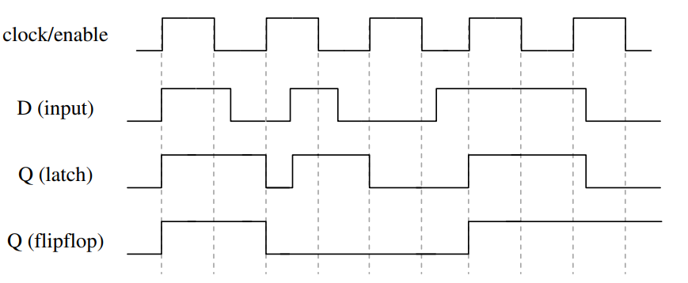
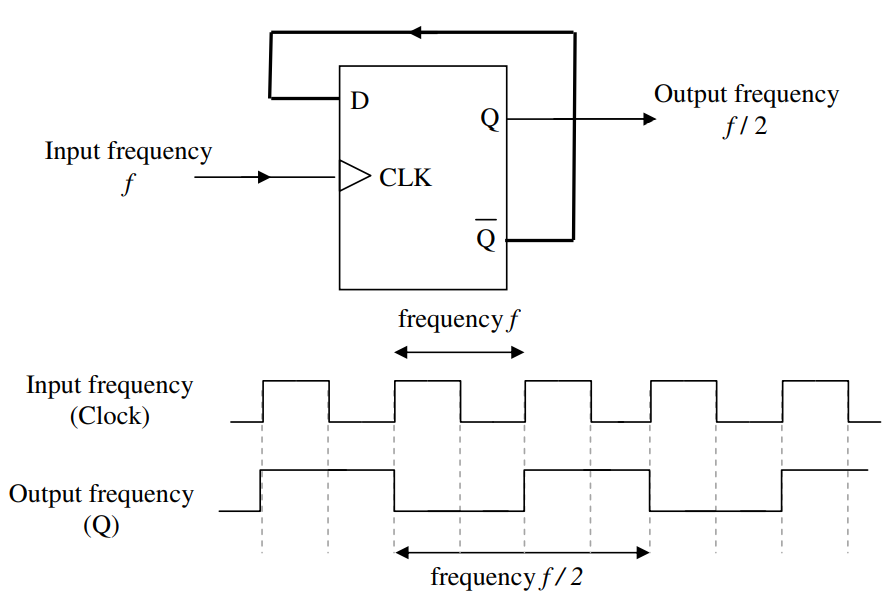
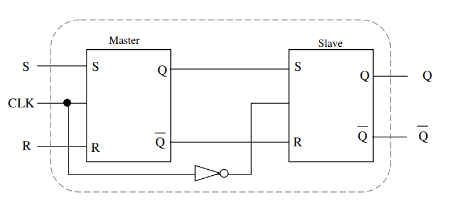

一，触发器
需要使用具有记忆功能的逻辑单元保存运算结果/信息--》触发器
**触发器：能够存储1位二值信号的基本单元电路**
基本特点：具有两个能自行保持的稳定状态【输入端去除后，还可以保持】
根据不同的输入信号可以置成0和1
按照逻辑分类：
| RS  |
|-----|
| JK  |
| T   |
| D   |

用NAND
2，The Asynchronous SR Flipflop
the previous design will react to changes in the input at any instant of time,

1 电路
2 state table
3 symbol
4 requirement table
5 next state
6 state diagram

二，
1，A synchronousSR Flipflop【CLK=1，当CLK=0；输出=输入】

1 电路2 state table3 symbol4 requirement table5 next state6 state diagram

2，D Flipflop【保存值，输入=输出】

1 电路

2 state table

3 symbol
4 requirement table

5 next state
6 state diagram

3,JK

1 电路

2 state table

3 symbol
4 requirement table

5 next state

6 state diagram

4,T

1 电路

2 state table

3 symbol
4 requirement table

5 next state

6 state diagram

三、
flip-flop：如果是正的，0--》1负的，1--》0
latches：在enable=1的时候，随着input变

五，主从JK触发器

When clock is **HIGH**, the inputs to the Master flipflop can affect its outputs. The Slave
device is disabled and, as such, its outputs remain unchanged.

When clock goes **LOW**, the Slave is now enabled and the outputs of the Master flipflop
and, hence, the inputs to the Slave flipflop, now affect the outputs of the latter. The
Master flipflop is now disabled so its outputs are unchanged during this LOW clock
cycle.

