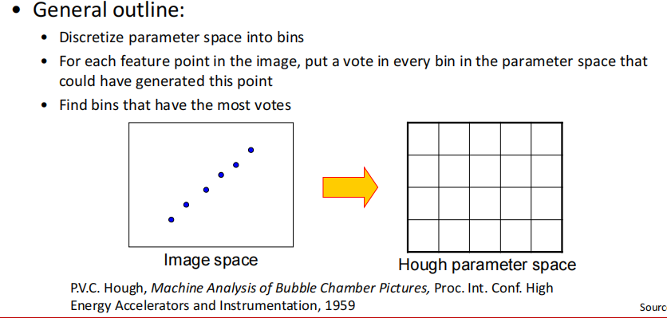

最小二乘，随机采样一致性
## 1、拟合
目标：找出边，找出轮廓

难点：（也是拟合面对的问题
- 噪声
- 外点
- 丢失的数据

总览：

\- 如果我们知道哪些点属于直线，我们如何找到最佳 "直线参数？（所有点都是有效点

**- • Least squares**

\- 如果有离群值怎么办？
| **- Robust fitting, RANSAC** |    |
|------------------------------|-----|
\- 如果有很多条线呢？

**- Voting methods: RANSAC, Hough transform**

\- 如果我们甚至不确定它是一条线怎么办？

\- Model selection

## 2、普通最小二乘法Least squares line fitting
沿着Y方向的距离最短

E函数描述的是点到线的距离，越小越好

以上公式**无法用于垂直，旋转的情况**

• Not rotation-invariant

• Fails completely for vertical lines

## 3、Total least squares全最小二乘
点到线的距离最短，怎么转距离都不会变

==不是很懂==

## ==3、RANSAC（不是很理解）==
随机采样一致性

外点数量很多的时候用

两点确定一条直线

思路
<table>
<colgroup>
<col style="width: 43%" />
<col style="width: 56%" />
</colgroup>
<thead>
<tr class="header">
<th>
- 均匀地随机选择一个小的点的子集

- 对该子集拟合一个模型

-

3. 在剩下的点中找到贴近模型数据的点，其他点视为外点拒绝

- 多次这样做，并选择最佳模型
</th>
<th>
• Choose a small subset of points uniformly at random

• Fit a model to that subset

• Find all remaining points that are “close” to the model and reject the rest as outliers

• Do this many times and choose the best model
</th>
</tr>
</thead>
<tbody>
</tbody>
</table>
以直线为例子

<table>
<colgroup>
<col style="width: 54%" />
<col style="width: 45%" />
</colgroup>
<thead>
<tr class="header">
<th>
重复N次。

- 均匀地随机抽取s个点

- 对这s个点拟合直线

- 在剩余的点中找到对这条直线的离群点（即与直线的距离小于t的点）。

- 如果有d个或更多的离群点，则接受该线，并使用所有离群点重新拟合。
</th>
<th>
Repeat N times:

• Draw s points uniformly at random

• Fit line to these s points

• Find inliers to this line among the remaining points (i.e., points whose distance from the line is less than t)

• If there are d or more inliers, accept the line and refit using allinliers
</th>
</tr>
</thead>
<tbody>
</tbody>
</table>

需要的参数：
- 初始点数量s
  - 通常是适合模型所需的最小数量
- 门限距离t
- 要迭代的次数N
  - 选择N，这样，如果概率为p，至少有一个随机样本没有异常值（例如p=0.99）（离群值比率： e）
- 共识集大小d

## 
## 优缺点
<table>
<colgroup>
<col style="width: 34%" />
<col style="width: 65%" />
</colgroup>
<thead>
<tr class="header">
<th>
- 优点

- 简单而普遍

- 适用于许多不同的问题

- 在实践中往往效果很好
</th>
<th>
- 缺点

- 有很多参数需要调整

- 对于低分母比率的问题，效果不好（迭代次数太多，或者完全失败）

- 不能总是得到一个好的初始化 不能总是在最小样本数的基础上获得良好的模型初始化 基于最小样本数的模型初始化
</th>
</tr>
</thead>
<tbody>
</tbody>
</table>
## 
## 
## 
## 4、Hough function霍夫变化
投票思想Voting schemes

\- 让每个特征为所有与之兼容的模型投票（让直线上的每个点给直线投票，哪个票数最高就输出）

\- 希望噪声特征不会对任何单一模型进行一致投票（希望噪声不要给某一个具体的东西投票）

\- 只要有足够多的特征可以在一个好的模型上达成一致，缺失的数据并不重要。（即使被遮挡了一部分点，也能找出最后结果）

霍夫的思想

把参数空间取值（m,b）进行离散化

让直线上的点对参数投票

找到最多的结果

参数空间到参数空间的变换（霍夫空间）

图像空间中直线到参数空间中，变成一个点

图像空间中一个点是参数空间一条直线

两点的交际处，被投票

存在的问题：

参数空间量化没有边界

垂直的时候怎么办？

怎么办：在极坐标系下完成

算法步骤

初始化累加器H

对图像每个边界点进行遍历

对于Θ∈(0,180)

计算p，进行投票

结束

结束

设置门槛

进行非极大值抑制

霍夫空间

垂直点？

噪声的影响

1、峰值变得模糊，难以定位

噪声点增大，格子里的投票数变少

2、随机点足够多时，会进行投票，产生伪结果

怎么处理噪声问题？
- 选择一个好的网格/离散化
  - 太离散：当太多不同的行对应于一个桶时，获得大量的投票
  - 太密集：错过了线，因为一些点是不完全共线的，为不同的桶投票
- 软投票：给邻居投票，给周围格子投票，中间票数最多，越远票数越少
- 试着去掉不相关的特性
  - 只取具有显著梯度幅度的边缘点

**==霍夫圆变换（具体看吴克吧，笔记待补充==**

圆有几个参数：三个，半径，坐标（X,Y）

构建三维霍夫空间

