局部特征
## 1、全景拍照
常应用：全景拍照（拍很多照片，连起来，形成全景）
怎么拼起来？（要解决的问题

怎么办
1.提取特征
2.匹配特征
3.拼接图片
<table>
<colgroup>
<col style="width: 100%" />
</colgroup>
<thead>
<tr class="header">
<th>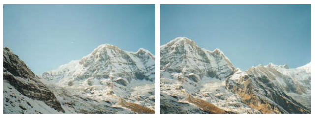</th>
</tr>
</thead>
<tbody>
<tr class="odd">
<td>
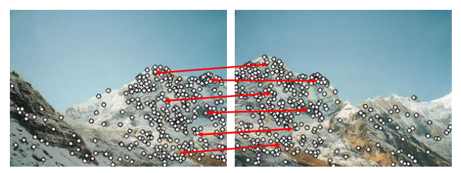

</td>
</tr>
<tr class="even">
<td>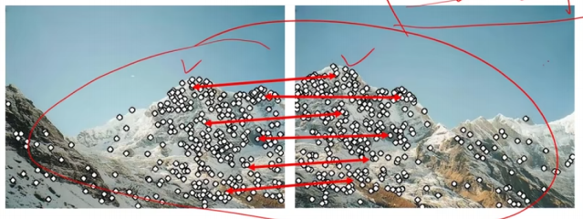</td>
</tr>
<tr class="odd">
<td>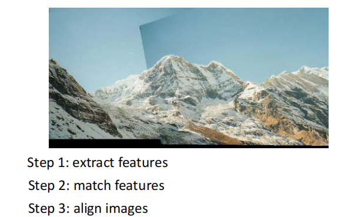</td>
</tr>
</tbody>
</table>

好的特征
- 重复性:两个图形的重复部分要多
- 显著性：特征要有意义
- 计算起来要高效
- 局部性

总结，要干什么
1.找特征，有特定的点
2.找匹配关系
3.拼接图像

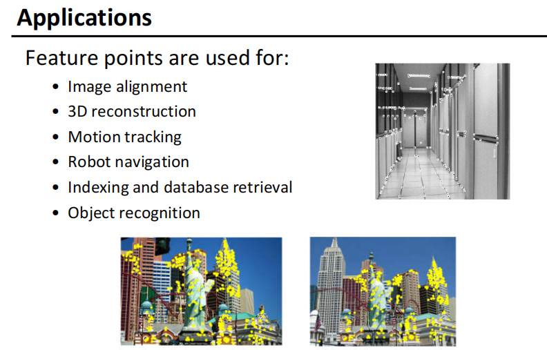

## 2、角点检测
什么是角点：在两个及以上的方向有变化的点
角落是可重复的和独特的

怎么识别角点
我们应该可以很容易地识别要点，向任何方向移动窗口都会有很大的强度变化

看窗体里面的内容变不变
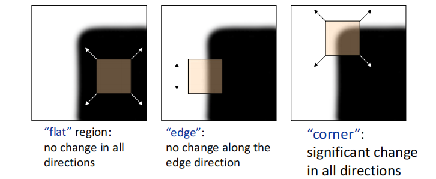

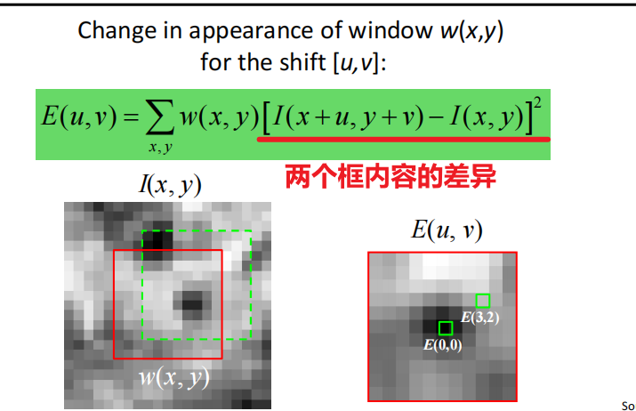

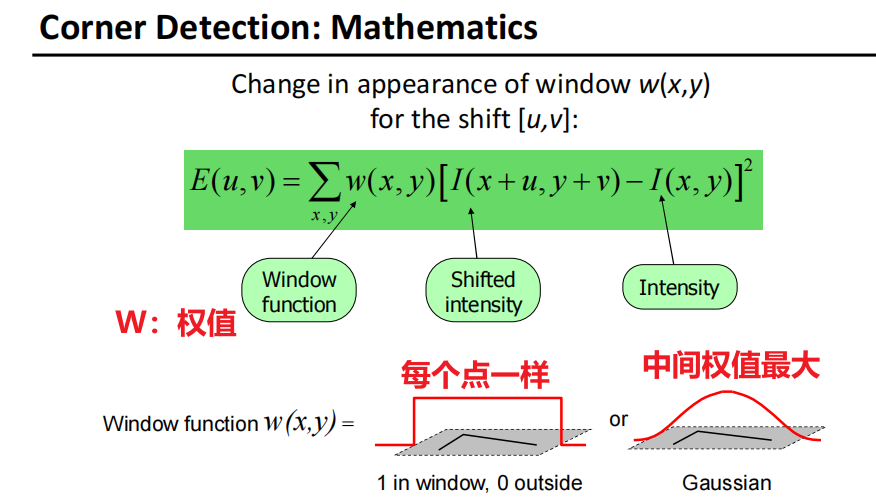

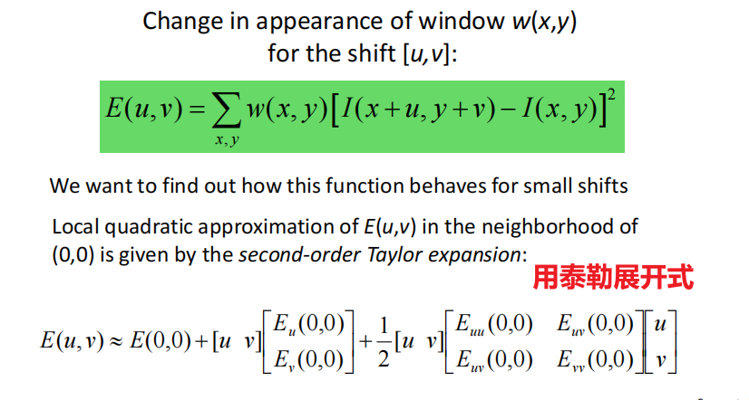
转换，为了找E(u,v)与u,v关联
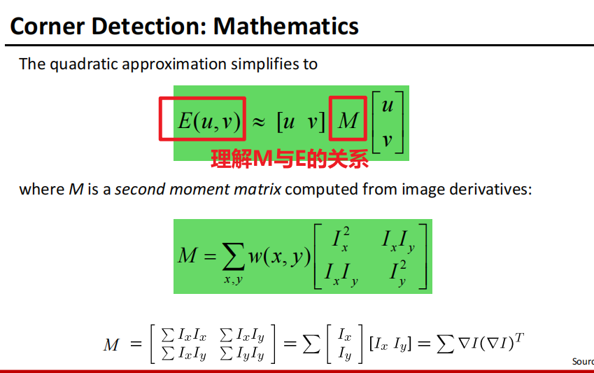

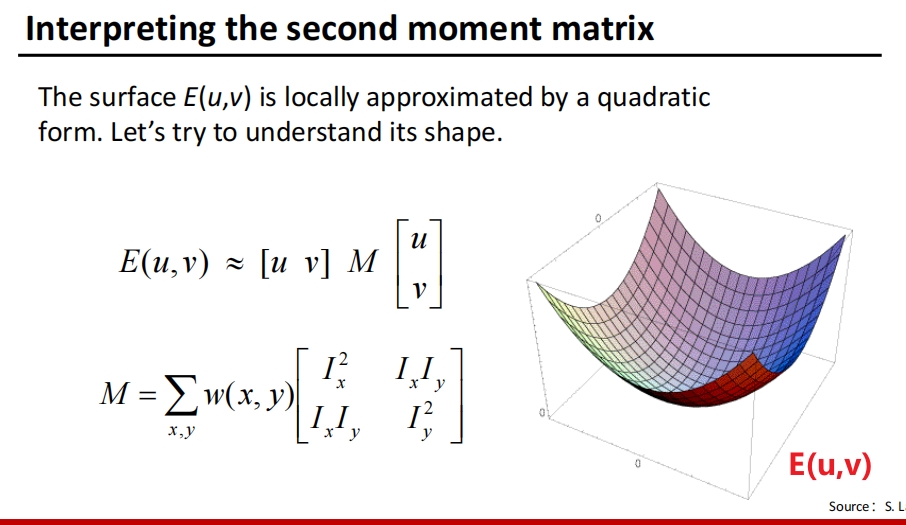

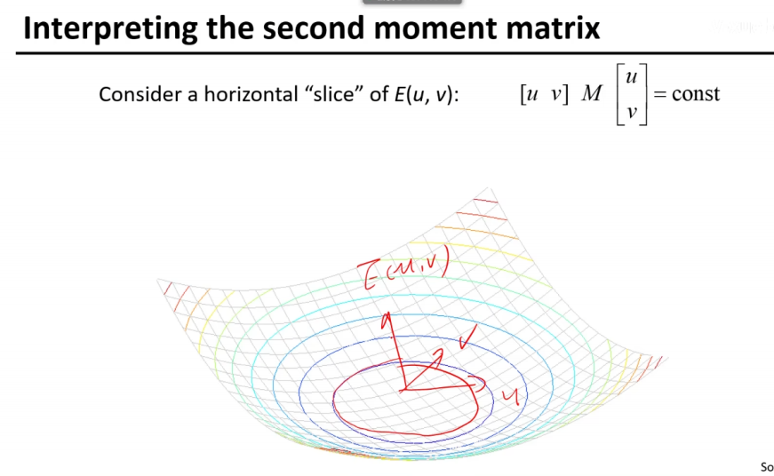
==过程听不太懂不理解==
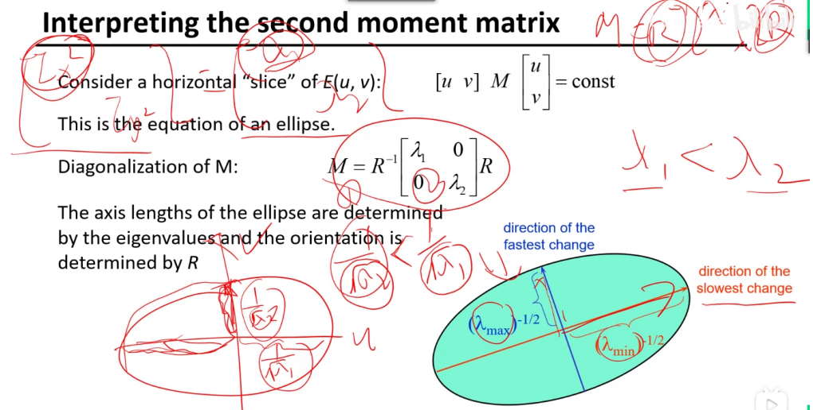

结论
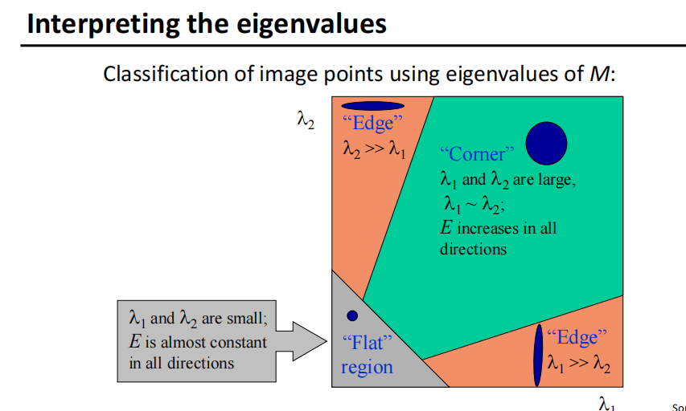
更简洁的
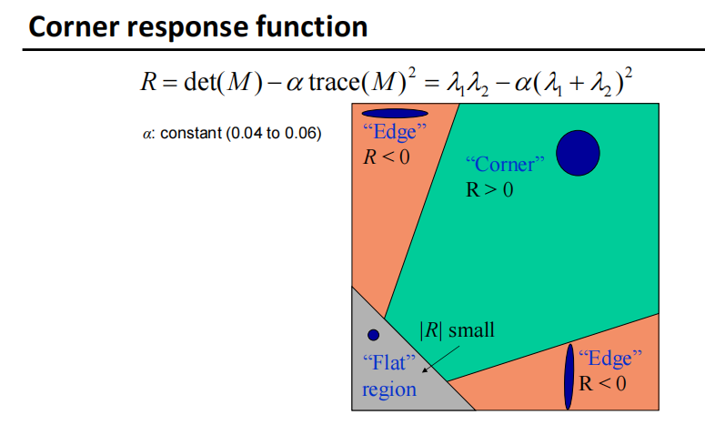
<table>
<colgroup>
<col style="width: 32%" />
<col style="width: 67%" />
</colgroup>
<thead>
<tr class="header">
<th>
1.计算每个像素的高斯偏导

2.计算每一个像素的二阶矩矩阵

3.计算R值

4.门限R

5.非极大值抑制
</th>
<th>
Harris detector: Steps

1. Compute Gaussian derivatives at each pixel

2. Compute second moment matrix M in a Gaussian window around each pixel

3. Compute corner response function R

4. Threshold R

5. Find local maxima of response function

(nonmaximum suppression)
</th>
</tr>
</thead>
<tbody>
</tbody>
</table>

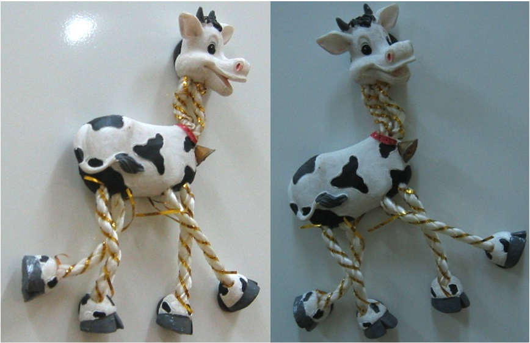

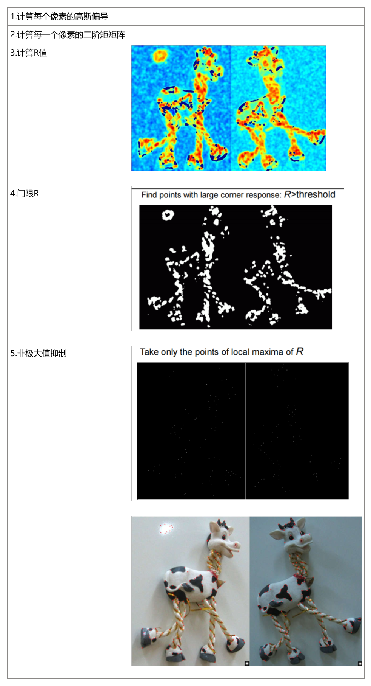

\- 我们希望角落的位置对光度测量的不变性 变化和几何变化的协变性。
\- 不变性：图像被转换后，角的位置不会改变

\- 协变性：如果我们有同一图像的两个转换版本。特征应该在相应的位置被检测到

==Affine intensity change==（后续未看
