不考了尺度，远近，大小，都能检测出来
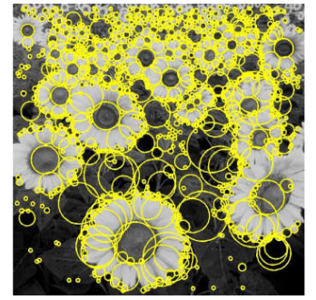
## 1、一维的角度
**目标：在同一图像的缩放版本中独立检测相应的区域**
需要尺度选择机制来寻找与图像变换协变的特征区域大小
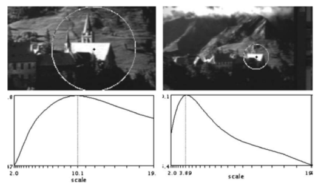

高斯二阶导（拉普拉斯是二阶导）
二阶过零点代表突变
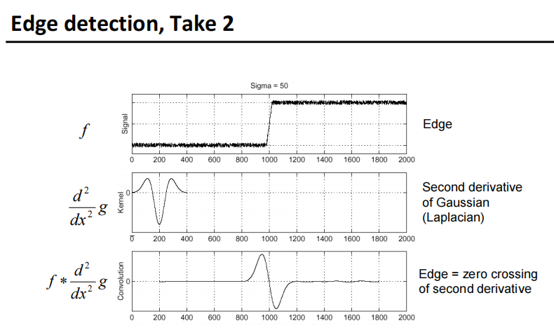

高斯一阶导要制定几个参数：一般指定σ就好，窗宽（经验公式3σ+1）

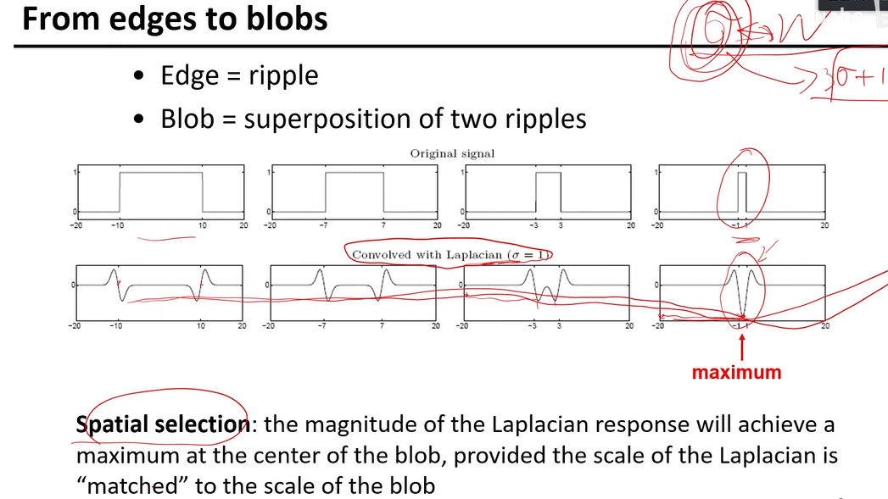
空间选择：如果拉普拉斯响应的尺度与斑点最大源S“匹配”，拉普拉斯响应的大小将在斑点的中心达到最大值。

当信号和二阶导的模板能够匹配上的时候，一定能产生一个最大值
那怎么找模板，一个个上去试试吗（σ=1，2，3，4，5，6？
我们希望通过将其与多个尺度上的拉普拉斯函数进行卷积并寻找最大响应来找到斑点的特征尺度
问题产生：然而，拉普拉斯式的响应随着尺度的增加而衰减：
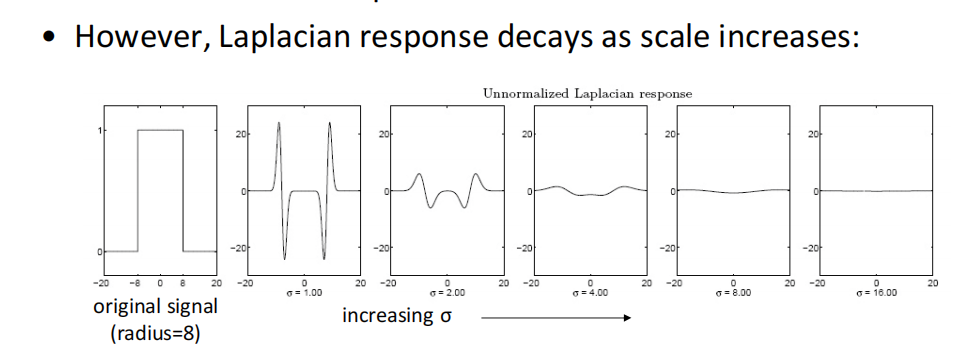

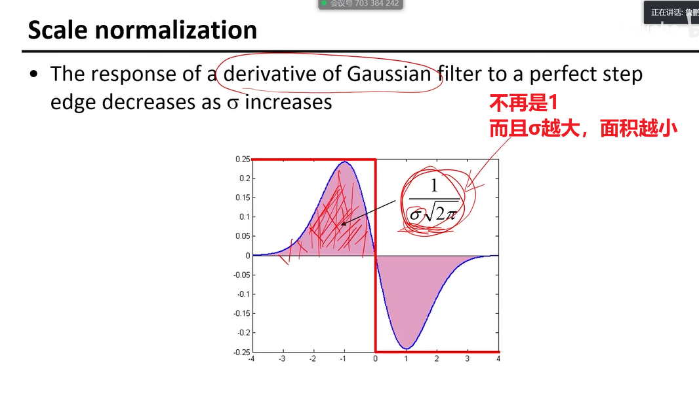

高斯滤波器对完美阶跃边的响应随着σ的增加而减小
为了保持响应相同（尺度不变），必须将高斯导数乘以σ
拉普拉斯算子是二阶高斯导数，所以它必须乘以σ2
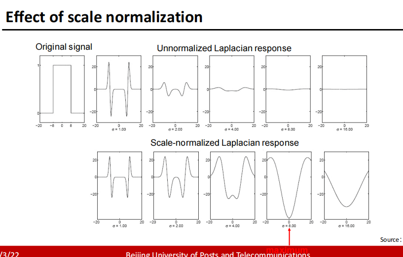

尺度归一化后（用乘以σ2）
用不同σ去卷，找到对于σ
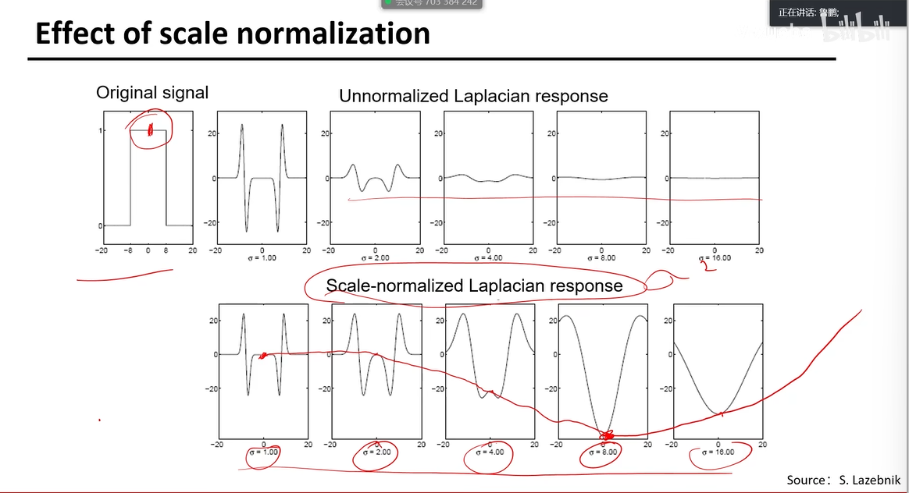

## 2、二维角度

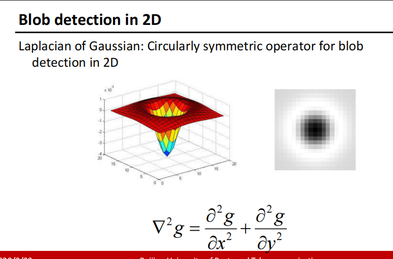
左图，大部分在0下
尺度归一化后
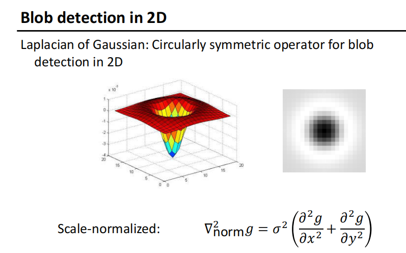
拉普拉斯矩阵在什么尺度上达到了对半径为r的二元圆的最大响应？（尺度σ和圆半径的关系）
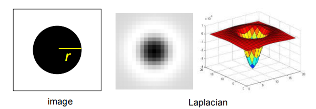

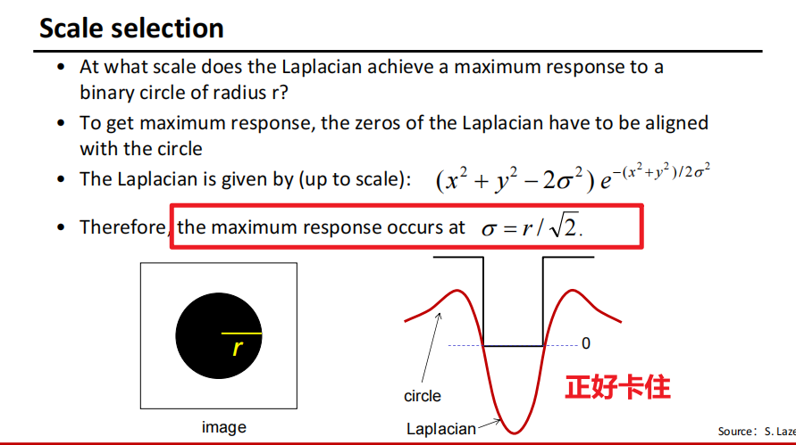

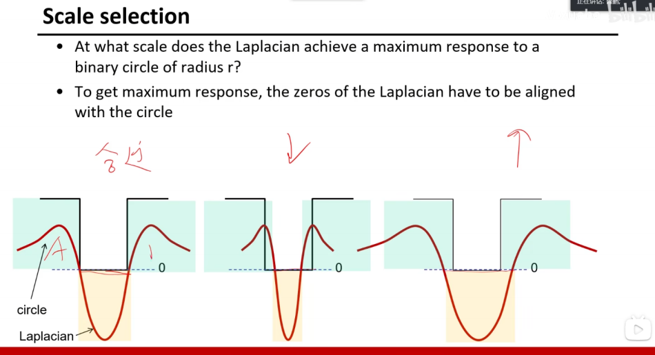

## 3、尺度选择特性
我们将一个斑点的特征尺度定义为在斑点中心产生拉普拉斯反应峰值的尺度
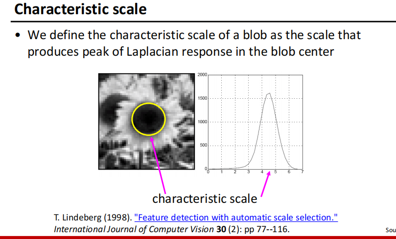

Scale-space blob detector

<table>
<colgroup>
<col style="width: 42%" />
<col style="width: 57%" />
</colgroup>
<thead>
<tr class="header">
<th>
1、在多个尺度上用尺度归一化拉普拉斯矩阵卷积图像

2、求出尺度空间中平方拉普拉斯响应的极大值
</th>
<th>
1、Convolve image with scale-normalized Laplacian at several scales

2、Find maxima of squared Laplacian response in scale-space
</th>
</tr>
</thead>
<tbody>
<tr class="odd">
<td></td>
<td></td>
</tr>
</tbody>
</table>

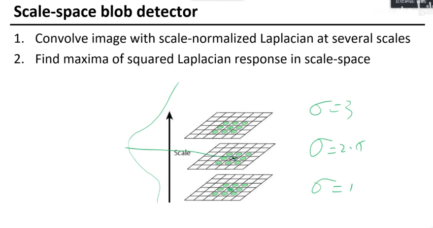
<table>
<colgroup>
<col style="width: 34%" />
<col style="width: 33%" />
<col style="width: 32%" />
</colgroup>
<thead>
<tr class="header">
<th>
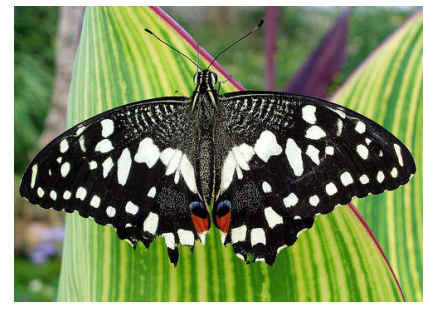

</th>
<th>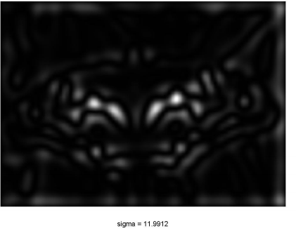</th>
<th>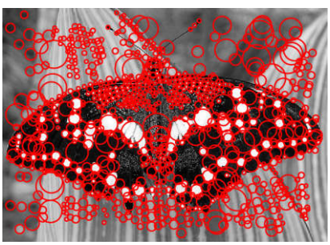</th>
</tr>
</thead>
<tbody>
</tbody>
</table>

改进
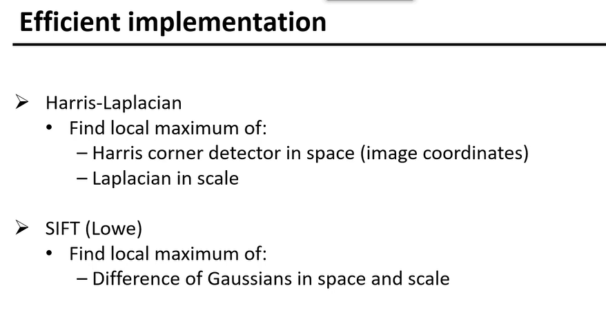
- Harris+拉普拉斯
- SIFT

