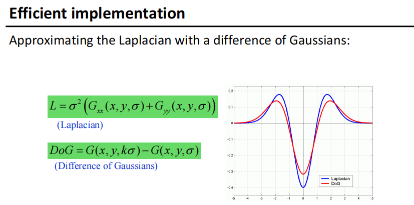

拉普拉斯很好，但是太慢了，所以用高斯核
那sift做了什么来提升速度？
1、构造高斯差分空间
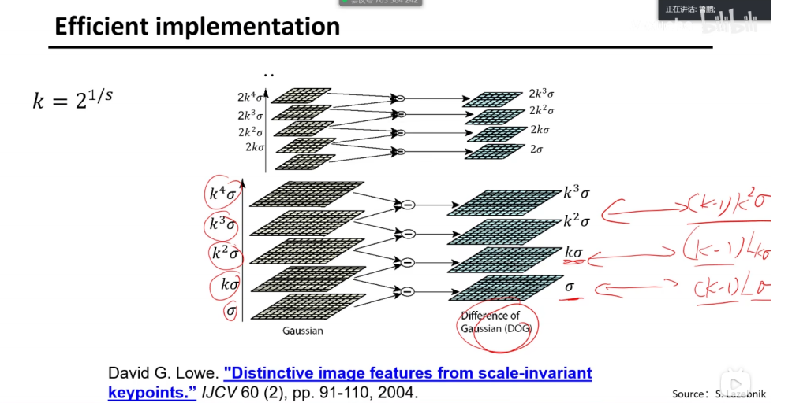

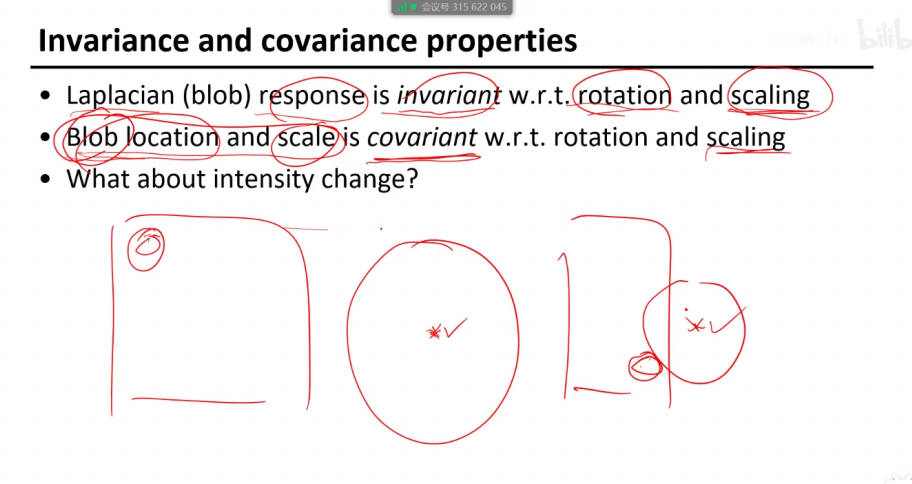

灰度变化会改变吗
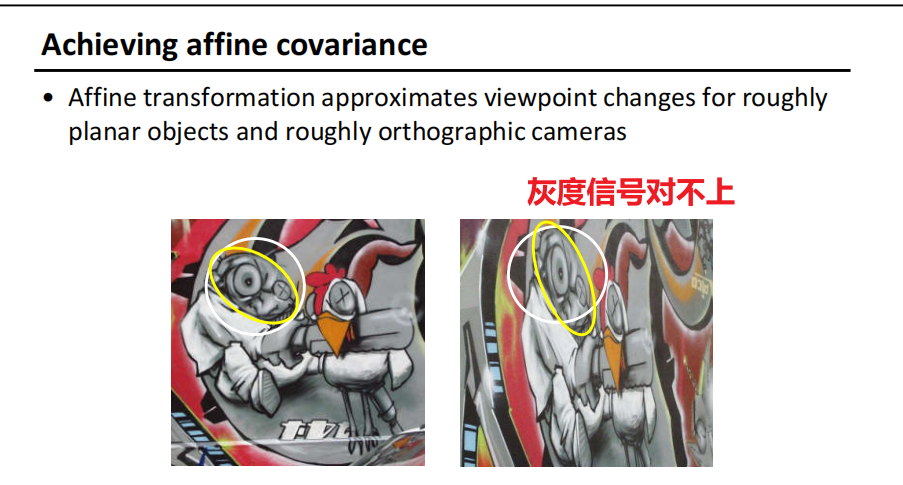

对视角的变换不是不变的
要克服视角带来的问题
希望圆有自适应性

harris里面的公式
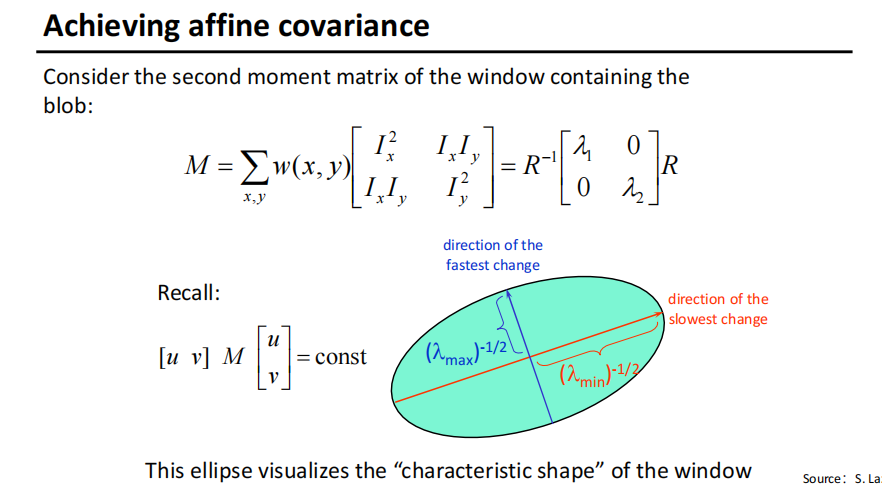

<table>
<colgroup>
<col style="width: 49%" />
<col style="width: 50%" />
</colgroup>
<thead>
<tr class="header">
<th>
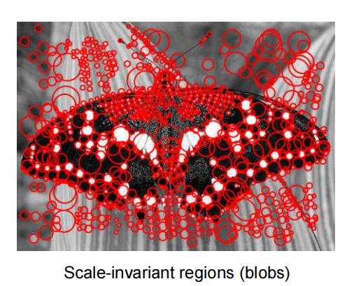

</th>
<th>
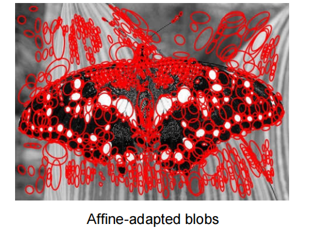

</th>
</tr>
</thead>
<tbody>
</tbody>
</table>

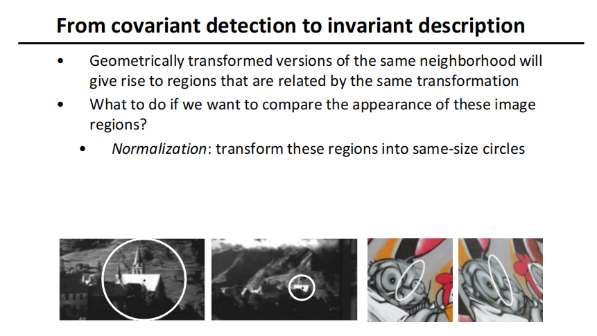

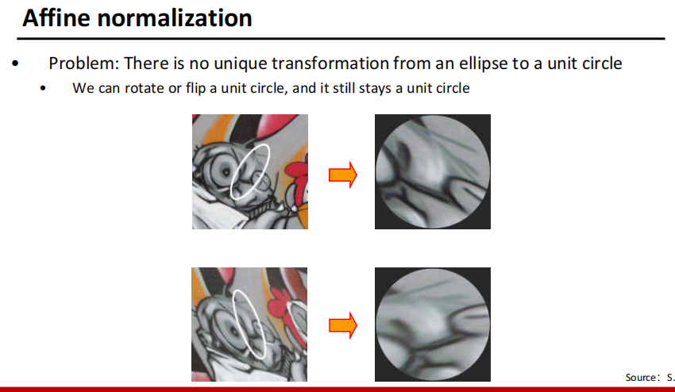

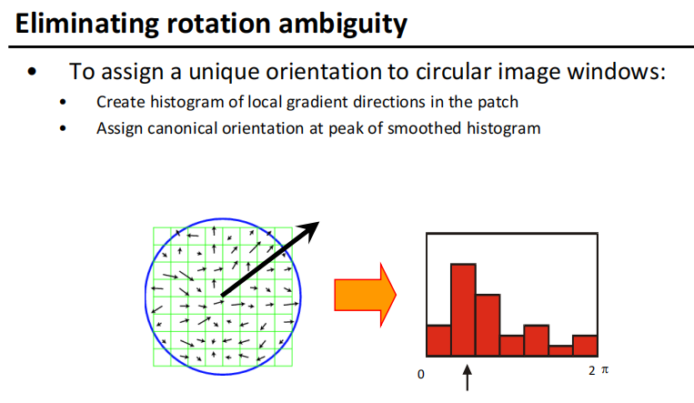

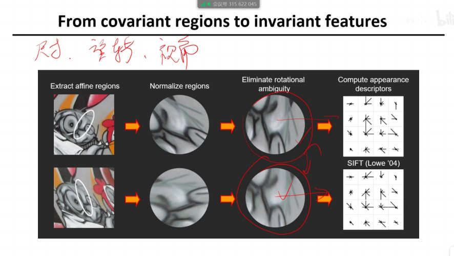

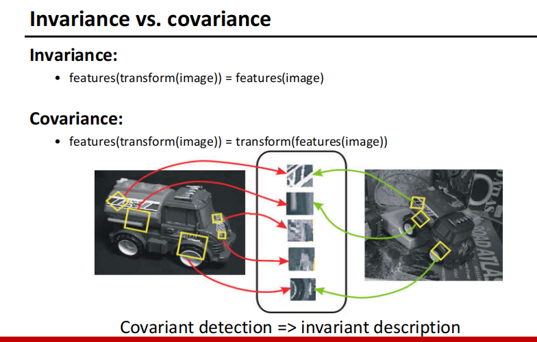

