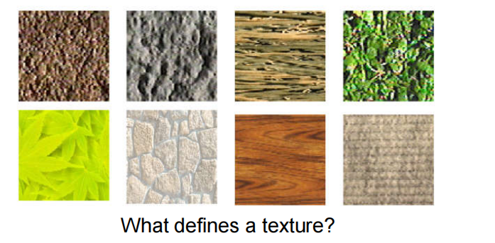
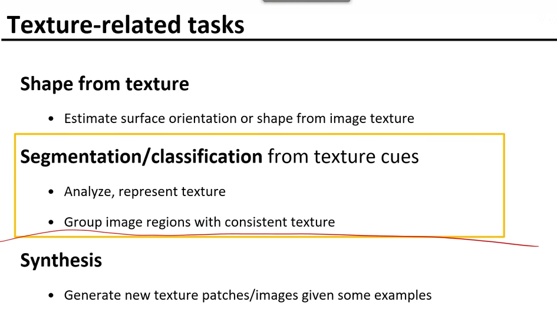
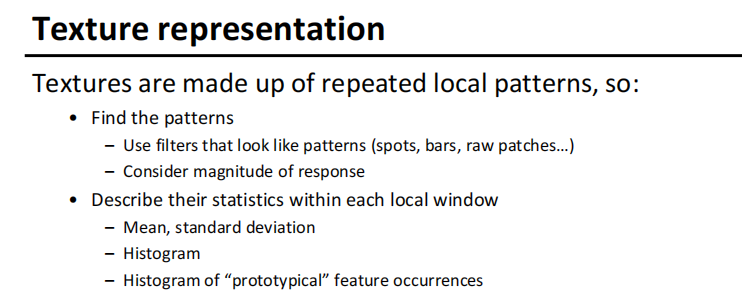

1、纹理

纹理：规则的，不规则的
纹理的作用：
- 从纹理中恢复形状
  - 根据图像纹理估计曲面方向或形状
- 分隔和分类
  - 分析，表示纹理差异
  - 将纹理一致的图像区域分组
- 合成
  - 为新的纹理生成补丁/图像

了解纹理，区别开不同物体

2、纹理分类Segmentation/classification from texture cues

- 重要性:
  - 通常表示一种材料的性质，理解物理特性
  - 可能是重要的外观线索，特别是当物体的形状相似时
  - 力求区分形状、边界和纹理

- 技术上:
  - 希望找到一个特征，优于目前的表达方式（滤波器，边）

纹理有什么特性
重复的局部模型（相似的图案）

任务
1、发现模式
2、描述局部区域

