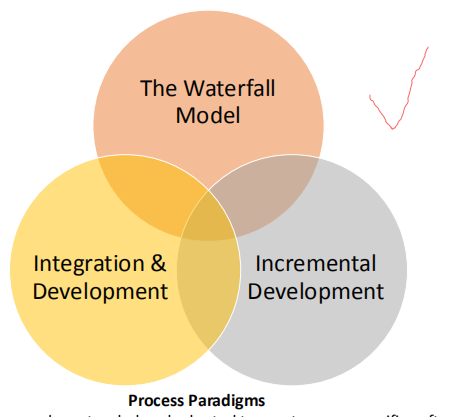
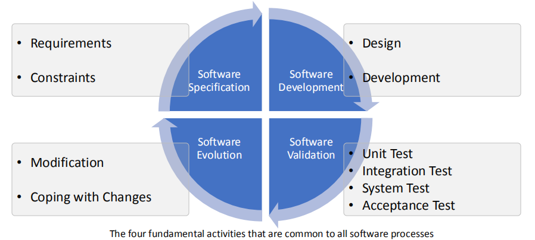
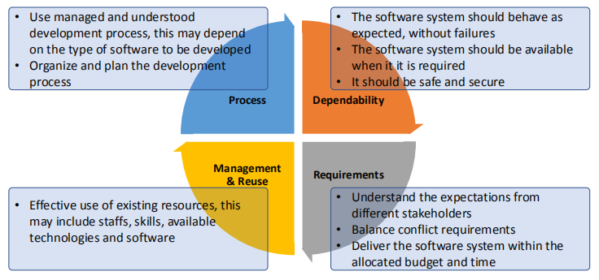
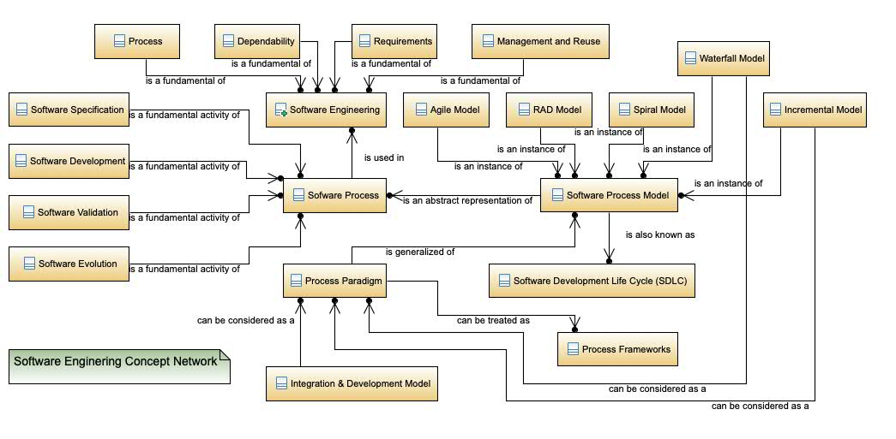

1，什么是软件工程
2，什么是软件过程
3，什么是软件规范
4，软件流程的基本活动
5，软件产品的质量
6，软件的分类
7，软件工程的基础
8，概念图

## 1，什么是软件工程Software Engineering

1.1 软件工程，是一门工科学科，涉及软件生产从最初概念到操作和维护的各个方面。
with all aspects of software production from initial conception to operation and maintenance.

注：
1）软件生产的各个方面
- 软件开发的技术流程
- 软件项目管理、支持软件开发的工具、方法和理论的开发等活动

## 2，什么是软件过程Software Process
2.1 在软件工程中使用的系统方法有时被称为软件过程。软件过程是使产品生产的活动。

2.2 软件过程的简化和抽象表示称为软件过程模型
软件过程模型通常被称为软件开发生命周期(SDLC)模型

<u>根据要开发的软件应用程序的类型，可以使用不同的软件流程模型</u>

## 3，什么是软件规范
这些通用模型是对软件过程的高级抽象描述，可以用来解释软件开发的不同方法。
explain different approaches to software development.

每一个都可以扩展和适应，以创建更具体的软件工程过程。它们也可以被视为过程框架。

## 4，软件流程的基本活动

## 5，软件产品的质量
评估软件，从可接受性，可靠性和安全性，效率， 可维护性四个方面入手。
Acceptability，Dependability & Security，Efficiency，Maintainability

理解四个特点的着重点
<table>
<colgroup>
<col style="width: 32%" />
<col style="width: 67%" />
</colgroup>
<thead>
<tr class="header">
<th>Acceptability</th>
<th><ul>
<li>
软件必须符合其设计的用途类型。
</li>
<li>
它必须可以理解、可用，并与他们使用的其他系统兼容。
</li>
</ul></th>
</tr>
</thead>
<tbody>
<tr class="odd">
<td>Dependability &amp; Security</td>
<td><ul>
<li>
软件必须可靠、安全、安全
</li>
<li>
可靠的软件在发生故障时不应造成物理或经济损害。
</li>
</ul></td>
</tr>
<tr class="even">
<td>Efficiency</td>
<td><ul>
<li>
软件不应浪费系统资源
</li>
<li>
效率包括响应性、处理时间和资源利用率等。
</li>
</ul></td>
</tr>
<tr class="odd">
<td>Maintainability</td>
<td>软件的开发方式应能够不断发展，以满足客户不断变化的需求。</td>
</tr>
</tbody>
</table>

软件质量不仅仅涉及软件的功能，它还包括软件在运行时的行为，以及系统程序和相关文档的结构和组织。

## 6，软件的分类
**Stand-alone applications独立应用程序**
- **在个人计算机、移动设备或大型机上运行的应用程序**
- **例如，Adobe PS、Windows计算器等**

Interactive transaction-based applications基于事务处理的交互式应用程序
- 在远程计算机上运行但用户从自己的计算机访问的应用程序
- For example, Web applications, Taobao Apps, cloud-based services, etc

**Embedded control systems嵌入式控制系统**
- **控制和管理硬件设备的软件**
- **如冰箱温度控制、微量烹饪功能、油泵控制等。refrigerator temperature control, microware cooking functions, oil pump control, etc.**

Batch processing systems批量处理系统
- 以大批量处理数据的应用程序系统
- For example, cell phone billing systems, staff salary payment systems, bank transaction processing systems, etc

**Entertainment systems娱乐系统**
- **这些系统大多是可以在个人电脑或特殊控制台硬件上运行的游戏，例如，Xbox、PS4、任天堂交换机等**

System for modeling and simulation仿真建模
- 为科学家和工程师开发的物理过程建模和模拟、化学反应、蛋白质折叠、可视化等

Data collection and analysis systems数据收集和分析系统
- 从其环境中收集数据并将该数据发送到其他系统进行处理的软件系统
- For example, data warehouse, data lake, big data analytics systems, sensor data processing systems, etc.
Systems of systems系统

## 7，软件工程的基础
- 在大型企业或组织中使用的系统或子系统。
- For example, Enterprise Resource Planning (ERP) system, or systems that are composed from other discrete systems.

这些类型的软件之间有明确的界限。随着世界越来越多的软件控制，其他类型的软件可能会出现，因此新的软件过程也会出现。

## 8 软件工程的重要性
能够经济快速生产可靠可靠的系统。
从长远来看，使用软件工程的方法和技术通常更便宜。
To be able to produce reliable and trustworthy systems economically and quickly.
It is usually cheaper, in the long run, to use software engineering methods and techniques.

## 9.失败的软件工程
不当使用软件工程方法会导致测试、质量保证和长期维护的成本增加。

10,软件工程的基本原则Fundamentals

Process过程
- 使用受管理和理解的开发过程，这可能取决于要开发的软件的类型
- 组织和计划开发过程

Dependability可靠性
- 软件系统应按预期运行，且无故障
- 软件系统在需要时可用
- 它应是安全安全的

## 11，概念图【重点，理清关系】

