Software Testing

## 一、介绍
**1，Program testing**
测试旨在表明程序执行其打算执行的操作，并在投入使用之前发现程序缺陷
在测试软件时，您将使用人工数据执行一个程序
您检查测试运行结果中有关程序非功能属性的错误、异常或信息。
Can reveal the presence of errors NOT their absence
==Testing is part of a more general verification and validation process.==

**2，Program testing 目标**
- 向开发人员和客户证明该软件满足其要求。
  - 对于自定义软件，这意味着对于需求文档中的每个要求都至少要进行一次测试。对于通用软件产品，这意味着应该对所有系统特性进行测试，以及这些特性的组合，它们将包含到产品版本中
- **发现软件的行为不正确、不可取或不符合其规范的情况**
  - 缺陷测试涉及根除不希望的系统行为，如系统崩溃、与其他系统不希望的交互、不正确的计算和数据损坏。
- **验证测试Validation testing**
  - 向开发人员和系统客户证明该软件满足其要求
  - 一个成功的测试表明，该系统可以按预期的方式运行。
- **缺陷测试Defect testing**
  - 发现软件行为不正确或不符合软件规范的故障或缺陷
  - 成功的测试是一种使系统执行不正确从而暴露系统缺陷的测试。

3，一种程序测试的输入输出模型
An input-output model of program testing
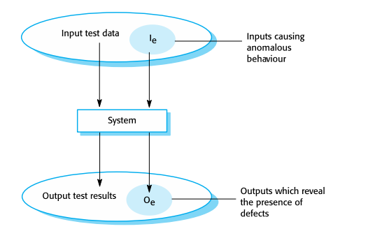

4，Verification vs validation（重要）

\[e-从程序员角度，a-产品经理角度\]
| Verification软件验证 | Are we building the product right” |
|----------------------|------------------------------------|
该软件应符合其规范的要求。

| Validation软件确定 | "Are we building the right product” |
|--------------------|-------------------------------------|
软件应该做用户真正需要的操作

两个V的目的： to establish confidence that the system is ‘==fit for purpose’==
建立对该系统“适合于目的”的信心

static verification：软件检查涉及分析静态系统表示，以发现问题
可以通过基于工具的文档和代码分析进行补充。
dynamic verification：涉及锻炼和观察产品行为的软件测试
该系统使用测试数据来执行，并观察到其操作行为。
<table>
<colgroup>
<col style="width: 100%" />
</colgroup>
<thead>
<tr class="header">
<th>
Verification: 通过实验，或者实物证据对产品或样品与要求规格规范一致性评价的过程;

Validation: 确认批准，依据验证得到的结果其有效性与预先的要求规范规格是否一致，并予以批准释放;

Inspection:检验，检测，通常对尺寸，外观，气味，噪音等要素进行把控。例如 Inspection Specification 检验规格书
</th>
</tr>
</thead>
<tbody>
</tbody>
</table>

5，Inspections and testing(动静态，重要)

2） Inspections and testing是互补的，而不是相反的验证技术。
3）Both should be used during the V & V process.
4）Inspections可以检查是否符合规范，但testing是否符合客户的实际要求。
5）Inspections不能检查非功能性特征，比如performance，usability等

6，A model of the software testing process
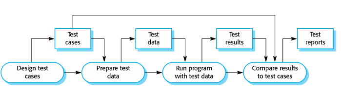

7，Stages of testing
Development testing，在开发过程中测试系统，以发现错误和缺陷。
Release testing，一个单独的测试团队在系统发布给用户之前测试系统的完整版本。
User testing，系统的用户或潜在用户在他们自己的环境中测试系统。

案例
我们需要检查一个最多可以接受10个字符的输入字段。所以它应该接受最多包含10个字符，但不应该接受超过10个字符。
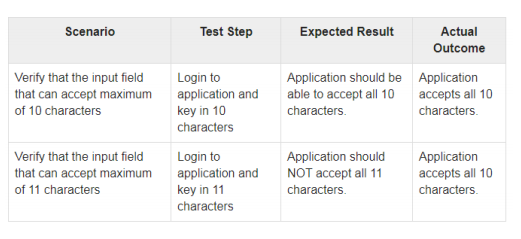
## 
## 
## 二、TESTING AND DEBUGGING测试和调试
0.区别
| Testing                                                        | Debugging                                                          |
|----------------------------------------------------------------|--------------------------------------------------------------------|
| Testing is the process to find bugs and errors.                | Debugging is the process to correct the bugs found during testing. |
| It is the process to identify the failure of implemented code. | It is the process to give the absolution to code failure.          |
| Testing can be done by insider as well as outsider.            | Debugging is done only by insider. Outsider can’t do debugging.    |
| Testing is the display of errors.                              | Debugging is a deductive process.                                  |
<table>
<colgroup>
<col style="width: 100%" />
</colgroup>
<thead>
<tr class="header">
<th>
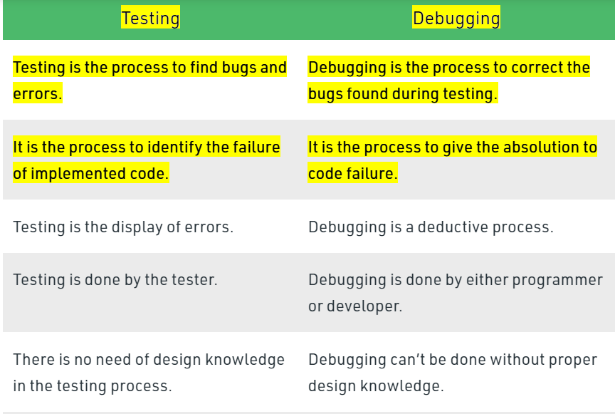

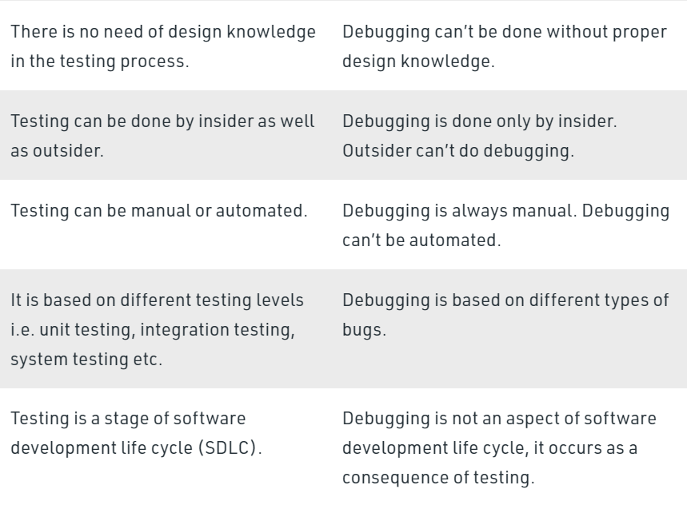

</th>
</tr>
</thead>
<tbody>
</tbody>
</table>

1，debugging
Defect testing and debugging是完全不同的过程
Defect testing and debugging涉及到确认是否存在错误
debugging关心如何定位和修复errors
debugging包括制定一个关于程序行为的假设，然后测试这些假设，以发现系统错误
—Defect testing is concerned with ==confirming the presence of errors==
—Debugging is concerned with locating and repairing these errors
—Debugging involves formulating a hypothesis about program behavior then testing these hypotheses to find the system error

2，Testing
比较输入/输出对与规格
Compare input/output pairs to specification

4，测试前
==确保代码的运行— ensure code runs==
删除语法错误

删除静态语义错误

那些在编译时可以确定的，包括数据类型，是否声明了所有变量，哪个声明适用于范围内的哪个变量，它们的类型是什么，是否用正确的调用序列调用函数和方法，赋值是否与类型兼容
==有一组预期的结果— have a set of expected results==
an input set

对于每个输入，即预期的输出

5，Debugging
研究导致错误的事件
为什么它不起作用呢？
我如何修复我的程序？
其目标是有一个没有错误的程序
要有系统地寻找bug

6，Debugging: Approaches
| Brute Force                      | –破解该代码，直到找到它                            |
|----------------------------------|----------------------------------------------------|
| 原路返回Backtracking             | –对于小程序也可以                                  |
| 估计导致的原因 Cause elimination | 假设是什么导致了错误，并输入测试数据来检查这个问题 |
所有这些方法都可以用调试工具进行补充
(such as debugging compilers, dynamic debugging aids)

7，Debugging: Issues
观察到的错误及其原因可能在地理上是分开的
当另一个问题得到解决时，观察到的错误可能会消失
造成错误的原因可能是由于难以追踪的人为错误
造成错误的原因可能是由于每个人都相信的假设
由于系统或编译器错误，观察到的错误可能是间歇性的

8，有时调试非常困难
- 重新考虑的假设
  - 该操作系统已经改变了吗？硬盘是否满吗？这是一个闰年吗？

- 开始记录您的系统
  - 提供了一个新的角度，并突出了混乱的区域
  - 确保注释和规范描述了这些代码

- 寻求帮助，我们都在发展盲点

- 休息一下，睡一会儿吧！

9,Don’ts and Dos

<table>
<colgroup>
<col style="width: 48%" />
<col style="width: 51%" />
</colgroup>
<thead>
<tr class="header">
<th>不要</th>
<th>要</th>
</tr>
</thead>
<tbody>
<tr class="odd">
<td>
写整个程序

测试整个程序

Debug整个程序
</td>
<td>
写一个方法

测试方法，debug方法

写一个方法

测试方法，debug方法

做integration测试(集合测试)
</td>
</tr>
<tr class="even">
<td>
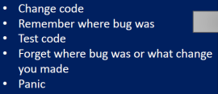

</td>
<td>
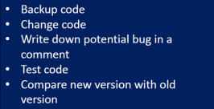

</td>
</tr>
</tbody>
</table>

## 三、QUALITY AND SOFTWARE
1，Quality and Software
存在与软件开发相关的风险
现代程序是复杂的，并且有数千行代码
客户的要求可能很模糊，缺乏准确性
截止日期和预算给开发团队带来了压力

这些因素的结合可能导致缺乏强调软件产品的最终质量
质量不佳可能导致软件故障，导致高维护成本和在最终部署前的长时间延迟
对业务的影响可能是声誉损失、法律索赔、市场份额下降

国际标准ISO91261软件工程-产品质量围绕六个主要属性构建
这些可以用客观和主观指标的混合来衡量(重要)

2，ISO 91261 Attributes
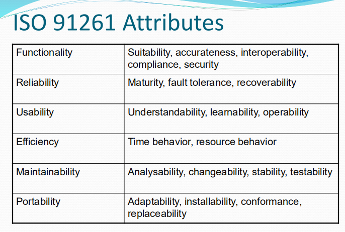

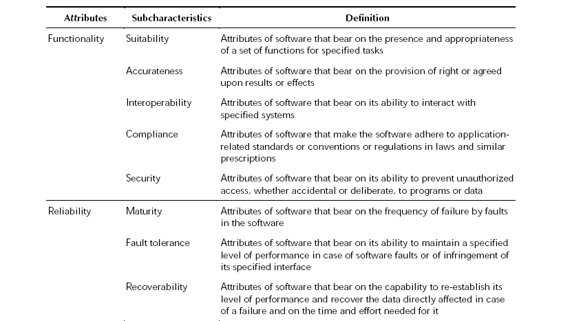

3，Errors, Faults and Failures（重要）
1）定义
error：这些都是软件开发人员所犯的错误。它们存在于头脑中，并可能导致软件中的一个或多个故障。
faults：这些由源代码中的材料组成，可能是一个或多个错误的产物。故障可能会导致在程序执行期间出现故障。
failure：这些是故障症状，包括软件不正确或超出规范的行为。故障可能保持隐藏，直到满足一组条件，显示它们在软件执行中出现故障。
these are symptoms of a fault, and consist of incorrect, or out-of specification behaviour by the software.

2）From Fault to Failure
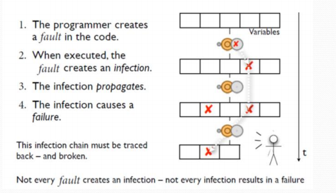

3）Software Faults - Categories
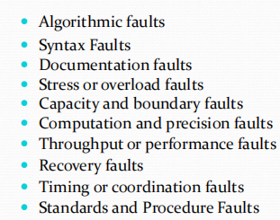

4）Software Faults(看)
Algorithmic faults
算法故障是指当软件的一个单元不产生与指定算法下的给定输入对应的输出时发生的故障
Computation and precision faults
当使用所选公式的计算结果不符合预期的精度或精度时，就会发生计算和精度故障

故障导致系统崩溃，恢复时间很长；或故障导致功能和数据丢失，没有解决办法
故障会导致功能或数据丢失，但有手动解决方法可以临时完成任务

故障会导致部分功能或数据丢失，用户可以通过少量的解决方案完成大部分任务
故障会导致美容和轻微的不便，因为所有用户的任务仍然可以完成

1\. Failure causes a system crash and the recovery time is
extensive; or failure causes a loss of function and data
and there is no workaround
2\. Failure causes a loss of function or data but there is
manual workaround to temporarily accomplish the tasks
3\. Failure causes a partial loss of function or data where user
can accomplish most of the tasks with a small amount of
workaround
4\. Failure causes cosmetic and minor inconveniences where
all the user tasks can still be accomplished

## 四。Testing
1，在开发过程中进行的测试
软件具有三个关键特点
说明用户需求的用户需求

说明软件必须做什么的功能规范

被集成以形成最终系统的许多模块

这些测试必须使用以下四项测试活动进行验证

1）Unit Testing单元测试
1.  测试单个软件单元，以确保其正常工作。这可以是单个组件或复合成分。
2.  组件可以是方法、类或子系统。它可以是一个单一的GUI组件(例如。或者是它们的集合。一个窗口）。
3.  这就利用了该单元的编程接口。

2）Integration Testing集成测试
1.  测试两个或多个单元，以确保它们正确互操作。
2.  这可以使用编程接口或系统接口
3.  Can be Top-Down, Bottom-up, or take an ‘end-to-end user functionality’ approach

3）System Testing系统测试
1.  对整个软件系统进行测试，以确保其正常工作，并满足/解决用户的需求/问题。
2.  使用系统界面可以是GUI、网络界面、web界面等…

4）Acceptance Testing
1.  将测试整个软件系统，以确保其满足用户的需要
2.  再次强调，这使用了系统接口
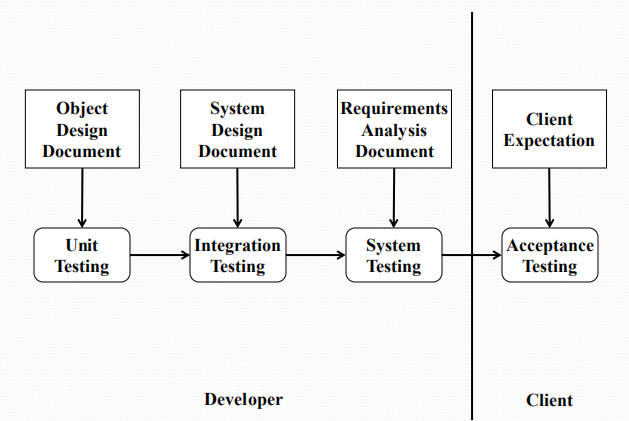

2，Regression testing（看）
1）回归测试是在软件发生更改后确认或拒绝软件功能的一种软件测试形式。
在发现和纠正错误时，进行新的回归测试
请确保不要重新引入以前已修复的错误
Regression testing is a form of software testing that confirms or denies a software’s functionality after the software undergoes changes.

2）Regression Testing practice回归测试
保持严格的定期测试计划
Use Test Management Software
对测试进行分类，以便它们很容易理解
根据需要确定测试的优先顺序，例如。客户的要求
<table>
<colgroup>
<col style="width: 100%" />
</colgroup>
<thead>
<tr class="header">
<th>
Q45: What is Regression testing? Why do we need regression testing? Identify one application scenario where a regression testing is needed. For the identified application scenario, what the negative side-effect of not using regression testing would be?

什么是回归测试?

为什么我们需要回归测试?

确定一个需要进行回归测试的应用程序场景。

对于已确定的应用程序场景，不使用回归测试的负面副作用是什么?
</th>
</tr>
</thead>
<tbody>
<tr class="odd">
<td>
1.Regression testing is <mark>when you modify old code</mark> and retest to make sure that the <mark>change did not introduce new errors or cause errors in other code</mark>.回归测试是指你修改旧代码并重新测试以确保这些更改不会引入新的错误或导致其他代码中的错误

2. Why we need:

1). Avoid <mark>abnormal</mark> test results caused by various operating errors in the regression test.

2). It can improve the test efficiency.

3.For not using regression testing:

The programmers may reintroduce errors that were previously fixed.

It may be hard to follow the testing Schedule.

</td>
</tr>
<tr class="even">
<td>
1,避免在回归测试中应各种操作误差所引起的测试结果异常。

2.可以保持和原始测试一直性。

3.可以提高测试效率。

4.测试经理可以更好的掌握测试存在的问题

1. Avoid abnormal test results caused by various operating errors in the regression test.

2. Consistency with the original test can be maintained.

3. It can improve the test efficiency.

4. The test manager can better understand the problems with the test
</td>
</tr>
</tbody>
</table>

3，Theory of Testing
目标是确定理想的测试，即确保软件适用于所有输入所需的最小测试数据。

4，Exhaustive Testing(看) 穷举调试
这通常是不可行的，因为它需要太长时间或需要太多的内存空间。
一个好的测试应该有发现故障的可能性很高，而不是重复另一个测试，独立于它的测量方法，所以没有故障相互隐藏，并尽可能多地测试代码。

5，Testing Types
<table>
<colgroup>
<col style="width: 11%" />
<col style="width: 88%" />
</colgroup>
<thead>
<tr class="header">
<th>黑箱测试</th>
<th>
生成执行规范exercise the specification的输入值，

并将实际输出与预期输出进行比较
</th>
</tr>
</thead>
<tbody>
<tr class="odd">
<td>白盒测试</td>
<td>生成执行实现exercise the implementation的输入值，并将实际输出与预期输出进行比较</td>
</tr>
</tbody>
</table>

6，Finishing Testing
预算观点：当分配的时间或预算已到期时
活动观点：当软件通过所有计划的测试时
风险管理的观点：当预测的故障率达到某些质量标准时

## 五，Static and Dynamic Verification
(再次，重要)
区别：==静态验证不需要执行软件代码，而动态验证则需要执行。==

1，Static Verification
静态验证（或静态分析）可以像让受过培训和经验的人阅读代码以搜索故障一样简单。
它还可以采用一种包含符号执行程序的数学方法
最后，它可以是一种正式的方法，包括对规范和源代码之间的转换的符号验证。

2，Dynamic Verification
动态验证（或软件测试）通过执行程序来确认程序的运行。
创建的测试用例可指导选择合适的测试数据（包括输入值和预期输出值）。
输入值作为执行期间对程序的输入提供
从程序中收集实际输出，然后将其与预期输出进行比较。
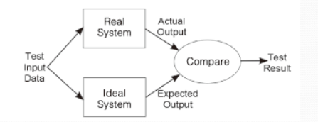
理想系统由规范specification表示，而真实系统是实际代码。
要使测试成功，不需要通过结果。一个失败的测试也将传授一些关于该系统的新知识。

## 六、Black and White Box Testing
1，黑白盒子
黑箱测试完全基于程序规范，旨在验证程序是否满足指定的要求
白盒测试使用该软件的实现来推导出这些测试。这些测试被设计用于执行程序代码的某些方面

2，区别
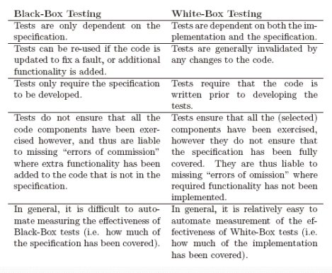
3，Errors of Omission and Commission、？？？？
白框测试未发现与缺失功能相关的故障。这些都是omission的错误。
黑箱测试未发现与额外功能相关的故障。这些都是commission的错误。

4，Coverage Interpretation
黑盒测试提供了规范的覆盖范围，但不是实现的全部覆盖范围。也就是说，实现中可能有代码产生规范中未说明的结果。

白盒测试提供了实现的覆盖范围，但不包括规范。这就是在规范中可能存在在实现中没有代码的行为

5，Black Box testing
黑盒测试的基本原理可以用许多不同的方式来表示

1.  根据规范进行测试。
2.  使用基于本规范的测试覆盖范围标准
3.  开发源自本规范的测试用例。
4.  “Exercise” the specification

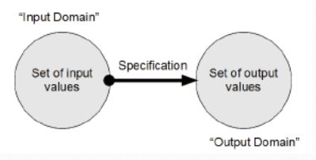

| Equivalence Partitioning | 将输入数据划分为区域，并在每个区域中测试一个值 |
|--------------------------|------------------------------------------------|
| Boundary Value Analysis  | 看看这些边界                                   |
| Combinational Testing    | l查看输入值的组合                              |
| Random Testing           | 选择随机的值                                   |

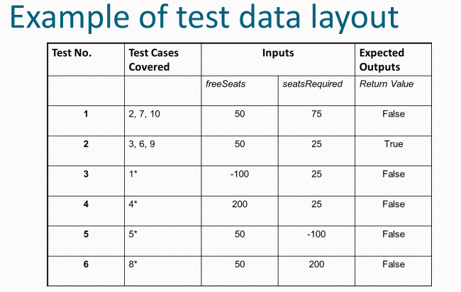

6，White Box Testing

1.  白盒测试的基本原理可以表示：
2.  针对实施测试
3.  使用基于实施情况的测试覆盖范围标准
4.  开发从实现中派生出来的测试用例
5.  “Exercise” implementation
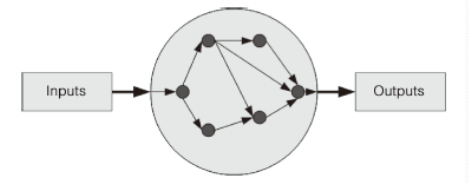

