3-敏捷开发
2021年6月19日
8:36

## 一、软件流程的演变
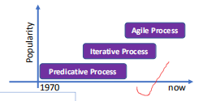

预测性的过程--》 迭代过程--》敏捷开发
迭代过程与敏捷开发，没有明确的边界

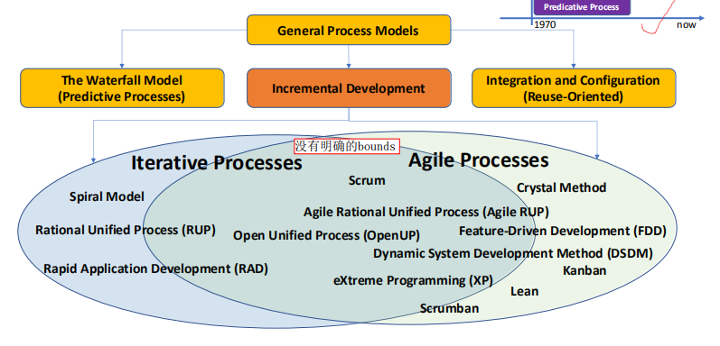

为什么没有明确的边界
敏捷开发和迭代开发都有**采用迭代的方法**进行软件开发
敏捷开发只是一个总体概念，而**迭代式开发**只是几乎所有敏捷开发所采用的一个**主要的基础实践**。
敏捷开发与迭代开发是整体与局部的关系，前者就像大家庭，而后者是大家庭中的一员

## 二、敏捷开发Agile Software Development
1，采用敏捷的方法
Scrum, Scrum/XP Hybrid,。。。
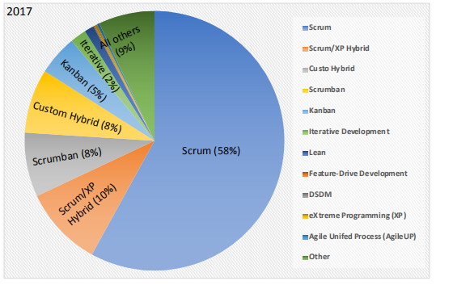

2,敏捷软件开发宣言Manifesto (理)
Manifesto for Agile Software Development
**个体和互动高于流程和工具**

**工作的软件高于详尽的文档**

- ==注重产品本身，而不是形式和流程==，文档应简洁易阅读，方便==维护和同步==

**客户合作高于合同谈判**

- 主==动拥抱变化==，及时响应，持续交付

**响应变化高于遵循计划**

- --制定可实现的**短期清晰的目标**，**中期的粗略**的计划，**长期的大方向**有大概目标即可

3，Principles of Agile Methods
记住五个大点，理解各个部分
<table>
<colgroup>
<col style="width: 43%" />
<col style="width: 56%" />
</colgroup>
<thead>
<tr class="header">
<th><strong>Customer Collaboration客户协作</strong></th>
<th>
用户应与开发团队密切合作。

用户<strong>应提供系统反馈和要求/改进建议</strong>。
</th>
</tr>
</thead>
<tbody>
<tr class="odd">
<td><strong>Embrace Change 拥抱变化</strong></td>
<td>
在开发过程中，可以随时更改需求。

随着需求的快速变化，计划可能会很快变得不准确。
</td>
</tr>
<tr class="even">
<td><strong>Incremental Delivery增量交付</strong></td>
<td>
交付软件比按照计划执行更为重要。

软件应通过增量和迭代方式开发，每个交付都包含更多的功能。
</td>
</tr>
<tr class="odd">
<td><strong>Maintain Simplicity保持简单性</strong></td>
<td>
对于软件和软件过程，一切都保持简单。

专注于向客户提供有价值的软件，而不是编写全面的文档。
</td>
</tr>
<tr class="even">
<td><strong>People, not Process</strong></td>
<td>
关注团队中的人员。其次是工具和实践。

<mark>应该让人们发展自己的工作方式，而不是制定规定的过程。</mark>

开发和探索团队成员的技能和知识，并信任他们。
</td>
</tr>
</tbody>
</table>

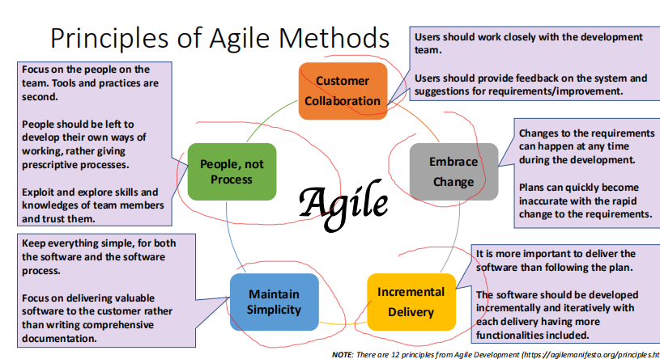

## 三、XP
eXtreme Programming (XP)
1，XP定义：XP是一种软件开发风格，专注于编程技术的优秀应用、清晰的沟通和团队合作……

记住三大核心
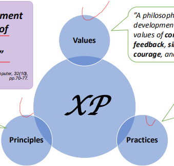

| Values     | 一种基于沟通、反馈、简单性、勇气和尊重等价值观的软件开发理念 |
|------------|--------------------------------------------------------------|
| Practices  | 一组实践被证明可用于改进软件开发                             |
| Principles | 一套互补的原则，将价值转化为实践的知识技术。                 |

2，XP Principles
软件开发越快赚钱，越晚花钱，就更有价值
大量的软件内部文档就是违反互利的实践的一个例子。
项目不会通过接受低质量而更快

<table>
<colgroup>
<col style="width: 100%" />
</colgroup>
<thead>
<tr class="header">
<th>
1.Humanity

<ul>
<li>
平衡个人的需求与团队的需求
</li>
</ul>

2.Economicsn. 经济

<ul>
<li>
时间的经济成本
</li>
<li>
系统和团队的可选价值
</li>
</ul>

3，Mutual Benefit 互惠，互利

<ul>
<li>
每一项活动都应使所有有关人士受益
</li>
<li>
编写自动化测试，帮助设计和实现更好的今天；将测试作为未来程序员的“文档”
</li>
<li>
重构，以提高简单性、清晰度和连贯性
</li>
</ul>

4，Self-Similarity？？

<ul>
<li>
将一个解决方案的结构使用到新的上下文中，即使是在不同的规模下（这是一个很好的起点
</li>
</ul>

5，Improvement改进

<ul>
<li>
立即开始活动，然后随着时间的推移而优化结果。
</li>
</ul>

6，Diversity差异性，多元

程序员应该共同解决这个问题，所有的意见都应该得到重视

7，Reflection反思

<ul>
<li>
回顾和分析他们成功或失败的原因
</li>
</ul>

8，Flow

<ul>
<li>
活动的连续流动，而不是离散相位（小增量、连续集成）
</li>
</ul>

9，Opportunity时机

<ul>
<li>
将问题视为变革的机会（个人成长、加深关系和改进软件）
</li>
</ul>

10，Redundancy冗长

<ul>
<li>
软件开发中的难题应该几种不同的方式解决。
</li>
</ul>

11，Failure

<ul>
<li>
如果您有3种方法来实现用户故事，但您不知道要使用哪一种，请尝试所有这些方法
</li>
</ul>

12，Quality

<ul>
<li>
质量可以通过缺陷、设计质量和开发经验来衡量
</li>
</ul>

13，Baby Step

<ul>
<li>
一次进行一次测试，一次集成和测试价值几个小时的变化
</li>
</ul>

14，Accepted Responsibility

<ul>
<li>
不能分配责任，只能接受
</li>
</ul></th>
</tr>
</thead>
<tbody>
</tbody>
</table>

3，XP 工作流程
(结合语境回答问题，要知道专业词汇的含义，必须)
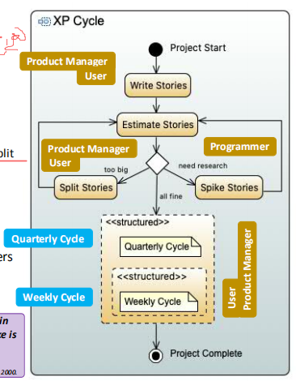

<table>
<colgroup>
<col style="width: 100%" />
</colgroup>
<thead>
<tr class="header">
<th>
1，在项目开发开始时，产品经理和用户编写故事stories（程序员也可能参与其中）。

2，程序员们会估计出这些故事和任务

<ul>
<li>
如果故事太大，产品经理和/或用户将拆分故事；
</li>
<li>
如果程序员不理解该主题，请首先探针initial a Spike.。
</li>
</ul>

3，产品经理和/或用户决定每季度周期的“主题”（大局）

<ul>
<li>
该过程将持续到项目结束。
</li>
</ul>

4，产品经理、用户和/或程序员为每周周期选择合理数量的用户故事，并添加一些片段slacks。

<ul>
<li>
该过程将迭代到季度周期结束
</li>
</ul></th>
</tr>
</thead>
<tbody>
</tbody>
</table>

必须知道含义
<table>
<colgroup>
<col style="width: 15%" />
<col style="width: 84%" />
</colgroup>
<thead>
<tr class="header">
<th>Stories</th>
<th>用户需求吧？</th>
</tr>
</thead>
<tbody>
<tr class="odd">
<td>Spike.</td>
<td>
收集信息和寻找一个问题的答案，而不是交付具体产品。通俗的来说就是研发人员正式开始启动一个大的技术方案前。提前“摸一下”，摸的好不好直接决定了后面的工作是否能很好的开展

SPIKE:对不确定的需求和设计等，通过写一些程序、进行详细设计或者演算等等方式做探测和尝试，以确定可行性。这些探测过程称为SPIKE

Spike: To test and determine the feasibility of uncertain requirements and designs. Such as writing some programs or calculations to test if the program is suitable to implement. These probing processes are called spikes

(自己扯淡的)

如果没有spike，我们可能会花费时间，金钱和精力在一些没有必要的需求上，或者是我们无法完成的需求上，可能导致我们后续无法完成任务。对于开发过程而言，这是不好的现象，

Without Spike, we may spend time, money and energy on some unnecessary demands, or demands that we cannot complete, which may cause us to fail to complete the task in the future.

This is bad for the development process,

</td>
</tr>
<tr class="even">
<td>Slack</td>
<td>
可以被放弃的小任务

In any plan, include some <mark>minor tasks that can be dropped (Slacks)</mark> if you get behind.
</td>
</tr>
</tbody>
</table>

4-术语-User Story
1）用户故事是指系统用户可能会体验到的一种使用场景。
敏捷方法通常没有单独的需求工程活动，而是将其与开发相集成。

用户故事通常被写在用户故事索引卡上。

它可以满足了用户的需求

它可用于规划系统的迭代。

使用和/或产品经理确定实施故事的优先级。

2）模板
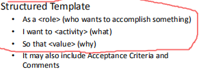

5，XP – Planning the Release
在每个周期中，我们应选择多少个用户故事？
- 取决于用户/产品经理期望一个周期的故事点。这个过程通常被称为宣布速度Declare the Velocity 。

是谁来决定这个速度的？
- 通常是Tracker跟踪迭代、验收测试、代码质量、客户管理等

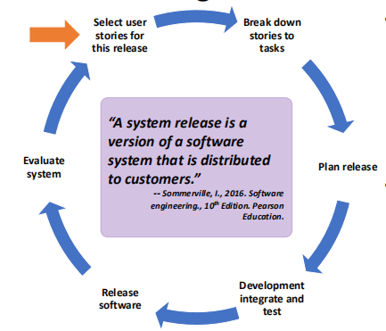

6，XP Programmer Workflow
注意做事情的人（不是重点）
1，临时会议（每天早上，10分钟)
- 识别问题，选择您要执行的任务
2，与同事合作，并进行快速设计
- 所有的生产代码都是由一对一个编程，
- 另一个思考；定期切换角色

3，测试
- 一次编写小的单元测试代码
- 测试所有可能被打破的东西

4，代码
- 只需编写足够的代码来通过单元测试
- 使用团队的编码标准，
- 如果有问题，请询问用户的反馈

5，重构
- 代码应通过所有单元测试，无重复逻辑，确保良好的编码实践
6，Q & A (Question and Answer)
- 软件系统的用户应在现场回答问题
- 用户和产品经理应该能够做出决策

7，整合
- 将代码提交到集成机器，构建系统并运行（通过）所有测试
8，Discard
- 如果事情无效，请丢弃它们
9，返回到“配对和快速设计课程”(第二步)
- 如果你今天还有足够的时间，你可以完成其他任务
10，Finishes today

## 三、Scrum
1,定义(重点)
Scurm是一个框架，人们可以解决==复杂的适应问题，同时高效和创造性地提供具有最高价值的产品。==
A framework within which people can address complex adaptive problems, while productively
and creatively delivering products of the highest possible value.

记住一下三个重点，理解
<table>
<colgroup>
<col style="width: 26%" />
<col style="width: 73%" />
</colgroup>
<thead>
<tr class="header">
<th>Transparency透明</th>
<th>
所有团队成员都必须看到流程

使用通用的语言，并共享一个通用的定义。
</th>
</tr>
</thead>
<tbody>
<tr class="odd">
<td>Inspection检查</td>
<td>Scrum项目和进度必须经常被检查，而不干扰团队的工作。</td>
</tr>
<tr class="even">
<td>Adaptation适应</td>
<td>
如果过程或开发偏离计划，必须及时进行调整。

使用迭代和增量的方法来控制风险

根据已知的情况来做出决定。
</td>
</tr>
</tbody>
</table>

2，Scrum框架的组件
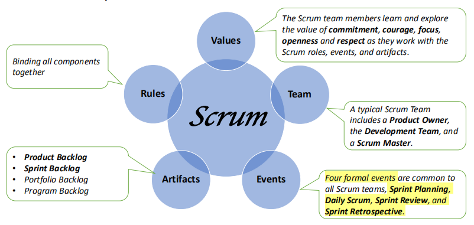

<table>
<colgroup>
<col style="width: 13%" />
<col style="width: 86%" />
</colgroup>
<thead>
<tr class="header">
<th>values</th>
<th>Scrum团队成员在使用Scrum角色、事件和工件时，可以学习和探索承诺、勇气、专注、开放和尊重的价值。</th>
</tr>
</thead>
<tbody>
<tr class="odd">
<td>Team</td>
<td>一个典型的Scrum团队包括一个产品所有者、开发团队和一个Scrum管理者。</td>
</tr>
<tr class="even">
<td>Events</td>
<td>
所有的Scrum团队都有四个正式的活动：Sprint规划、每日Scrum、Sprint回顾和Sprint回顾。

Sprint Planning, Daily Scrum, Sprint Review, and Sprint Retrospective.

</td>
</tr>
<tr class="odd">
<td>Artifacts</td>
<td>
• Product Backlog

• Sprint Backlog

• Portfolio Backlog

• Program Backlog
</td>
</tr>
<tr class="even">
<td>Rules</td>
<td>将所有组件绑定在一起</td>
</tr>
</tbody>
</table>

3，工作流程(重点)
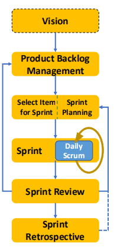
<table>
<colgroup>
<col style="width: 100%" />
</colgroup>
<thead>
<tr class="header">
<th>
谁：用户、产品所有者、可能的团队成员和相关利益相关者

解决：

<ul>
<li>
这个软件系统解决了什么问题
</li>
<li>
它提供了什么好处？
</li>
<li>
它是提供给谁的？
</li>
<li>
高级系统的功能是什么？
</li>
<li>
它将支持和遵守什么平台、法规、标准和约束条件？
</li>
<li>
以及其他高级别的业务目标。
</li>
</ul>

结果：<mark>功能、功能、需求；需要头脑风暴，并可能封装在一系列的用户故事中</mark>
</th>
</tr>
</thead>
<tbody>
<tr class="odd">
<td>
谁：产品所有者管理产品Product Backlog，开发团队负责所有估算，但所有变更必须由产品所有者进行

解决：Product Backlog有什么

<ul>
<li>
<strong>所有功能、功能、增强功能和修复程序</strong>
</li>
<li>
<strong>在回顾、回顾或回顾后收到用户的建议</strong>
</li>
</ul>

结果：Product Backlog，即对产品进行任何更改的单一需求来源。
</td>
</tr>
<tr class="even">
<td>
谁：整个Scrum团队共同为有价值的迭代工作创建一个计划，产品所有者给出了此迭代的目标。开发团队从产品积压日志中选择项目（没有人告诉团队该做什么）

解决：

<ul>
<li>
在工作的迭代后可以交付什么？
</li>
<li>
该迭代需要什么？
</li>
<li>
Sprint计划的时间限制为最长8小时，较短迭代更短
</li>
</ul>

结果：由选定的项目和计划组成。
</td>
</tr>
<tr class="odd">
<td>
元素：Sprint包含

Sprint Planning, Daily Scrums, the development

activity, Sprint Review, and the Sprint Retrospective.

规则：

<ul>
<li>
作为一个自我组织的团队，一起工作
</li>
<li>
Sprint goal不能改变
</li>
<li>
目标的质量不受影响
</li>
<li>
一个Sprint不能被缩短
</li>
<li>
一个Sprint的时间不能大于一个月
</li>
<li>
只有产品所有者才能取消Sprint。
</li>
</ul>

结果：Sprint目标实现，一个可能的可移动的增量。
</td>
</tr>
<tr class="even">
<td>
每日Scrum是为开发团队举办的15分钟的讨论活动。”

谁：开发团队成员需要在同一地点参加会议

Scrum Master来组织会议

解决：

Discussion:

<ul>
<li>
昨天我做了些什么，帮助团队实现了目标？
</li>
<li>
我今天做什么
</li>
<li>
我看到有什么障碍吗？
</li>
</ul>

Purpose：

<ul>
<li>
检查实现目标的进展情况
</li>
<li>
做好第二天的准备工作
</li>
</ul>

结果：第二天的非正式计划。

会议时间：最长15分钟
</td>
</tr>
<tr class="odd">
<td>
谁：Scrum团队和相关利益相关者审查所做的事情。

Scrum master组织了这次会议

产品所有者解释已完成的操作和未完成的操作

元素

<ul>
<li>
审查时间表、预算和潜在的能力
</li>
<li>
回顾一下下一步最有价值的事情是什么
</li>
<li>
讨论产品 Product Backlog的状态
</li>
<li>
演示已完成的工作并回答问题
</li>
</ul>

结果：a revised Product Backlog.

何时；在sprint的最后

会议时间：一个月的冲刺最多4小时
</td>
</tr>
<tr class="even">
<td>
谁：

Scrum master组织了这次会议，鼓励团队进行改进

Scrum团队成员计划了提高产品质量的方法

purpose

<ul>
<li>
检查上一次Sprint对人员、关系、流程和工具的进展情况
</li>
<li>
确定潜在的改进情况
</li>
<li>
创建一个用来实施改进的计划
</li>
</ul>

结果：改进计划

何时；Sprint Review之后

会议时间：

Maximum 3 hours for a one-month Sprint
</td>
</tr>
</tbody>
</table>

重点
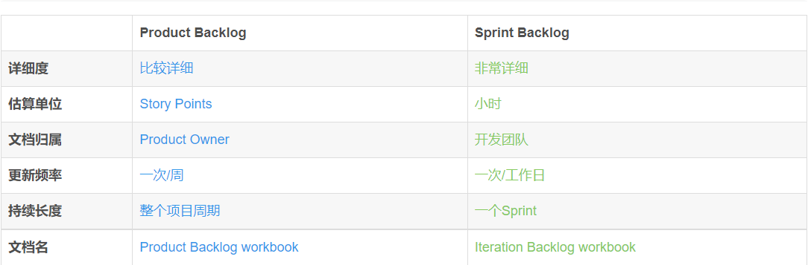

1，Product Backlog
Product Backlog是动态的，它不断变化以确定产品需要合适、具有竞争力和有用。
- 每个产品积压项目都应包括描述、订单（优先级）、估计值和值的属性
- 每个项目应包括评估是否“完成”的验收标准。
- 产品积压日志中的项目可以按其属性分组。
- 更高订单的项目通常有更清晰和更详细的描述，因为他们被更详细地理解。

2，Sprint Backlog
Sprint Backlog是Product Backlog的一个集合，从Product Backlog中选择items，再加上交付产品增量和实现冲刺目标的计划
- 选择Sprint Backlog中的items来到达Sprint的目标
- A sprint Backlog至少包括一个高优先级的人物改进（在回顾会议中，从以往Sprint中选择出的）
- Sprint Backlog中的计划应该有足够的细节来指导每日Scrum
- Sprint Backlog 中的项目可以进行更改，但只能由开发团队进行更改
- Sprint Backlog可以用来监视Sprint 进度
3，Sprint
Sprint指Scrum团队==完成一定数量工作所需的短暂、固定的周期==。Sprint是Scrum和敏捷的核心，找到正确的Sprint周期将帮助您的敏捷团队交付更高质量的产品
- 在整个项目中，Sprint有一致的持续时间
- 新的Sprint在上次Sprint回顾后立即开始
- 短时间将风险限制在小成本内。
- A Sprint may be cancelled when:
  - Sprint目标已过时
  - 在意外情况下，例如，重要团队成员离开
  - 有更重要的任务(优先级更高)需要做，由管理层请求

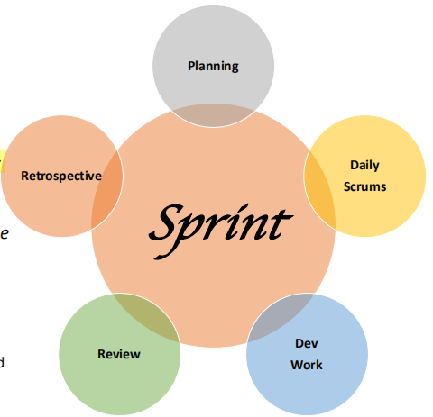

4，分析(提到)，要看懂图，（没懂）
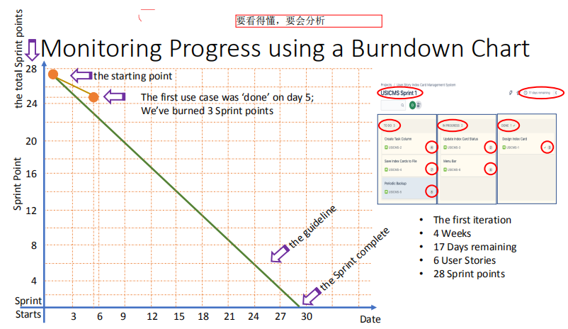

## 五、DevOps
1， DevOps 指的==是开发和操作的结合。==

2，软件开发的主要驱动因素包括：
- 要有更少的需求更改
- 为了大力注重测试和质量保证，
- 以实现一个更快的交货周期。
3，DevOps 尽可能地依赖于自动化工具。
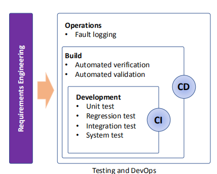

## 六、使用敏捷方法的实际问题
敏捷方法可能==不适用于嵌入式系统工程或大型和复杂系统的开发==
- 敏捷的非正式性与大型企业常用的法律方法不相容（合同问题）
- 敏捷通常用于新的软件系统开发，而不是软件维护
- 敏捷的方法是为小型的联合团队设计的。对于具有多个地理分布团队的大型项目，管理和协调的复杂性显著增加，因此敏捷方法的有效性值得质疑

