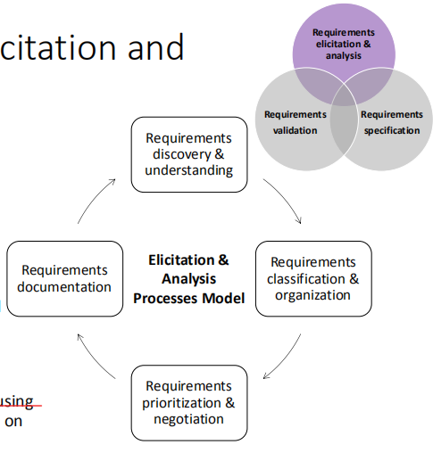
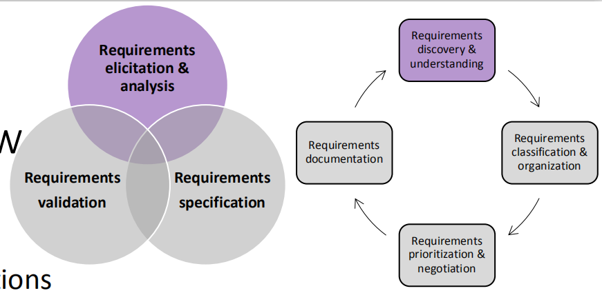

目标：
了解需求工程设计的重要性
熟悉需求工程的概念和流程
能够将主要需求的工程技术应用于简单的软件系统项目

## 一、基础
1，定义
发现、分析、记录和检查软件系统的服务和约束的过程称为需求工程(RE)。requirements engineering

标识系统、产品或过程特性或约束的声明，其明确、清晰、独特、一致、独立（非分组）且可验证，并且被认为是利益相关者可接受性的必要条件。

导致理解需求的广泛的任务和技术被称为需求工程。它为设计和施工奠定了坚实的基础

2，需求工程的重要性
- 项目成功因素

- 项目挑战因素

- 项目受影响的因素

3，需求工程流程

1）需求工程是一个迭代的过程
- 活动是交错的
- 为项目利益相关方提供需求文件

2）三个关键活动
**Elicitation and analysis许可和分析：**与利益相关者互动，发现用户和系统需求。
**Specification规范：**将要求转换为标准形式
**Validation验证：**评估项目的可行性；根据需要评估建筑原型；审查要求

4，术语--Stakeholder（学会判断）

可能影响、受到项目决策、活动或结果的影响，或认为自己受到项目决定、活动或结果影响的**个人、团体或组织**。”

**利益相关者是指与系统成功相关的人**：客户、最终用户、开发人员、项目经理、维护者，甚至是那些销售系统的人。”

确定潜在的利益相关者
案例
<table>
<colgroup>
<col style="width: 100%" />
</colgroup>
<thead>
<tr class="header">
<th><em><strong>Project Scenario:</strong></em></th>
</tr>
</thead>
<tbody>
<tr class="odd">
<td>
苏格兰中部地区卫生当局希望获得一个信息系统，以帮助管理对精神健康问题患者的护理。该系统的总体目标有两方面：

1.提供有关该地区心理保健的更好的管理信息。

2.为参与诊断和治疗的临床工作人员提供一个完善的记录系统
</td>
</tr>
</tbody>
</table>
苏格兰中部地区卫生当局

案例
阿尔巴特尔有限公司是一家初创的中小企业，提供人力资源咨询公司，专门从事工资、招聘和教练服务。该公司目前以传统的面对面的方式为客户提供服务。该公司唯一拥有的IT基础设施是该公司的网站。该网站的建设和管理被外包出去。该公司的网站基于WordPress平台，由一家第三方托管公司托管。配置托管环境以适应其他自定义的web应用程序的权限非常有限。公司有一个长期计划，旨在通过一个集成的软件平台提供人力资源相关服务。例如，允许多个员工申请提供信息（例如，时间、考勤、工资单和养老金等）。成为一个统一的综合分析和管理平台。在过渡的最初阶段，公司正在探索一些基于网络的在线问卷和自动化人力资源健康检查报告生成服务。此探索性服务应轻松与公司现有网站集成，而不会影响现有功能或进行重大修改。本项目的目标是提供一种交互式网络服务，允许公司的客户接受在线提问，并根据他们收到的回复，自动生成分析报告供客户下载

## 二、Requirements Elicitation

1，引出需求的目标：
<table>
<colgroup>
<col style="width: 100%" />
</colgroup>
<thead>
<tr class="header">
<th>
<strong>要了解该应用程序域</strong>

<blockquote>

例如，在人力资源工资制度中使用的标准程序是什么？

</blockquote>

<strong>确定相关的工作活动</strong>

<blockquote>

例如，员工加班审批过程中涉及到哪<strong>些</strong>活动/步骤？

</blockquote>

<strong>识别服务组件</strong>

<blockquote>

例如，系统应提供一个工资单生成功能组件

</blockquote>

<strong>识别系统功能</strong>

<blockquote>

E.g.，系统应高度可用，以便在数据库崩溃中生存。

</blockquote>

<strong>识别系统的约束条件和环境</strong>

<blockquote>

E.g.，系统的用户界面应与火狐浏览器（v.20.0或更高版本）和Safari浏览器（v14.0或更高版本）兼容

</blockquote>

<strong>这个新的系统将如何被使用</strong>

<blockquote>

例如，系统应通过网络浏览器访问，并集成到客户现有的IT基础架构中。

</blockquote>

<strong>新系统将如何帮助用户</strong>

<blockquote>

应提供该系统，以提高当前的工作效率。

</blockquote></th>
</tr>
</thead>
<tbody>
</tbody>
</table>

2，抽取过程与分析过程模型
发现与理解--》分类与组织机构--》确定优先顺序和协商--》需求文件

**发现与理解Discovery and understanding**
发现需求和域要求

**分类与组织机构Classification and organization**
采取需求的非结构化集合，组相关的需求

**确定优先顺序和协商Prioritization and negotiation**
确定需求的优先级，确定重复的需求，并解决需求冲突

**需求文件Documentation**
要求可以使用标准模板或在白板、wiki或其他共享空间上进行正式记录

术语--Domain Requirements
（重点）
<table>
<colgroup>
<col style="width: 100%" />
</colgroup>
<thead>
<tr class="header">
<th>
1）定义：Domain requirements来自于系统的应用程序域，而不是来自于系统用户的特定需求

(重点system)

2）

利益相关者通常不清楚他们想要从计算机系统中得到什么

利益相关者通常会很自然地用他们自己的术语来表达我们不理解的要求

同一项目的不同利益相关者可以不同的方式表达其要求

政治和/或监管因素可能会影响该系统的要求

例如，应根据标准IEC60601确保系统安全

1:医用电气设备..部分

1:对基本安全和基本性能的一般要求
</th>
</tr>
</thead>
<tbody>
</tbody>
</table>

### 步骤1--Discovery and understanding
Elicitation & Analysis的方法--三种

3.1 Interview
1)目的：==目标是全面了解用户在做什么，以及他们如何与新系统交互==
2)，方法：
- Closed Interviews
  - 利益相关者回答了一组预定义的问题
    - E.g.，当前的工作流程是什么？
    - 您希望如何使用新系统改进当前的工作流？
    - 这个项目让你担心的点？
    - 当前的系统是否依赖于特定的技术？
- Open Interviews
  - 没有预定义的问题，与利益相关者自由讨论

3.2 Ethnography
目标：
观察实际工作模式能帮助理解已经存在的工作过程，但是不太容易识别出：要加入系统中的，系统的新的特性。

1)为什么有：interview常用于挖掘需求，但是interview对于理解行业领域需求【必须要有特定的知识背景才能理解需求】并不是一个好的方式，这就需要用另一种方法：ethnography【花时间观察实际工作从而理解特定行业知识理解需求】

2)定义：Ethnography是一种观察技术，可以用于理解操作过程，并帮助获得软件支持这些过程的需求。

3）如何做
- 沉浸在工作环境中
- 观察日常工作和做笔记
- 发现人员的实际工作方式，而不是预定义的（标准）业务流程
- 发现系统的隐含要求

4）观察活动的重要性
- 实际的工作实践比假定的模型更丰富、更复杂、更动态
- 人们常常发现很难清楚地阐明他们的工作细节
- 人们可能了解自己的工作，但可能不理解它与组织中其他工作的关系

3.3Stories and Scenarios
在创造故事和场景时，经常需要头脑风暴。
1）
Stories
作为叙述性文本
提供有关系统使用的高级说明
有效地阐述了“大局”

Scenarios
具有特定信息的结构化，如输入和输出
故事的一部分可以更详细地开发，并表示为场景
Parts of stories can be developed in more detail and represented as **scenarios**

共同点
描述如何将系统用于某些特定任务
描述人们做什么以及他们如何与系统交互
描述他们在此过程中可能使用的系统

2）案例
Stories

<table>
<colgroup>
<col style="width: 67%" />
<col style="width: 32%" />
</colgroup>
<thead>
<tr class="header">
<th>
当用户启动该程序时，应显示一个图形用户界面。用户必须从本地磁盘或网络存储器中加载有效的项目文件。加载项目文件后，所有现有索引卡应根据索引卡的状态显示在其中一列（“Todo”、“正在进行”或“已完成”）中。如果用户决定创建一个新的用户故事，则必须在程序菜单中选择“创建用户故事”选项。该操作将导致程序主窗口顶部显示的弹出窗口。

在编辑过程中，后台保存过程必须定期将未完成的用户故事存储到特殊状态为“不完整”的项目文件中，以便在系统崩溃时，可以检索所有信息。当用户点击弹出窗口中的“确认”按钮时，所有信息应保存在项目文件中，现在应隐藏弹出窗口
</th>
<th>
A high-level description of :

1，如何使用该系统

2，人们在做什么

3，要使用和产生什么信息

4，可能使用什么其他系统

5，该系统的语境
</th>
</tr>
</thead>
<tbody>
</tbody>
</table>

Scenarios
模板
<table>
<colgroup>
<col style="width: 100%" />
</colgroup>
<thead>
<tr class="header">
<th>
初始假设：当场景开始时，系统和用户希望做什么

正常使用: 场景中事件的正常流。

可能会有什么问题：什么会出问题？如何处理由此产生的问题

其他活动：关于可能同时进行的其他活动的信息。

系统完成后的状态：该场景结束时的系统状态。
</th>
</tr>
</thead>
<tbody>
</tbody>
</table>

示例：正在保存索引卡
<table>
<colgroup>
<col style="width: 100%" />
</colgroup>
<thead>
<tr class="header">
<th>
初始假设：项目文件已创建并加载到程序中

正常使用: 用户从程序菜单中选择“创建用户故事”选项，应显示一个弹出窗口，允许用户输入用户故事的所有信息。当用户点击“确认”按钮时，应存储索引卡，并随后显示在程序主机框的“ToDo”栏中

可能会有什么问题：存储系统空间不足，已达到索引卡允许的最大数量；项目文件已被另一个程序打开。

其他活动：索引卡完整性检查器可能同时运行。

系统完成后的状态：：所有的索引卡都被持续存储。
</th>
</tr>
</thead>
<tbody>
</tbody>
</table>

3）总结：
| Interview           | 描绘了系统和应用程序领域的大局。                        |
|---------------------|---------------------------------------------------------|
| Ethnography         | 发现隐式的需求和实际的工作流                            |
| Stories & Scenarios | 描述用户和系统的期望，以及工作流等。进行头脑风暴的+创新 |

### 步骤二--需求的分类和组织
#### *分类一、用户要求与系统要求(重点重点)*

1，认识
User Requirements
- 通常是用自然语言写的，带有图表
- 系统应提供的服务或系统约束的高级抽象语句
- 通常是为非技术人员写的
- 
System Requirements
- 对软件系统的服务和操作限制条件的详细说明
- 精确地定义要实现的内容
- 它可能是系统投资者和软件开发人员之间的合同的一部分
- 

案例--需求陈述的粒度
User Requirements
用户故事索引卡管理系统应自动并定期将信息存储到本地硬盘上的文件中

System Requirements
系统应每5分钟自动将所有信息存储到本地磁盘上的文件中。
所有用户故事及其相关状态应存储为可序列化对象，以便可以通过网络传输到用户故事索引卡管理系统的另一个运行实例
该文件的扩展名应为“.sesp”。
自动保存组件应作为后台服务来实现。

#### *分类二-功能要求和非功能要求(注意区别和联系)【不完整总结】*
Functional Requirements and Non-functional Requirements
1，
Functional Requirements
- 系统应提供的服务声明
- 系统应如何对特定输入的反应
- 系统在特定情况下应如何行为
- 示例1：用户故事索引卡管理系统应提供导出功能，允许用户将所有索引卡保存在PDF文件中
- 示例2：数据科学家和分析人员应能够通过类似SQL的查询进行特别的数据分析，以查找特定的数据模式和相关性，以改进基础设施容量规划

Non-functional Requirements
- 对服务的约束，例如，时间约束、资源约束、标准所施加的约束
- 实例1：当系统处于峰值负荷时，丢弃从移动客户端接收的紧急消息，缓存的消息应尽快处理，多播至预选接收机，不再延迟。
- 示例2：系统应从大约300台web服务器收集多达15000平均/秒
2，细节
Functional Requirements
- 使用自然语言编写功能需求
  - 例如，大数据分析系统应为用户提供基于网络的门户以与系统交互
- 功能需求传统上集中在系统应该做什么上
  - 例如，对于用户故事索引卡管理系统，用户应能够通过用户故事ID搜索索引卡
- 根据待开发的系统的性质，重点可以转移到系统的其他方面
  - E.g.在人力资源在线报告管理项目，第三方现成产品中，如果组织决定使用3个要求，系统要说，但重点将是如何格式化系统的输入。

Non-Functional Requirements
- 指定整个系统的特征
- 非功能要求比单个functional requirements更为重要
  - E.g.，如果从系统高峰加载期间接收到无法在移动客户端立即处理的紧急消息，则接收器无法及时接收消息，系统不再降低。
- 非功能要求难以实现。
  - 例如，实现非功能需求可能会影响系统的整体体系结构。

3，Measurable Non-Functional Requirements（看，重要）
系统的可靠性：
当系统处于峰值负荷时，不得丢弃从移动客户端接收到的紧急消息，缓存消息应在10秒内处理，多播至预选接收机，不再延迟。
Quality Attribute Scenario

1，**Source of stimulus**：产生刺激的实体generate the stimulus（人类、计算机系统或任何其他执行器）
2，**stimulus**：在到达系统时需要响应的情况 a condition that requires a response when it arrives at a system
3，**environment**：the stimulus occurs under certain conditions刺激发生在一定的条件下。例如，系统处于过载状态或正常运行，或其他相关状态
4，**Artifact**：系统、整个系统或部分部分的集合。
5，**response**：由于刺激措施的到来而进行的活动
6，**response measure**：当响应发生时，应以某些方式进行测量，以便测试要求。

非功能要求必须进行可测试

Example: Quality Attribute Scenario for System Reliability

当系统处于峰值负载状态时，不得丢弃从移动客户端接收到的紧急消息，
缓存消息应在10秒内处理，多播到预选的接收器，不再延迟

4，太多的非功能性需求导致的问题
- ==许多非功能需求与其他需求相冲突==，例如，速度/安全性、可扩展性/可用性。
- 实现非功能要求可能要求员工具备专业技能
- 可能需要额外的资源，例如，特别配置的测试台、测试需要更多的时间、聘请外部专家的额外预算等

5，非功能需求的类别
产品要求，对组织机构的要求，外部要求

| Product Requirements       | 指定或限制该软件的运行时行为,usability，security，efficiency(space，time)  |
|----------------------------|----------------------------------------------------------------------------|
| External Requirements      | 源自于系统的外部因素及其开发过程，legislation(accounting，safety)，ethical |
| Organizational Requirement | 源自客户和开发人员组织中的政策和程序的广泛系统要求operational，development |

<table>
<colgroup>
<col style="width: 21%" />
<col style="width: 78%" />
</colgroup>
<thead>
<tr class="header">
<th>Product Requirements</th>
<th>When a user answers a questionnaire, if he quits due to an accident and return to the questionnaire within 30 seconds, he can pick up where they left off.用户回答一份问卷时，在如果因为意外退出，在30s内回到问卷里，可以从上一次回答的地方继续作答</th>
</tr>
</thead>
<tbody>
<tr class="odd">
<td>External Requirements</td>
<td>
Whether this questionnaire is in accordance with local laws.

这一份问卷是否符合当地的法律规定
</td>
</tr>
<tr class="even">
<td>Organizational Requirement</td>
<td>一个产品如何部署，比如可以托管在第三方平台直接运行。</td>
</tr>
</tbody>
</table>

5，功能要求和非功能要求之间的界限（重点重点）
在记录需求时，我们通常需要指定功能需求和非功能需求之间的关系。

Non-Functional：系统应安全地维护信息。只有经授权的用户才能访问用户故事索引卡。

Functional：系统应提供登录机制，以便只有授权用户才能访问用户故事索引卡。

5，需求的类型
认识关系，给例子

<table>
<colgroup>
<col style="width: 35%" />
<col style="width: 64%" />
</colgroup>
<thead>
<tr class="header">
<th>Functional Requirements</th>
<th>用户应能够搜索用户故事索引卡列表中项目中的所有用户故事</th>
</tr>
</thead>
<tbody>
<tr class="odd">
<td>User Requirements</td>
<td>用户应能够在用户故事索引卡列表中搜索项目中的所有用户故事。</td>
</tr>
<tr class="even">
<td>Non-Functional Requirements</td>
<td>搜索功能应在1秒内返回所有满足该条件的用户故事。（工作效率）</td>
</tr>
<tr class="odd">
<td>System Requirements</td>
<td><ul>
<li>
用户应能够通过关键字搜索，包括用户故事名称、ID或短点。
</li>
<li>
搜索结果应按短点进行降序排序。
</li>
<li>
所有的搜索结果都应在1秒内返回
</li>
</ul></td>
</tr>
</tbody>
</table>

功能性要求和非功能性要求的区别
<table>
<colgroup>
<col style="width: 100%" />
</colgroup>
<thead>
<tr class="header">
<th>
软件工程中的功能需求和非功能需求的区别为：性质不同、约束不同、关联不同。

一、性质不同

1、功能需求：功能需求定义了开发人员必须实现的软件功能，使得用户能完成他们的任务，从而满足了业务需求。

2、非功能需求：非功能需求描述了系统展现给用户的行为和执行的操作等。

二、约束不同

1、功能需求：功能需求定义了对系统提供的服务或功能的约束，包括时间约束、空间约束、开发过程约束及应遵循的标准等。

2、非功能需求：非功能需求源于用户的限制，包括预算的约束、机构政策、与其他软硬件系统间的互操作，以及如安全规章、隐私权保护的立法等外部因素。

三、关联不同

1、功能需求：功能需求与软件系统本身有关。

2、非功能需求：非功能需求不仅与软件系统本身有关，还与系统的开发过程有关。

</th>
</tr>
</thead>
<tbody>
<tr class="odd">
<td>
<mark>1.Different property.</mark>

<strong>Functional requirements</strong> <mark>define the software functions t</mark>hat developers <mark>must implement</mark> to enable users to complete their tasks and meet business requirements while <strong>Non-functional requirements</strong> describe the behaviors presented to users and the <mark>operations performed by the system.</mark>

1、功能需求：功能需求定义了开发人员必须实现的软件功能，使得用户能完成他们的任务，从而满足了业务需求。

2、非功能需求：非功能需求描述了系统展现给用户的行为和执行的操作等

<mark>2.Different constraints</mark>.

<strong>Functional requirements</strong> define the <mark>constraints on the services or functions provided by the system</mark>, including time constraints, space constraints, development process constraints and <mark>standards to be followed</mark>. <strong>Non-functional requirements</strong> arise from user constraints, including <mark>budget constraints, institutional policies, interoperability with other hardware and software system</mark>s, and external factors such as security regulations, privacy protection legislation, etc.

1、功能需求：功能需求定义了对系统提供的服务或功能的约束，包括时间约束、空间约束、开发过程约束及应遵循的标准等。

2、非功能需求：非功能需求源于用户的限制，包括预算的约束、机构政策、与其他软硬件系统间的互操作，以及如安全规章、隐私权保护的立法等外部因素。

3<mark>.Different associations.</mark>

<strong>Functional requirements</strong> are related to the <mark>software system itself</mark>. <strong>Non-functional requirements</strong> are not only related to the software system itself, but also <mark>related to the development process of the system.</mark>

1、功能需求：功能需求与软件系统本身有关。

2、非功能需求：非功能需求不仅与软件系统本身有关，还与系统的开发过程有关。

</td>
</tr>
</tbody>
</table>

步奏三-Prioritization and Negotiation确定优先顺序和谈判

1，（重点）为什么需要：当涉及到多个利益相关者时，需求就会发生冲突。通过协商解决需求冲突。
<table>
<colgroup>
<col style="width: 100%" />
</colgroup>
<thead>
<tr class="header">
<th>
1,It helps in providing <mark>maximum business</mark> value withing given <mark>constraints like cost, timelines and resources.</mark> Most of the times, customer <mark>expectations are high</mark>, t<mark>imelines are short</mark>, and <mark>resources are limited.</mark> In these cases, the best option is to <mark>deliver the product in the order requirement</mark> Prioritization

2,Prioritization of requirements can also be done to <mark>minimize risk</mark> associated with the product development. Product components or modules <mark>with highest risk can be put in the high priority list</mark>. This helps in eliminating the risks and carrying on with the remaining project without any unknowns

1,它有助于在给定的约束条件下(如成本、时间线和资源)提供最大的业务价值。大多数时候，客户的期望很高，时间线很短，而资源是有限的。在这些情况下，最好的选择是按照业务重要性的顺序交付产品。

2,需求的优先级也可以用来最小化与产品开发相关的风险。具有最高风险的产品组件或模块可以放在高优先级列表中。这有助于消除风险并在没有任何未知数的情况下继续剩余的项目
</th>
</tr>
</thead>
<tbody>
</tbody>
</table>

2，Using Utility Tree来决定非功能性的需求
1）作用
- 一种在一个地方记录所有非功能需求的方法
- 确定每项要求的优先级
  - 对软件架构的影响
  - 对业务价值的影响
- 利益相关者可以审查公用事业树，以确保他们的担忧已经得到解决
2）Constructing a Utility Tree（重点，如何建立）
- 树的==root==是一个占位符节点，标注为“Utility”
- 树的第二级包含 broad quality attribute categories.(performance,usability。。。
- 树的第三层细化了这些类别。（transaction response time, throughput。。。
- 需求作为场景被捕获。
- 每个场景都由系统买家和架构师评定为低(L)、中(M)或高(H)。
  - 评级为（H、H）的场景是最值得关注的场景。
  - 拥有过多==（H、H）可能会令人担忧：该系统是否可实现==

- 注重business value和==architectural impact==
3）案例

补充： 可行性研究Feasibility Study（重点）
Business
- 运行可行性
  - 拟议的系统将如何影响组织结构、工作程序和人员
- 经济可行性
  - 评估该项目的成本和效益
  - 也被称为成本效益分析
Technical
- 技术可行性
  - 评估拟议的技术解决方案的实用性以及技术技能、专业知识和资源的可用性
- 进度计划的可行性
  - 评估项目时间表

三、Requirements Specification
1，
- **有结构化的自然语言Structured natural language**
  - 要求以标准语言或模板编写
  - 始终一致地使用语言来区分强制性的要求和理想的要求
  - 不要假设读者理解技术或软件工程语言
- **图形符号**Graphical Notation
  - 统一建模语言(UML)图
  - • Use case diagrams
  - • Sequence diagrams

- **数学技术规范**
  - 使用基于数学概念的符号
  - E.g.，有限状态机或形式化方法

2，Structured natural language
1）结构化的自然语言--使用标准形式

2）结构化的自然语言-一致性Consistency
一个功能要求说明：该系统应提供登录服务。
一个非功能要求声明：该系统应通过具有登录功能组件来保持安全。

3）结构化的自然语言-模糊性Ambiguity
一个功能要求说明：系统应允许工作人员将大的图像文件上传到数据库。
一个非功能要求声明：在使用系统提供的服务之前，系统中的每个员工都应由其八位数的员工号码进行唯一标识。

3，Graphical Notation --UML Use Case Diagram（重点）
当用户使用系统时，用户将在与系统的对话中执行行为相关的事务序列。我们将这种特殊的序列称为use case

1）UML用例图表示法

4，Mathematical Specification -- Finite State Machine
Finite State Machine

5、

6、需求和工程设计工具

四、需求验证
1，分类
通过**更改系统来修复需求**问题的成本通常比修复设计或编码错误要高得多。

- 有效性检查
  - 这些需求是否反映了系统用户的实际需求
- 一致性检查
  - 确定存在冲突和混淆的要求
- 完整性检查
  - 记录的要求是否定义了所有功能和约束
- 现实主义的检查
  - 软件系统是否可在建议预算内实施或由现有技术支持
- 可证实性
  - 功能和质量属性是否可验证

2，方法

要求应进行测试。
<table>
<colgroup>
<col style="width: 29%" />
<col style="width: 70%" />
</colgroup>
<thead>
<tr class="header">
<th>Review</th>
<th>
• Internal review

• External review
</th>
</tr>
</thead>
<tbody>
<tr class="odd">
<td>Test-case</td>
<td>针对具有挑战性的要求实施测试用例</td>
</tr>
<tr class="even">
<td>Prototyping</td>
<td>开发该系统的可执行文件模型</td>
</tr>
</tbody>
</table>

**如果测试困难或无法设计，这通常意味着要求难以实施，应重新考虑**

3，如果测试困难或无法设计，这通常意味着要求难以实施，应重新考虑（重点）

