# 5-System Modelling
2021年6月22日
8:29

目标：
<table>
<colgroup>
<col style="width: 100%" />
</colgroup>
<thead>
<tr class="header">
<th><ol type="1">
<li>
理解为什么我们需要这样
</li>
<li>
了解基本的系统建模视角

<ol type="a">
<li>
● Context models
</li>
</ol>
<ol start="2" type="a">
<li>
● Interaction models
</li>
<li>
● Structure models
</li>
<li>
● Behaviour models
</li>
</ol></li>
</ol>
<blockquote>

了解统一建模语言(UML)中的主图类型

将UML应用于系统建模

</blockquote></th>
</tr>
</thead>
<tbody>
</tbody>
</table>

## 一、基础
1，What is a Model
模型是所研究的系统的抽象
模型是从特定的角度对规范、设计或系统的抽象表示。”

2，建筑模型的目的（重点）
对于已经存在的系统而言
- 帮助阐明现有系统的作用
- *形成关于系统的优缺点的讨论*
对于新的系统
- 帮助解释建议的要求
- 形成关于设计方案的讨论的形式
- 帮助记录系统

重点：系统模型**并不是系统的完整表示**。它是该系统的另一种表示形式。

3，System Modelling 视角
系统建模是开发系统抽象模型的过程，每个模型都呈现出该系统不同的视角

每一个模型都是从一个角度or方面来反应系统。
大家一般都用UML语言来modeling
modeling：有助于帮助理解系统的功能、与客户之间的交流

记住四大点
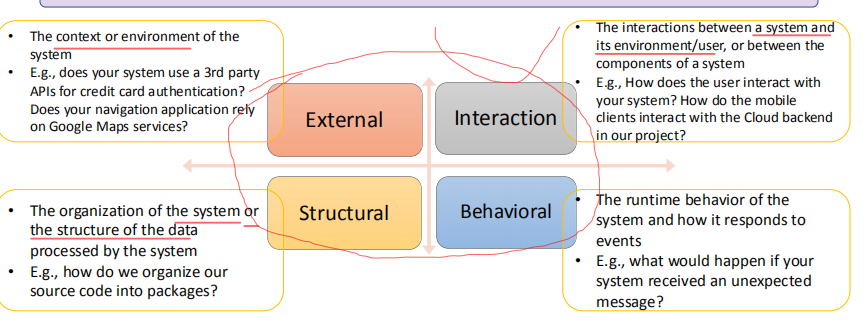

<table>
<colgroup>
<col style="width: 19%" />
<col style="width: 80%" />
</colgroup>
<thead>
<tr class="header">
<th>External</th>
<th>
<strong>系统的上下文或环境</strong>

E.g.，您的系统是否使用第三方API进行信用卡身份验证？你的导航应用程序依赖于谷歌地图服务吗？
</th>
</tr>
</thead>
<tbody>
<tr class="odd">
<td>Interaction</td>
<td>
<strong>系统与环境/用户之间或系统组件之间的交互</strong>

E.g.，用户如何与您的系统进行交互？移动客户端在我们的项目中如何与云后端进行交互？
</td>
</tr>
<tr class="even">
<td>Structural</td>
<td>
<strong>系统的组织结构或由系统处理的数据的结构</strong>

E.g.，我们如何将源代码组织成软件包呢？
</td>
</tr>
<tr class="odd">
<td>Behavioral</td>
<td>
<strong>系统的运行时行为及其对事件的响应方式</strong>

E.g.，如果您的系统收到意外消息，会发生什么？
</td>
</tr>
</tbody>
</table>

4，Unified Modeling Language (UML)
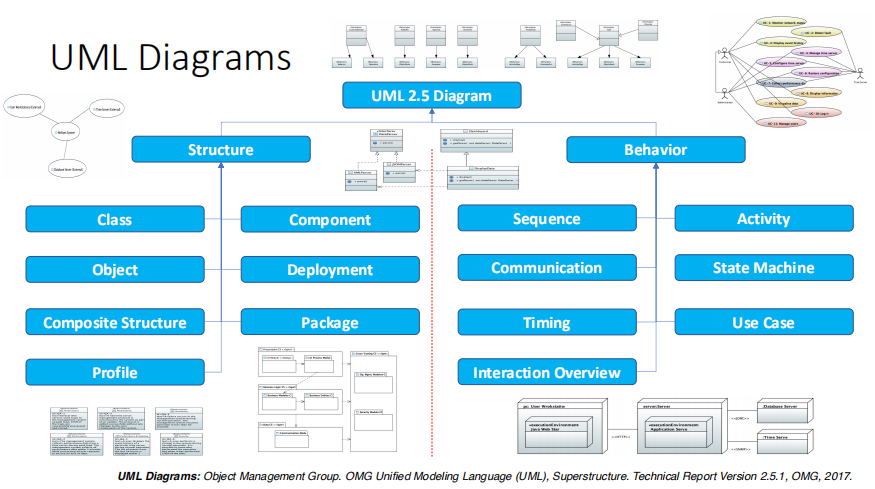
工具
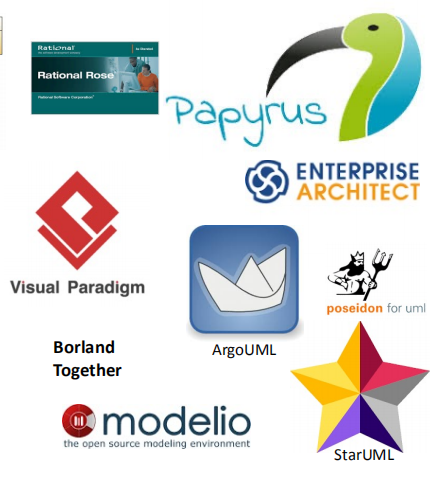

## 二、 External Perspective
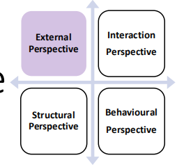
1，使用模型
**Context Model**
**（要会画）**
**反映一个系统的边界情况，和其他系统之间的关系，在整体环境中的所处位置。**
- 在需求工程的早期阶段创建的
- 了解并决定正在开发的系统的边界
- 建立系统与操作环境之间交互的高级视图，不无需详细信息。
- 使用简单的方框图或空的类图

**UML不为上下文模型提供专用类型的图表**

**Business Process Model**
- 模拟业务流程
- 描述系统参与特定业务流程的方式
- 使用活动图或专用的业务流程模型和符号(BPMN)

2，Context Model
反映一个系统的边界情况，和其他系统之间的关系，在整体环境中的所处位置。
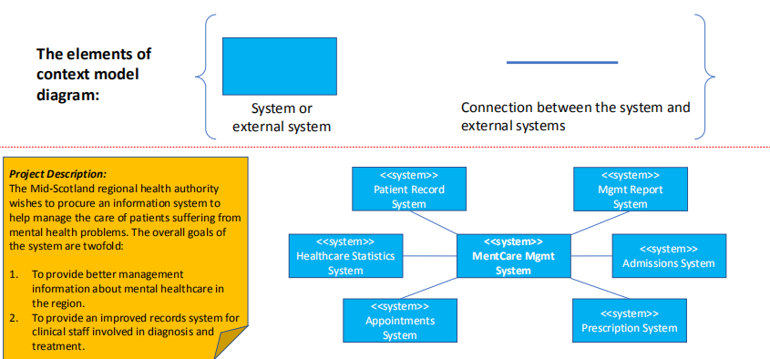
苏格兰中部地区卫生当局希望获得一个信息系统，以帮助管理对精神健康问题患者的护理。该系统的总体目标有两方面：
1.提供有关该地区心理保健的更好的管理信息
2.为参与诊断和治疗的临床工作人员提供一个完善的记录系统。

案例

术语--Stereotype
刻板印象是UML向模型项附加额外分类的方式；这是使UML成为可扩展的方式之一
- 它被用于描述模型元素
- 它被放置在图中的元素附近，
- • It uses a pair of \<\< \>\> to enclose a type, e.g., \<\<use\>\>,\<\<include\>\>, \<\<import\>\>, \<\<system\>\>, etc
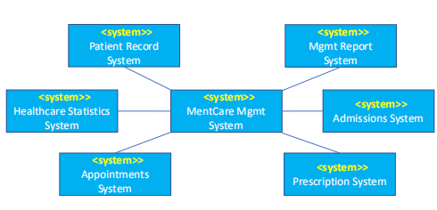

4，**Business Process Modelling**
**过程模型：揭示大量的业务处理过程是。用UML中的activity diagram来做process mode**l
1）Elements of Activity Diagram
活动是一种指定为由边缘连接的节点图的行为。执行流程被建模为由活动边缘连接的活动节点。”
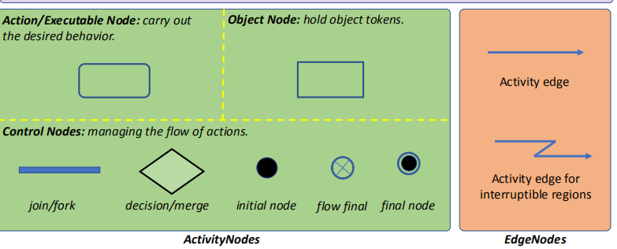
2）使用活动图的业务流程建模（要会画）
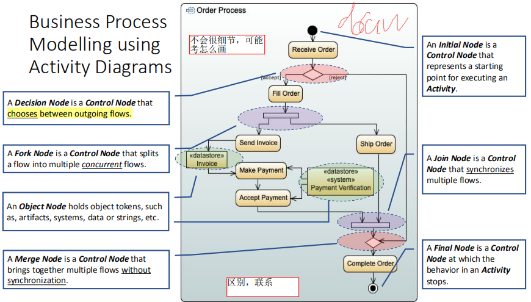

注意成对
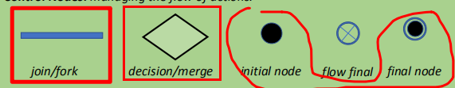

## 三、System Modelling – Interaction Perspective
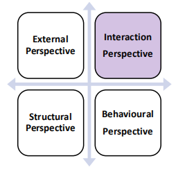

1，
**User interaction**，涉及**用户**的输入和输出；帮助识别用户的需求
- 帮助确定用户的需求。
**System interaction**，正在开发的软件系**统与其环境**中的系统之间的相互作用；
- 强调可能出现的通信问题。
**Component interaction**，软件系统的**组件之间**的交互作用
- 帮助了解所提议的系统结构是否有可能提供所需的系统性能和可靠性

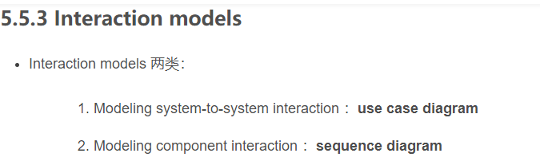
2，介绍组件
1）Use Cases
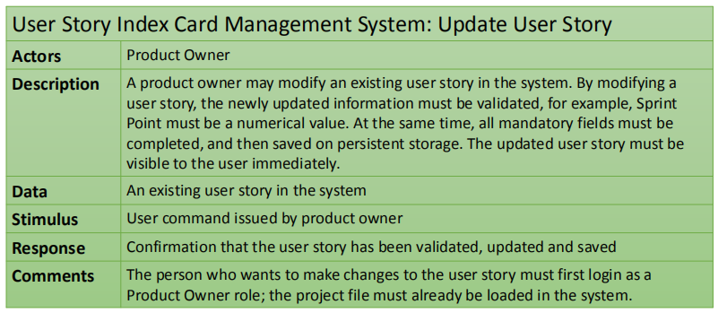
2）重点
**Use Case Dependency -- Extends**
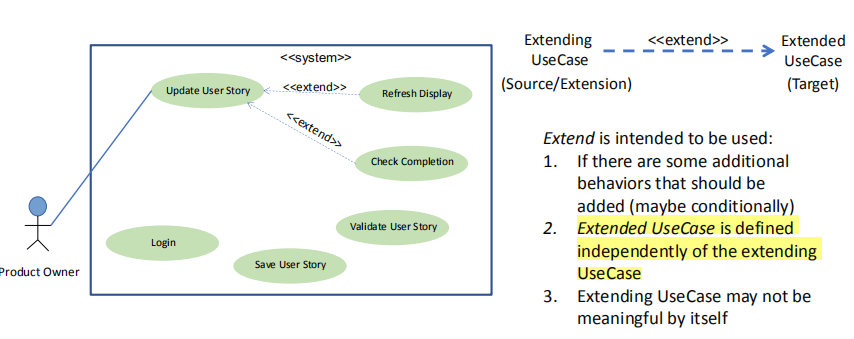
Extend is intended to be used:
- 1.如果有一些应添加的其他行为（可能是有条件的）
- 2.扩展的UseCase是独立于扩展的UseCase来定义的
- 3.扩展UseCase本身可能没有意义

**Use Case Dependency -- Include**
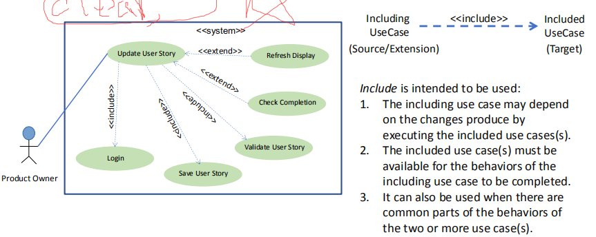
Include is intended to be used:
1.包含的用例可能取决于执行包含的用例所产生的更改。
2.必须提供包含用例才能完成包含用例的行为。
3.当两个或多个用例的常见行为部分时，也可以使用它。

案例
使用案例，头脑风暴-火车票在线预订系统
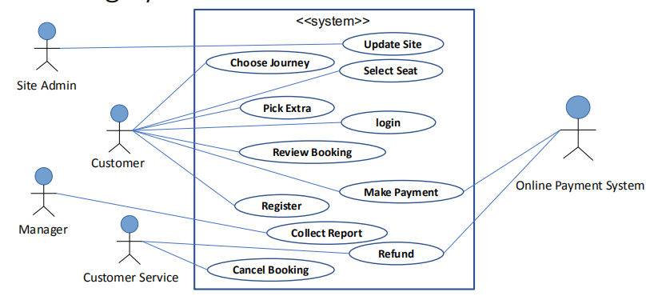

**Use Case Dependency -- Generalization**
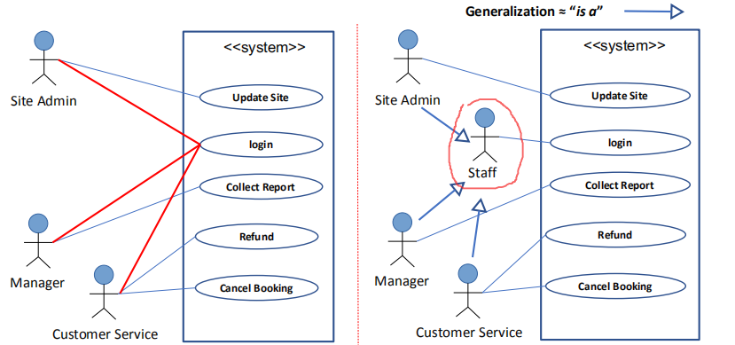

- 泛化关系、一般和特殊的关系、a-kind-of关系、常在面向对象的系统表示继承关系

- 空心的三角箭头

3，分类--三类
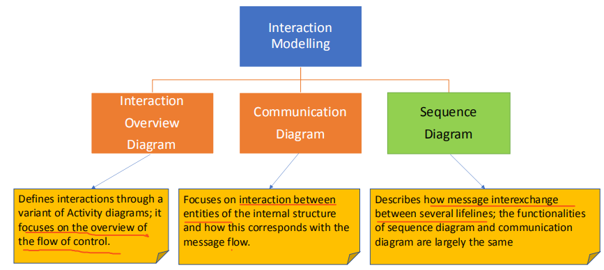

| Interaction Overview Diagram | 通过Activity diagrams的一个变体来定义交互作用；它**侧重于控制流程的概述**     |
|------------------------------|-------------------------------------------------------------------------------|
| Communication Diagram        | 重点关注**内部结构实体之间**的交互，以及这如何与消息流对应                    |
| Sequence Diagram             | 描述几条生命线之间的信息交换方式；顺序图和communication diagram的功能基本相同 |

4，Sequence Diagrams（记）
时序图，是一种UML交互图，它通过描述对象之间发送消息的时间顺序显示多个对象之间的动态协作

二维图，横轴表示对象，纵轴表示时间，消息在各个对象之间横向传递，依照时间顺序纵向排列，箭头是消息的传递

alt判断
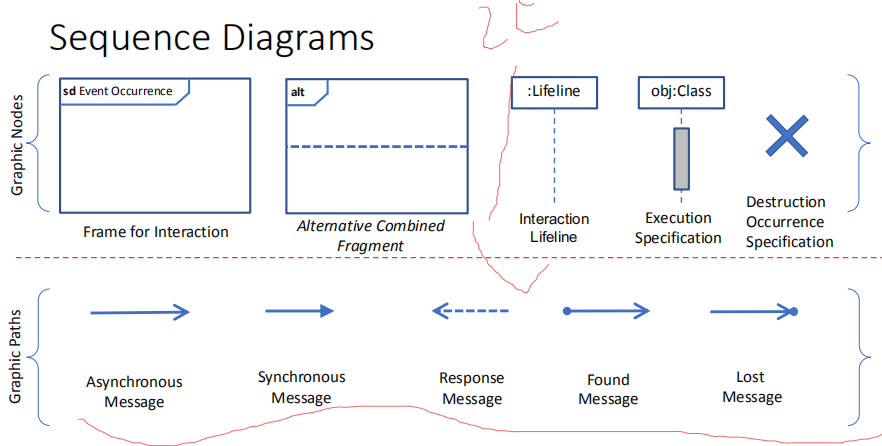
案例
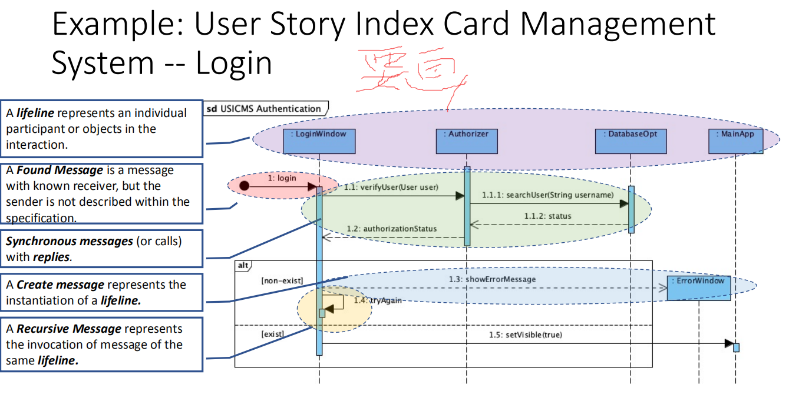
## 
## 
## 
## 四、System Modelling – Structural Perspective
1，
根据功能组件及其关系对系统的组织结构进行建模
- 系统设计的组织机构（静态结构）
- 系统执行时的组织结构（动态结构）
用于讨论和对系统架构的设计
类图用于建模系统的静态结构
2，Class Diagram

<https://blog.csdn.net/hemeinvyiqiluoben/article/details/69788251?utm_medium=distribute.pc_relevant.none-task-blog-baidujs_baidulandingword-0&spm=1001.2101.3001.4242>

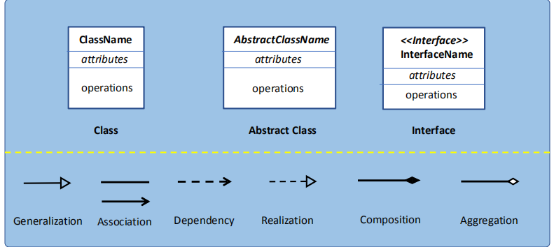

**Generalization（着重点）**
1，泛化关系、一般和特殊的关系、**a-kind-of**关系、常在面向对象的系统表示继承关系

空心的三角箭头

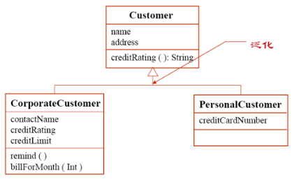

**2，**

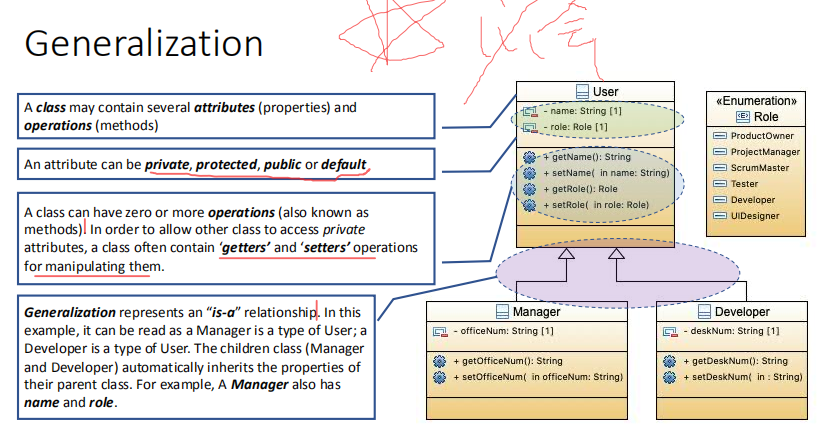

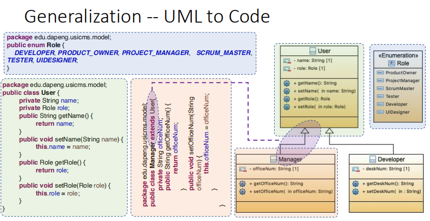

**Dependency**
1，依赖关系：虚线箭头。**表示一个事物，会受另外一个事务的影响。**

CourseSchedule会依赖于Course【参数】，Iterator依赖于CourseSchedule【友元**】**

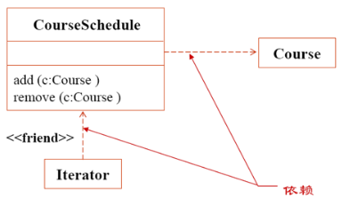

**2，依赖关系表示实体之间的关系，其中如果对一个实体定义的更改可能会导致对其他实体的更改。**

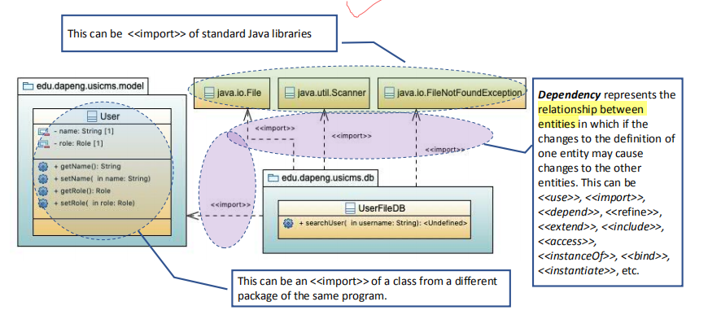

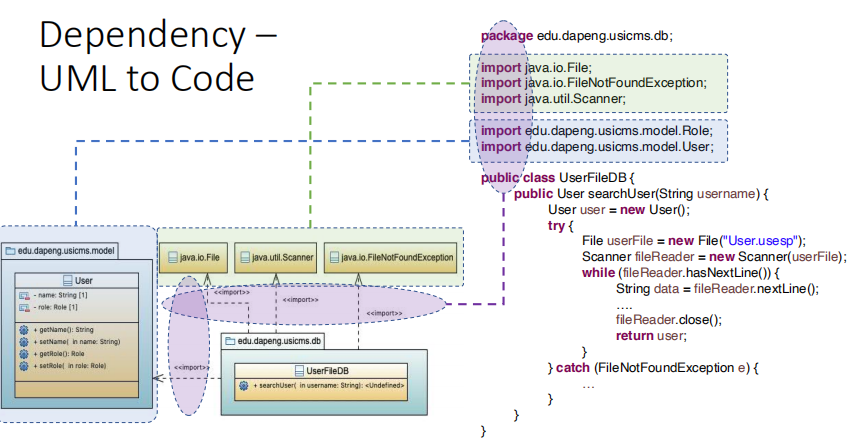

**Realization**
实现关系：一个事物是由另外一个事物来实现的。

实现分为两种情况，如下图

**椭圆：代表系统提供的功能or服务。虚线椭圆加虚线箭头 实现 实线椭圆**。

即：Order Management 实现 Place Order

**虚线椭圆：表示一种协作，是由一系列对象配合完成的，可以用时序图or协作图表示。**

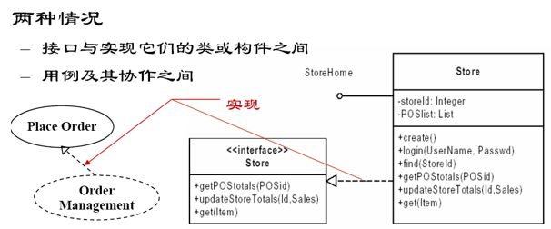

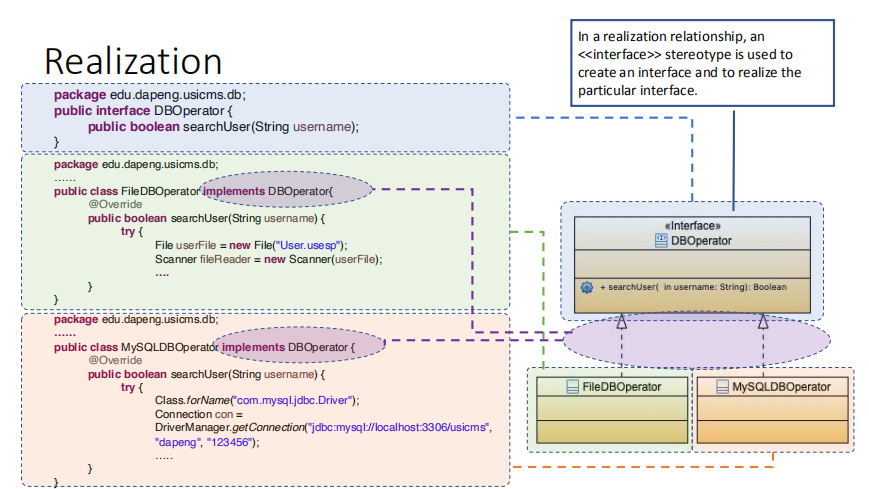

**Association**关联关系

用一根实心的线来关联两个事物。类似于数据库中实体关系模型

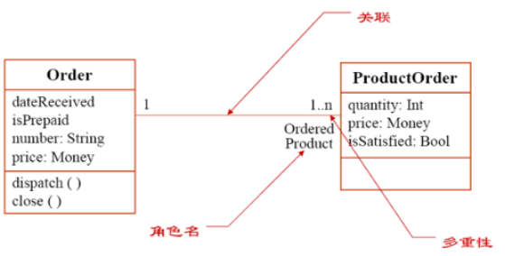

**聚合Aggregation 和 组合Composition**

他们都属于：关联关系 association

聚合和组合都是：**整体和部分的关系，a-part-of 关系。**

**Aggregation**聚合：如何没有这样一个部分，整体依然存在。==空心菱形==。

**Composition组合：没有这个部分，整体就不存在了。<u>实心菱形。</u>**

例中：

Order由：运输信息、订单信息、清单信息组成。

我们可以没有ShippingInfo，但是不能没有Book和BillingInfo

**Association, Aggregation and Composition（重中之重）**

Association关系表示系统中对象之间的连接或关联
Aggregation是Association关系的一个子类型。它可以被描述为人际关系的“一部分”。在聚合关系中，对象具有不同的生命周期。
Composition是Aggregation关系的一种子类型。它代表了一种“整体/部分”的关系。如果删除了composite，也将同时删除其所有相关部件。

五、其他
1，Package Diagrams
- 程序包被视为其成员的命名空间。
- 执行分析时，软件包图用于组织开发的工件
  - 提供封装和封装并支持模块化
  - 在复杂的系统开发中提供清晰和整洁的组织
  - 支持机本系统的版本控制
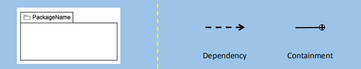

案例
包是其成员的命名空间，它包括拥有或包含的元素和导入的元素。
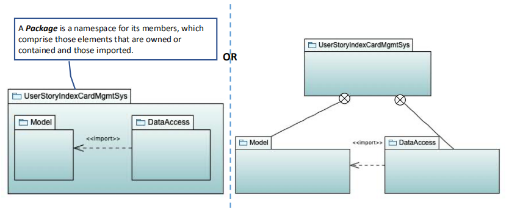

2，Deployment Diagrams
部署图显示了系统与分配给/或物理的逻辑和/或资产之间的关系。
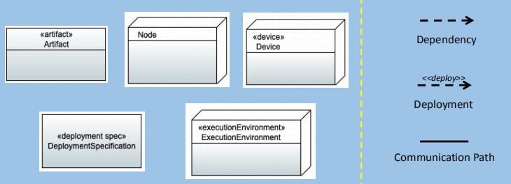

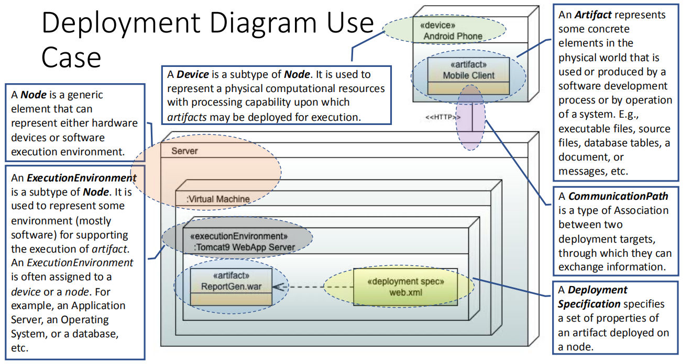

## 六、总结
model是故意忽略某些系统视图的系统细节的抽象视图
A context model显示了系统如何在操作环境中的定位。它可以帮助定义系统的边界
Use case diagrams用于描述外部参与者与待开发的系统之间相互作用
Sequence diagrams用于显示系统对象之间的交互作用
Class diagrams用于定义系统类的静态结构及其关系
Package diagrams用于组织开发过程中的工件。
Deployment diagrams用于显示组件对物理节点的分配。
