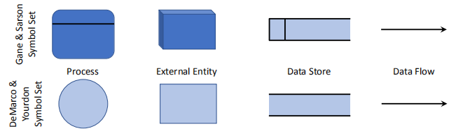
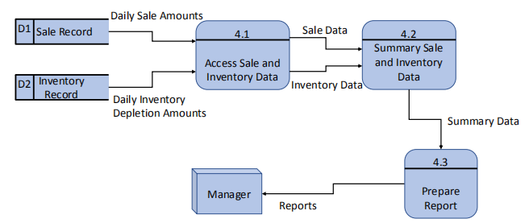
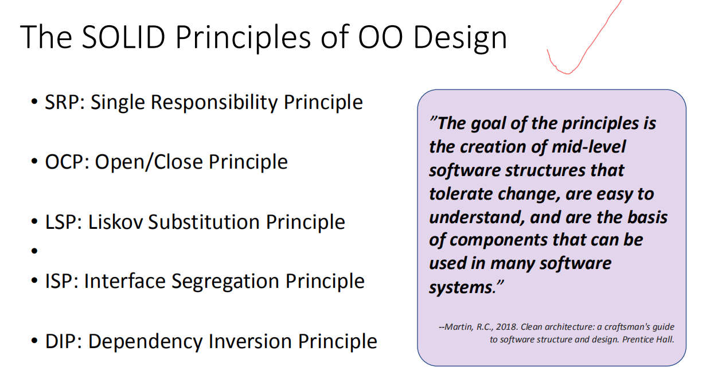
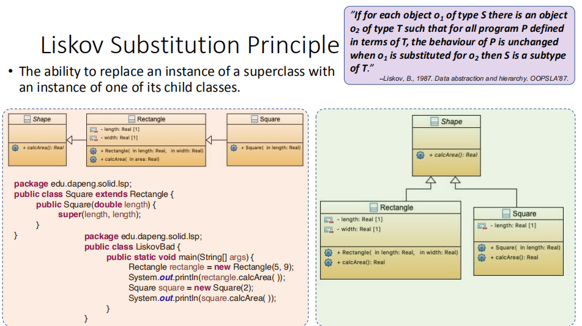

System Analysis, Modelling and Design
## 一、OO家族
关系，区别，分析，理解这三类

**1，Object-Oriented Programming (OOP)面向对象编程(OOP)**
定义：面向对象编程是一种实现方法，其中程序被组织为对象的协作集合，==每个集合都代表某个类的一个实例==，其类都是通过==继承关系联合==起来的类层次结构的成员

- 面向对象的编程使用对象，而不是算法，作为它的基本逻辑构建块。
- 对象是某个类的实例，即，对象具有关联的类型（类）
- ==类可以从父类（超类）继承属性==

**2，Object-Oriented Design (OOD)具有面向对象功能的设计(OOD)**
定义：面向对象设计是一种设计方法，包括面向对象==分解的过程和描述==所设计系统的逻辑和物理以及静态和动态模型的符号
- 面向对象设计使用类和对象抽象来实现逻辑结构系统（面向对象分解），相比之下，传统的结构化设计使用算法抽象。
- 术语面向对象设计是指使用面向对象方法来推导系统逻辑结构的任何方法。
- 面向对象设计的结果是一套实现系统的蓝图

**3，Object-Oriented Analysis (OOA)面向对象分析(OOA)**
定义：“面向对象分析是一种分析方法，它从在问题领域的词汇表中发现的类和对象的角度来检查需求。

- 传统的结构化分析技术，如数据流图(DFDs)，侧重于系统内的数据流，相比之下，==面向对象的分析强调了真实世界的模型==的构建。
- 面向对象分析的结果是一组对象模型。
- 面向对象的设计可以从面向对象分析的产品开始。

4，三者关联
<table>
<colgroup>
<col style="width: 100%" />
</colgroup>
<thead>
<tr class="header">
<th>
一、<strong>指代不同</strong>

1、OOA：面向对象分析方法，是确定需求或者业务的角度，按照面向对象的思想来分析业务。

2、OOD：面向对象设计方法是OO方法中一个<mark>中间过渡环节</mark>，是一个设计方法。其主要作用是对OOA分析的结果作进一步的规范化整理，以便能够被OOP直接接受。

3、OOP：面向对象程序设计作为一种实现方法，其本质是以建立模型体现出来的抽象思维过程和面向对象的方法。

二、规则不同

1、OOA：只是对需求中描述的问题，进行模块化的处理，描述问题的本质，区别每个问题的不同点相同点，确定问题中的对象。

2、OOD：是管理程序内部各部分的相互依赖。为了达到这个目标，OOD要求将程序分成块，每个块的规模应该小到可以管理的程度，然后分别将各个块隐藏在接口（interface）的后面，只通过接口相互交流。

3、OOP：模型是用来反映现实世界中事物特征的。任何一个模型都不可能反映客观事物的一切具体特征，只能对事物特征和变化规律的一种抽象，且在所涉及的范围内更普遍、更集中、更深刻地描述客体的特征。

三、侧重点不同

1、OOA：强调的是在系统调查资料的基础上，针对OO方法所需要的素材进行的归类分析和整理，而不是对管理业务现状和方法的分析。

2、OOD：是一种解决软件问题的设计范式（paradigm），一种抽象的范式。使用OOD这种设计范式，我们可以用对象（object）来表现问题领域（problem domain）的实体，每个对象都有相应的状态和行为。

3、OOP：通过建立模型而达到的抽象是人们对客体认识的深化
</th>
</tr>
</thead>
<tbody>
</tbody>
</table>

4,,Object Identification
- 在分析和设计早期阶段，重要的两个任务：
  - 确定构成问题领域发声的类
  - 创建反映问题需求的对象模型

- 面向对象分析的常用方法
  - • Textual/Use Case Analysis
  - • Classical Analysis
  - • Behavior analysis
  - • CRC (Class-Responsibility-Collaboration) Cards
  - • Structured analysis
    - Process Modelling (DFDs - Data Flow Diagrams)
    - Entity-Relationship Modelling (ERDs - Entity-Relationship Diagrams)

## 二、面向对象分析的常用方法Object-oriented analysis common approaches
### 1，Textual/UseCase Analysis
（how）
**怎么做**：通过查看用例图来执行文本分析，并分析用例说明，以识别潜在的对象、属性、操作和关系
**目标**：创建一组初始的类。
**备注**：它经常与其他技术一起使用

案例

确定主语(类)，确定有什么（属性），确定动作(类的方法),

## 2，Classical Analysis
（要）

- 主要从经典分类原理派生类和对象
- **关注问题领域的有形事物。**

确定物品，事件，物品的关系

### 3，Behavior Analysis
（理解）
- 关注动态行为作为类和对象的主要源。
- 基于具有类似行为的对象组的表单类。
- 将具有共同责任的事物分组
  - 类的层次结构是从一般责任到特殊行为而创建的。

- 源自系统功能
  - 1.将系统行为分配给系统的各个部分
  - 2.了解谁发起这些行为，谁参与这些行为
  - 3.具有重要角色的发起者和参与者被视为对象。

4，CRC (Class-Responsibility-Collaboration) Cards
- class责任协作(CRC)卡用于记录一个class的职责和协作
- 这组CRC卡包含了构建所调查问题的逻辑结构模型的所有信息
- 分析人员可以使用CRC卡和使用例角色扮演来发现隐藏的类、对象、属性、操作和关系。

**Responsibilities and Collaborations职责与协作**
(很重要)
- 责任与对象的角色方面的行为有关
- 在分析和对象设计期间，职责被分配给对象类别。
==A responsibility is different from a method of a class, but methods fulfill==

==responsibilities.==
- 一点责任可以通过一个对象的单一方法来实现，而一个大责任可以承担多个类和方法。
- 两类职责Responsibilities
  - 执行某个对象的职责
    - E.g.，执行计算，创建对象，启动/控制其他对象中的动作/活动
  - 了解一个对象的责任
    - E.g.，了解被封装的数据，相关的对象
A set of classes that support a business process or a **Use Case** forms

collaborations.

### 4,CRC Cards Analysis
**(不太需要)**
1.查看用户案例说明。
选择要角色扮演的特定用例。

从==最重要、最复杂或最不被理解的用例开始==。

从用例中识别对象和类

为每个已识别的类创建一个CRC卡
2.确定相关的参与者和对象
确定要扮演的相关角色。

每个角色都与参与者或对象相关联。
3.用例中的角色扮演场景
每个团队成员作为角色的实例（在步骤2中标识）。

每个角色扮演者都会问一些简单的问题

1。你知道什么？（知情的责任）

2。你能做到吗？（工作职责）

为您的角色填写CRC卡
4.重复上述步骤，直到执行所有用例。

###  5，Structured analysis
- Process Modelling (DFDs - Data Flow Diagrams)
- Entity-Relationship Modelling (ERDs - Entity-Relationship Diagrams)

## 一、Structured Analysis – Process Modeling
show ==how data moves== through an information
show the processes that ==change or transform data==.

1，系统分析人员使用数据流图(DFD)来显示数据如何通过信息系统移动
数据流图显示了更改或转换数据的过程
一组数据流图提供了一个逻辑模型，它显==示系统在做什么，但不是它是如何做的==，即数据和过程建模

2，Basic Rules in DFDs
**1）Process标识一个特点函数**

- Process接收输入数据并产生具有不同内容、表单或两者两者的输出。
- 一个Process可以是简单的或复杂的
- Process包含可转换数据并产生所需输出的业务逻辑。
- process名称标识一个特定的函数
  - 一个动词，后跟一个单数名词（注意书写
- Processing细节不显示在DFD中；因此，一个进程通常被称为 a black box。
  - 详细信息通常记录在相关的流程描述中。

**2）Data Flow**一种用来将数据从系统的一部分移动到另一部分的路径

- 
数据流是一种用来将数据从系统的一部分移动到另一部分的路径
- 数据流表示一个或多个数据项
  - • E.g., a Sprint ID, the Reporter of an issue, a User Story (consists of many fields).
- 数据流有一个名称。
  - 单数名词和形容词
- 一个进程可以有多个输入和输出
- 数据流必须至少在一个端上有一个进程

3.  **To Avoid**
(可能给一个复杂的，让你来修改)
注意，不要发生以下的错误
**有输入就要有输出，而且输入要足以产生输出**
无生源Spontaneous generation
进程有输出，但没有输入数据流

黑洞Black hole
一个进程有输入，但没有输出

Gray hole
输出，但输入不足以产生输出。

4）Data Store
数据存储表示系统存储或一个或多个processes使用的数据。

数据存储区不显示其详细内容
Structures, format and elements are defined in the data

dictionary.

数据存储区的物理特性并不重要。
数据存储名称是由一个名词和可选的形容词组成的复数名称。
数据存储区不能直接连接到另一个数据存储区。收票单

5）External Entity
仅向系统提供数据或接收系统输出的外部实体将显示在DFD图中
系统的边界可以从外部实体出现的位置来确定
向系统提供数据的外部实体称为source；从系统接收数据的实体称为sink。
外部实体名称是一个组织、一个部门、另一个信息系统或一个人员的单数形式

外部实体不能直接向彼此发送数据或接收彼此之间的数据。
外部实体不能向数据存储区发送数据或从数据存储区接收数据。

3，创建DFDs(需要)

**第一步-Draw a context diagram**
**(画出各大模块)**
确定有什么人，与什么系统
在DFD中， a context diagram是软件系统的顶级视图。
a context diagram**定义了系统的边界和范围**。
确定将向正在开发的系统提供数据或从正在开发的系统接收数据的外部实体。
a context diagram中**不包括数据存储区。**
The entire system under development is denoted as process 0 (zero).

进程0表示整个系统。每个进程的唯一标识符。

**第二步Draw a Diagram 0 DFD**
**在人和系统的关系上细化**
Diagram 0 DFD提供了==系统的所有组件的概述==
它显示了进程0的**主要内部流程、数据流和数据存储**。
在图0的级别上，它还包括上下文图中已识别的外部实体。
流程编号并不意味着流程执行的顺序。

**第三部 Draw the Low-level DFDs【Diagram 1 or Level-1 DFD**
**Level-1 DFD(low-level)对0图的其中一个组件的从头到尾的流程展示**
只有在确定所有功能原语时，才能确定低级别DFD的级别(leveling).
所有低级DFD均基于上层确定的流程。
所有低级别DFD中的输入和输出数据流都必须正确对齐（平衡）。
图0中流程2的输入输出保留在图1中

案例
Restaurant Food Ordering System
(Context Diagram)

**(Level-0)**

**(Level-1 \<Process 4\>)**

**4，总结DFD**
DFD用于建模数据和过程。
DFD显示了系统中的数据移动和转换
DFD可组织层次结构中的详细信息级别。
上下文图表示系统范围及其外部依赖关系

图0显示了系统中的主要流程、数据存储、外部实体和数据流。

低级图（图1、2等）显示该系统的其他详细信息
DFD应准确地反映被建模的信息系统。
完整的DFD集应该扩展到原始级别，其中每个组件都反映了某些不可约的性质。这是一个迭代的过程。

## 二，概念性的数据建模Conceptual Data Modelling
1，定义
捕获组织数据整体结构并独立于任何数据库管理系统或其他实施考虑事项的详细模型

- 数据建模开发了数据中的定义、结构和关系。
- 数据模型解释组织的操作以及管理组织中执行的工作的规则
- 数据模型并不关心如何或何时处理或使用数据。
- 概念数据建模通常与其他需求分析和系统分析活动一起进行，如过程建模和逻辑建模。
  - 这些工作和活动通常通过项目字典或由公共计算机辅助软件工程(CASE)软件工具维护的项目字典或存储库来协调和共享。
- 数据建模最常用的技术是实体关系（E-R）图表。

2，Data Modelling重要性
数据的特性在数据库、程序、计算机屏幕和打印报告的设计中具有重要意义。
数据是许多现代信息系统中最复杂的方面。
事务处理系统，如订单处理系统，可以具有相当大的过程复杂度，即验证数据、协调错误和协调数据的移动

关于数据的特征，如格式和实体关系，是相对稳定的，并且在同一业务领域的跨组织上基本相同。
基于数据方向而不是进程或逻辑方向的信息系统设计应该具有更长的使用寿命。

3，为概念数据建模收集信息
概念数据模型可以从头开始开发，从现有数据模型中细化，或者购买（特定业务领域的标准数据模型）。
数据建模通常是从多个角度来进行的。
- The top-down approach
  - 从对业务性质的理解（面试、询问特定问题）中衍生出数据模型的业务规则
- The bottom-up approach
  - 审核特定的业务文件，如报告和收据等。

The Top-Down Approach--典型的面试问题
| Determine data entities and their relationships:确定数据实体及其关系：业务的主题/对象是什么？什么类型的人、地方、事情、材料、事件等等。是否在此业务中使用或交互，关于必须维护哪些数据？每个对象可能存在多少个实例？ |
|---------------------------------------------------------------------------------------------------------------------------------------------------------------------------------------------------------------------|
| Determine primary key确定主键：每个对象的唯一特性（或特征）区别于相同类型的其他对象？这种显著的特征会随着时间的推移而变化，还是永久性的？即使我们知道对象的存在，也会丢失对象的这个特性吗？                         |
| Determine attributes and secondary keys:确定属性和辅助键：有哪些特性描述了每个对象？引用、选择、限定、排序和分类？为了运行业务，我们必须知道每个对象的什么？                                                        |
| Determine cardinality and time dimensions of data:确定数据的基数和时间维度：您对这些数据感兴趣？您是否需要历史趋势、当前“快照”值和/或估计或预测？如果对象的特征随时间而变化，必须知道过时值？                       |
| Determine supertypes, subtypes, and aggregations:确定超类型、子类型和聚合：每个对象的所有实例是否都相同？也就是说，组织描述或不同处理的每个对象是否有特殊类型？某些对象是摘要或更详细的对象的组合？                 |
| Determine relationships and their cardinality and degree:确定关系及其基数和程度：发生了哪些事件，意味着不同物体之间的关联？业务的自然活动或事务涉及处理有关相同或不同类型的多个对象的数据                           |

The Bottom-Up Approach

## 三、Entity-Relationship Modelling
1，
- E-R模型==是组织或业务区域的数据的详细逻辑表示。==
- E-R图是E-R模型的图形表示。
  - ERD的符号可能因组织而异
- E-R建模是==数据库设计中常用的一种方法==。
- 基本的E-R建模符号使用了三个主要结构：
  - **数据实体、关系及其相关的属性**

2，E-R Model – Entities
实体是用户环境中的人、地点、对象、事件或概念。
• Person: STUDENTS, LECTURER, CLEARK, etc.

• Place: STORE, WAREHOUSE, DEPARTMENT, etc.

• Object: SENSOR, PRODUCT, CAR, etc.

• Event: SALE, REGISTRATION, PURCHASE, etc.

• Concept: COURSE, ACCOUNT, STOCK, etc.
一个实体有自己的身份，从而区别于其他实体
实体类型（或实体类）是共享共同属性或特性（类似于OOD中的类）的实体的集合。
实体实例是实体类型的单一出现情况（类似于OOD中的对象）
E.g.，大学中有一个讲师实体类型，但在大学的员工管理数据库中可能有数百（或数千）存储了这种类型的实例。

3，命名实体类型
实体类型名称应为单数名词
• E.g., STUDENT, LECTURER, ACCOUNT, etc.

实体名称应是描述性的且特定于组织的。
E.g.，针对与供应商签订的订单的采购订单与由客户签订的客户订单不同。这两种实体类型都不应被命名为顺序

事件实体类型应为事件的结果命名，而不是事件的活动或进程。
E.g.，项目经理指定开发人员处理项目的事件，会导致分配实体类型

4，Defining Entity Types
(注意)
实体类型定义应包括：
实体类型的每个实例的唯一特征是什么。

在实体类型中包含而不包含在什么实体实例中。

当创建和删除该实体类型的实例时。

当一个实例可能会更改为另一个实体类型的实例时。

例如，“建筑公司的投标一旦被接受就成为合同。

关于实体实例的历史。

重要

<table>
<colgroup>
<col style="width: 36%" />
<col style="width: 63%" />
</colgroup>
<thead>
<tr class="header">
<th>Strong Entity or Parent Entity</th>
<th><ul>
<li>
<mark>独立于其他实体</mark>的情况
</li>
<li>
一个强大的实体通常有依赖于它们的弱实体。
</li>
<li>
一个很强的实体有<mark>一个主键</mark>。
</li>
</ul></th>
</tr>
</thead>
<tbody>
<tr class="odd">
<td>Weak Entity</td>
<td>
弱实体取<mark>决于其他实体类型</mark>

弱实体<mark>没有主键</mark>。

弱实体没有其父实体，在图中没有意义
</td>
</tr>
<tr class="even">
<td>Associative Entity</td>
<td>
关联实体关联服务器实体类型的实例

关联实体通常包含特定于这<mark>些实体实例之间的关系的属性</mark>。
</td>
</tr>
</tbody>
</table>

5，E-R Model – Attributes
- 每个实体类型都有一组属性（类似于OOD中的类属性）
- 属性是一个实体的一个属性或特征。
  - 例如，实体类型的学生可能具有包括Student_ID、Student_Name、专业、Contact_Number等在内的属性。
- 每个实体类型都必须具有一个属性或一组属性，以区分一个实例和同一类型的其他实例。属性或属性集称为候选键。
- 可以包含多个值的属性称为多值属性。
- 一起重复的几个属性称为重复组。
- 使用一对卷括号来包围重复组或多值属性。
- 必须为每个实体实例具有值的属性称为必需属性。
- 可能没有每个实体实例的值的属性称为可选属性
- 具有有意义的组件部分的属性称为复合属性
- 可以从数据库中的其他数据计算出的属性值称为派生属性

案例

6，E-R Model –Relationships
关系是指组织感兴趣的一个或多个实体类型的实例之间的关联。
关联通常意味着事件已经发生或实体实例之间存在某种自然链接
关系用动词短语进行标记。
参与关系的实体类型的数量称为关系的程度
一元关系（或递归关系）、二进制关系和三元关系都很常见。

更高程度的关系是可能的，但在实践中很少遇到它们。

**Degree of a Relationship**
(注意他们之间的关系)

**Cardinalities in Relationships**
**(重要)**

可以（或必须）与实体A的每个实例关联的实体B的实例的数量

7，Supertypes and Subtypes
Subtype子类型（类似于OOD中的子类）
实体类型中实体的一个子组，它表示组织的完整含义，并且共享与其他子组不同的共同属性或关系。

Supertype超类型（类似于OOD中的父类）
与一个或多个子类型具有关系的通用实体类型

8，Rules Govern Supertype/Subtype Relationships

9，The Connections between DFDs and Data Models

10，Data Stores and External Entities to E-R Model

11，OOA Summary
Textual analysis用于通过查看用例及其相关描述来识别潜在的对象、属性、操作和关系。
Classical analysis从经典分类原则推导出关注问题领域中有形事物的类和对象。
Behavior analysis关注动态行为作为类和基于具有相似行为的对象组形成类的对象的主要源。
CRC卡分析集中于职责的分配和class协作的识别。
数据流图用于建模数据和流程。
DFD显示系统中的数据移动和转换。
DFD可组织层次结构中的详细信息级别。
Context diagram表示系统范围及其外部依赖关系。

图0显示了系统中的主要流程、数据存储、外部实体和数据流。

低级图（图1、2等）显示该系统的其他详细信息。
概念数据建模是基于关于数据结构的某些构造，而不是使用。

## 三、Designing Objects with Responsibilities
(全部都很重要重要)
## 1，Designing Objects with Responsibilities -- The GRASP Principles
1）定义
软件对象（像人与人的合作意愿）负责与其他部件合作以完成工作。

The GRASP (General Responsibility Assignment Software Pattern or
Principles)是一种负责任的OO设计的学习辅助工具。

2，Domain Model
A domain model是一个域中概念类或真实情况对象的视觉表示。
”A domain model is a ==visual representation== of conceptual classes or real-situation
objects in a domain.”（重要）
==Domain Model == Conceptual Model == Domain Object Model == Analysis Object Model==

域模型提供了一个概念性的视角
• Domain objects
• Conceptual classes
• Relationships between
conceptual classes
• Attributes of conceptual
classes

3,GRASP – Creator
<table>
<colgroup>
<col style="width: 100%" />
</colgroup>
<thead>
<tr class="header">
<th><h2 id="creator创造者">Creator（创造者）</h2>

实际应用中，符合下列任一条件的时候，都应该由类 A 来创建类 B，这时 A 是 B 的创建者：

<table>
<colgroup>
<col style="width: 100%" />
</colgroup>
<thead>
<tr class="header">
<th>
a、A 是 B 的聚合

b、A 是 B 的容器

c、A 持有初始化 B 的信息（数据）

d、A 记录 B 的实例

e、A 频繁使用 B
</th>
</tr>
</thead>
<tbody>
</tbody>
</table>

如果一个类创建了另外一个类，那么这两个类之间就有了耦合，也可以说产生了依赖关系。依赖或耦合本身是没有错误的，但是他们带来的问题就是在以后的维护中产生连锁反应，而必要的耦合是逃不掉的，我们能做的就是正确的创建耦合关系，不要随便建立类之间的依赖关系，那么该如何去做呢？就是要遵守创建者模式规定的基本原则，凡是不符合以上条件的，都不能随便用 A 创建 B。

例如：因为订单（Order）是商品（SKU）的容器，所以应该由订单来创建商品。如下图：

这里因为订单是商品的容器，也只有订单持有初始化商品的信息，所以这个耦合关系是正确的且没有办法避免的，所以由订单来创建商品。
</th>
</tr>
</thead>
<tbody>
</tbody>
</table>

4，GRASP – Information Expert
When we design an object (class), if a class has all the information and it needs to perform a responsibility, then that responsibility should be assigned to that class.
<table>
<colgroup>
<col style="width: 100%" />
</colgroup>
<thead>
<tr class="header">
<th><h2 id="infomation-expert信息专家">Infomation Expert（信息专家）</h2>

我们设计对象（类）的时候，如果某个类拥有完成某个职责所需要的所有信息，那么这个职责就应该分配给这个类来实现。这时，这个类就是相对于这个职责的信息专家。

<strong>例如：</strong> 常见的网上商店的购物车（ShopCar），需要让每种商品（SKU）只在购物车内出现一次，购买相同商品，只需要更新商品的数量即可。如下图：

针对这个问题需要权衡的是，比较商品是否相同的方法需要放到哪个类里来实现呢？分析业务得知需要根据商品的编号（SKUID）来唯一区分商品，而商品编号是唯一存在于商品类的，所以根据信息专家模式，应该把比较商品是否相同的方法放在商品类里。
</th>
</tr>
</thead>
<tbody>
</tbody>
</table>

5，GRASP – Low Coupling
Coupling:类之间的连接
<table>
<colgroup>
<col style="width: 100%" />
</colgroup>
<thead>
<tr class="header">
<th><h2 id="low-coupling低耦合">Low coupling（低耦合）</h2>

尽可能地减少类之间的连接。

其作用非常重要：

a、低耦合降低了因一个类的变化而影响其他类的范围。

b、低耦合使用类更容易理解，因为类会变得简单，更内聚。

下面这些情况会造成类 A、B 之间的耦合：

<table>
<colgroup>
<col style="width: 100%" />
</colgroup>
<thead>
<tr class="header">
<th>
a、A 是 B 的属性

b、A 调用 B 的实例的方法

c、A 的方法中引用的 B，例如 B 是 A 方法的返回值或参数。

d、A 是 B 的子类，或者 A 实现 B
</th>
</tr>
</thead>
<tbody>
</tbody>
</table>

关于低耦合，还有下面一些基本原则：

a、Don’t Talk to Strangers 原则

意思就是说，<strong>不需要通信的两个对象之间，不要进行无谓的连接，连接了就有可能产生问题，不连接就一了百了了。</strong>

b、如果 A 已经和 B 有连接，如果分配 A 的职责给 B 不合适的话（违反信息专家模式），那么就把 B 的职责分配给 A。

c、两个不同模块的内部类之间不能连接，否则比招报应！

例如：Creator 模式的例子里，实际业务中需要另一个出货人来清点订单（Order）上的商品（SKU），并计算出商品的总价，但是由于订单和商品之间的耦合已经存在了，那么把这个职责分配给订单更合适，这样可以降低耦合，以便降低系统的复杂性。如下图：

这里我们在订单类里增加了一个 TotalPrice() 方法来执行计算总价的职责，没有增加不必要的耦合
</th>
</tr>
</thead>
<tbody>
</tbody>
</table>

6，GRASP – Controller
<table>
<colgroup>
<col style="width: 100%" />
</colgroup>
<thead>
<tr class="header">
<th><h2 id="controller控制器">Controller（控制器）</h2>

用来接受和处理系统事件的职责，一般应该分配给一个能够代表整个系统的类，这样的类通常被命名为“XX处理器”、“XX协调器”或“XX会话”。

关于控制器类，有如下原则：

<table>
<colgroup>
<col style="width: 100%" />
</colgroup>
<thead>
<tr class="header">
<th>
a、系统事件的接收与处理通常由一个高级类来代替。

b、一个子系统会有很多控制类，分别处理不同的事务。
</th>
</tr>
</thead>
<tbody>
</tbody>
</table></th>
</tr>
</thead>
<tbody>
</tbody>
</table>

7，GRASP – High Cohesion
<table>
<colgroup>
<col style="width: 100%" />
</colgroup>
<thead>
<tr class="header">
<th><h2 id="high-cohesion高内聚">High cohesion（高内聚）</h2>

高内聚的意思是给类尽量分配内聚的职责，也可以说成是功能性内聚的职责。即功能性紧密相关的职责应该放在一个类里，并共同完成有限的功能，那么就是高内聚合。这样更有利于类的理解和重用，也便于类的维护。（也是一种隔离

高内聚也可以说是一种隔离，就像人体由很多独立的细胞组成，大厦由很多砖头、钢筋、混凝土组成，每一个部分（类）都有自己独立的职责和特性，每一个部分内部发生了问题，也不会影响其他部分，因为高内聚的对象之间是隔离开的。

例如：一个订单数据存取类（OrderDAO），订单即可以保存为 Excel 模式，也可以保存到数据库中；那么，不同的职责最好由不同的类来实现，这样才是高内聚的设计，如下图：

这里我们把两种不同的数据存储功能分别放在了两个类里来实现，这样如果未来保存到 Excel 的功能发生错误，那么就去检查 OrderDAOExcel 类就可以了，这样也使系统更模块化，方便划分任务，比如这两个类就可以分配到不同的人同时进行开发，这样也提高了团队协作和开发进度
</th>
</tr>
</thead>
<tbody>
</tbody>
</table>

8，GRASP – Polymorphism（注意）
<table>
<colgroup>
<col style="width: 100%" />
</colgroup>
<thead>
<tr class="header">
<th><h2 id="polymorphism多态">Polymorphism（多态）</h2>

这里的多态跟 OO 三大基本特征之一的“多态”是一个意思。

例如：我们想设计一个绘画程序，要支持可以画不同类型的图形，我们定义一个抽象类 Shape，矩形（Rectangle）、圆形（Round）分别继承这个抽象类，并重写（override）Shape 类里的Draw() 方法，这样我们就可以使用同样的接口（Shape抽象类）绘制出不同的图形，如下图：

这样的设计更符合高内聚和低耦合原则，虽然后来我们又增加了一个菱形（Diamond）类，对整个系统结构也没有任何影响，只要增加一个继承 Shape 类就行了。
</th>
</tr>
</thead>
<tbody>
</tbody>
</table>

9，Pure Fabrication, Indirection and Protected Variations（重要）

<table>
<colgroup>
<col style="width: 100%" />
</colgroup>
<thead>
<tr class="header">
<th><h2 id="pure-fabrication纯虚构">7、Pure Fabrication（纯虚构）</h2>

It's similar to a purely fictional function. Coherence and coupling are mediated by a purely fictional class.

这里的纯虚构跟我们常说说的<strong>纯虚构函数意思相近</strong>。<strong>高内聚低耦合，是系统设计的终极目标，但是内聚和耦合永远都是矛盾对立的。</strong>高内聚以为这拆分出更多数量的类，但是对象之间需要协作来完成任务，这又造成了高耦合，反过来依然。该如何解决这个矛盾呢？ 这个时候就需要纯虚构模式，由一个纯虚构的类来协调内聚和耦合，可以在一定程度上解决上述问题。

例如：上面多态模式的例子，如果我们的绘图程序需要支持不同的系统，那么因为不同系统的API结构不同，绘图功能也需要不同的实现方式，那么该如何设计更合适呢？如下图：

这里我们可以看到，因为增加了纯虚构类AbstractShape，不论是哪个系统都可以通过AbstractShape 类来绘制图形，我们即没有降低原来的内聚性，也没有增加过多的耦合，可谓鱼肉和熊掌兼得。

<h2 id="indirection间接">8、Indirection（间接）</h2>

This can't be done directly; it needs to be done in a roundabout way. Objects that would be directly connected are separated from each other, and one change does not affect the other.

“间接”顾名思义，就是这个事不能直接来办，需要绕个弯才行。绕个弯的好处就是，本来直接会连接在一起的对象彼此隔离开了，一个变动不会影响另一个。就像我在前面的低耦合模式里说的一样，“两个不同模块的内部类之间不能直接连接”，但是我们可以通过中间类来间接连接两个不同的模块，这样对于这两个模块来说，他们之间仍然是没有耦合/依赖关系的。

<h2 id="protected-variations受保护变化">9、Protected Variations（受保护变化）</h2>

Identify unstable points of change in advance and encapsulate them with a unified interface so that if changes occur in the future, new functionality can be extended through the interface without having to modify the original implementation.

预先找出不稳定的变化点，使用统一的接口封装起来，如果未来发生变化的时候，可以通过接口扩展新的功能，而不需要去修改原来旧的实现。也可以把这个模式理解为 OCP（开闭原则），就是说一个软件实体应当对拓展开发，对修改关闭。在设计一个模块的时候，要保证这个模块可以在不需要被修改的前提下可以得到拓展。这样做的好处就是通过拓展给系统提供了新的职责，以满足新的需求，同时又没有改变系统原来的功能。

</th>
</tr>
</thead>
<tbody>
</tbody>
</table>

<table>
<colgroup>
<col style="width: 10%" />
<col style="width: 32%" />
<col style="width: 32%" />
<col style="width: 24%" />
</colgroup>
<thead>
<tr class="header">
<th></th>
<th>Pure Fabrication</th>
<th>Indirection</th>
<th>Protected Variations</th>
</tr>
</thead>
<tbody>
<tr class="odd">
<td>问题</td>
<td>当您<mark>不想违反高凝聚力和低耦合或其他目标</mark>，但提供的解决方案不合适时，什么对象应该有责任？</td>
<td>在哪里分配责任，以避免两个或多个事物之间的直接耦合？如何解耦对象以支持低耦合，并且重用潜力仍然更高？</td>
<td>如何设计对象、子系统和系统，以使这些元件中的变化或不稳定性不会对其他元件产生不良影响？</td>
</tr>
<tr class="even">
<td>解决方法</td>
<td><mark>将一套高度内聚性的责任分配给一个不代表问题领域概念的人工或方便类</mark>，以支持高内聚性、低耦合和重用。这样的阶级是虚构的想象。</td>
<td><mark>将中间对象分配责任</mark>，在其他组件或服务之间进行调解，使您不会直接耦合。</td>
<td>识别预测变化或不稳定的点；指定责任在其周围创建稳定的界面（访问视图的广义意义）。</td>
</tr>
<tr class="odd">
<td>相关的设计模式：</td>
<td>几乎所有的设计模式</td>
<td>

</td>
<td>大多数的设计原则（多态性、接口、数据封装）和大部分的设计模式。</td>
</tr>
</tbody>
</table>

## 四、The SOLID Principles of OO Design

这些原则的目标是创建能够容忍变化、易于理解的中级软件结构，并且是在许多软件系统中可以使用的组件的基础

## 1.SRP: Single Responsibility Principle 
<table>
<colgroup>
<col style="width: 100%" />
</colgroup>
<thead>
<tr class="header">
<th><h2 id="单一职责原则srp">1、单一职责原则（SRP）</h2>

不该你管的事情你不要管，管好自己的事情就可以了，多管闲事害了自己也害了别人。

例如：参考下图中的设计，图形计算程序只使用了正方形的Area()方法，永远不会使用Draw()方法，而它却跟Draw方法关联了起来。这违反了单一原则，如果未来因为图形绘制程序导致Draw()方法产生了变化，那么就会影响到本来毫不关系的图形计算程序。

那么我们该怎么做呢？如下图，将不同的职责分配给不同的类，使单个类的职责尽量单一，就隔离了变化，这样他们也不会互相影响了。

</th>
</tr>
</thead>
<tbody>
</tbody>
</table>

1）定义
一个类应该只有一个改变的单一原因
一个模块应该对一个而只有一个参与者负责

2）
- 一个程序中的每个类和模块都应该关注单个任务。
- 每个模块或类都应负责软件提供的单部分功能。
- High Cohesion

## 2.OCP: Open/Close Principle
<table>
<colgroup>
<col style="width: 100%" />
</colgroup>
<thead>
<tr class="header">
<th><h2 id="开放封闭原则ocp">2、开放——封闭原则（OCP）</h2>

“你可以随便增加新的类，但是不要修改原来的类”。从这个角度去理解就好多了，其实这里还是一个<mark>隔离变化</mark>的问题。

例如：如下图，有一个客户端程序通过数据访问接口操作数据，对于这套系统来说，一开始计划使用的是SQL Server或Oracle数据库，但是后来考虑到成本，改用免费的mysql；那么对于客户端程序来说，后来数据的扩展对它没有任何影响，它在不知不觉间就用上了免费好用的MySQL数据库，这全要感谢OCP原则。

</th>
</tr>
</thead>
<tbody>
</tbody>
</table>

模块应同时开放（扩展、适应性强）和关闭（模块关闭，以影响客户端的方式进行修改）。

## 3. LSP: Liskov Substitution Principle
<table>
<colgroup>
<col style="width: 100%" />
</colgroup>
<thead>
<tr class="header">
<th><h2 id="替换原则lsp">5、替换原则（LSP）</h2>

“子类型必须能够替换掉它们的基类型。”也就是说继承中的“IS A”关系是必须保证的，否则还算什么继承啊！如果违反了LSP原则，常会导致在运行时(RTTI)的类型判断违反OCP原则。

例如：函数A的参数是基类型，调用时传递的对象是子类型，正常情况下，增加子类型都不会影响到函数A的，如果违反了LSP，则函数A必须小心的判断传进来的具体类型，否则就会出错，这就已经违反了OCP原则。
</th>
</tr>
</thead>
<tbody>
</tbody>
</table>
用超类的实例替换超类的实例。

## 4. ISP: Interface Segregation Principle
| “不应该强迫客户依赖于它们不用的方法。接口属于客户，不属于它所在的类层次结构。”这个说得很明白了，再通俗点说，不要强迫客户使用它们不用的方法，如果强迫用户使用它们不使用的方法，那么这些客户就会面临由于这些不使用的方法的改变所带来的改变。 |
|--------------------------------------------------------------------------------------------------------------------------------------------------------------------------------------------------------------------------------------------|
客户端不应该被迫依赖于他们不使用的接口

## 5. DIP: Dependency Inversion Principle
<table>
<colgroup>
<col style="width: 100%" />
</colgroup>
<thead>
<tr class="header">
<th><h2 id="依赖倒置原则dip">3、依赖倒置原则（DIP）</h2>

“抽象不应该依赖于细节。细节应该依赖于抽象。”关于这个原则，还有种说法是.“高层不应该依赖于底层，两者都应该依赖于抽象。”其实怎么说都是对的，关键就是要理解一点，只有抽象的东西才是最稳定的，也就是说，我们依赖的是它的稳定。如果将来“抽象”也不稳定了，<mark>那么谁稳定我跟谁</mark>，其实说白了不就是傍大款吗！

例如：参考下图的设计，一个开关跟灯直接连接在一起了，也就是说开关依赖于灯的打开和关闭方法，那么如果我想用这个开关也可以打开其他东西呢，比如电视、音响。显然这个设计是无法满足这个要了，因为我们依赖了细节而不是抽象，这个开关已经等价于“灯的开关”。

</th>
</tr>
</thead>
<tbody>
</tbody>
</table>
## 代码应该取决于抽象
## 摘要不应取决于细节。细节应取决于抽象化
对抽象接口的每一个更改都对应于对其具体实现的更改。相反，对具体实现的更改并不总是，甚至通常，需要更改它们所实现的接口。

Summary
- 抓取原则可以作为一个工具来帮助掌握OOD的基础知识和理解对象设计中的责任分配。
- 掌握遵循责任驱动的设计的理念，思考如何将责任分配给协作对象。
- GRASP and SOLID largely overlap
