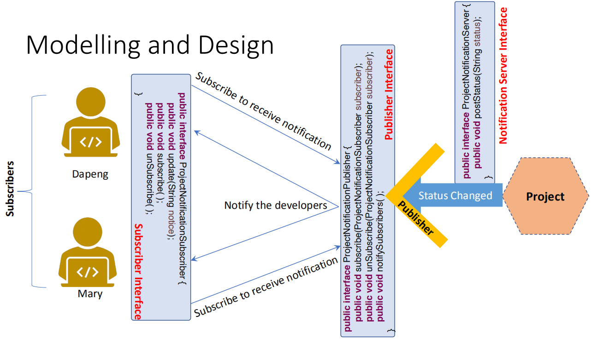

Design Patterns
## 一、基础
1，什么是design pattern

每个模式都描述了我们环境中反复发生的问题，然后描述了该问题解决方案的核心，这样您就可以多次使用这个解决方案，而不会以同样的方式做两次。

设计模式使它能够更容易地重用成功的设计和架构

2，动机
- 查找适当的对象Find appropriate objects
  - 在设计中需要考虑的因素太多了，例如，继承、封装、多态性、单一责任、接口编程等
- Determine object granularity
  - 系统中的对象的大小和数量
  - 类设计中的层次结构的级别
  - 组成与继承之间的关系
- 提高可重用性Improve reusability
- Design for change

4，软件工程中的设计模式

5，The Classical Design Patterns

6，设计模式的分类（重点）

| Creational | （处理对象的创建）                 |
|------------|------------------------------------|
| Structural | （处理类或对象的组成）             |
| Behavioral | （处理类或对象的交互和职责的分配） |

7，Elements of a Pattern

格式

**8，如何选择一个设计模式？(重要)**
- 考虑设计模式如何解决设计问题。
  - 如何识别适当的对象，
  - 如何确定对象的粒度，
  - 如何指定对象接口，
  - 如何指定对象实现，
  - 如何平衡类继承和接口继承之间，
  - 考虑编程到接口，而不是实现
- 查找设计模式的意图，以查找匹配项。
- 了解设计模式之间的相互关系
- 考虑如何使你的设计可重用。

**9，Agument(重要，why，how)**
- 设计模式使代码难以读取、理解/调试。
- 设计模式使软件结构更加复杂。
- 不恰当地使用设计模式会使事情变得更糟。
- 不要对简单的问题使用设计模式
10，总结

对着设计者模式

为什么使用
- 查找适当的对象Find appropriate objects
  - 在设计中需要考虑的因素太多了，例如，继承、封装、多态性、单一责任、接口编程等
- Determine object granularity
  - 系统中的对象的大小和数量
  - 类设计中的层次结构的级别
  - 组成与继承之间的关系
- 提高可重用性==Improve reusability==
- Design for change

为什么不用

• make **code** ==hard to read/understand/debug==.

• make software ==structure complex==.

• Use design patterns ==inappropriately== can ==make things worse==.

• ==Don’t== use design patterns for ==simple problems==.

开始介绍常用的设计模式
## 二、单例模式
Singleton Pattern

(Purpose: Creational, Scope: Object)

1，问题和应用

如何确保一个类只有一个实例存在（解决这个问题）

应用程序
- 操作系统使用文件系统来管理文件
- 用来访问硬件的接口
- 静态配置数据（配置文件）
- 用于日志记录的对象（日志记录器）
- 可访问高速缓存存储器
- 线程存储池
2，案例分析

Hardware Interface Access Example

Simulation of Hardware Interface Access

为每个用户创建一个打印机驱动程序的实例。

The Results from Running the Simulation

**3，问题和解决方案**

The Problems with the Current Design and the Solutions

问题1：打印机驱动程序的两个实例将尝试同时打印单独的文档。打印机对这两个单独的文档一无所知。打印机只是简单地打印了收到的数据，而不知道是谁发送的。

问题2：打印机驱动程序的两个实例之间没有协调。如果有协调员，则当用户数量尝试同时使用打印机时，将很难实现。

解决方案

1）. Use static methods

2.） Use the Singleton Pattern

I. Make constructors private

II\. Create an attribute to store an instance of itself

III\. Use a public operation to get the instance of the object.

详解

1）. Use static methods

关键：使打印驱动程序类中的打印方法静态和同步，以便在程序中只创建一个打印方法的副本，并且同步关键字确保一次只有一个线程可以访问打印方法。

**2.） Use the Singleton Pattern**

I. Make constructors private

II\. Create an attribute to store an instance of itself

III\. Use a public operation to get the instance of the object.

懒汉单例

饿汉选择直接创建

单例模式最好的方案--双重锁，使用关键字volatile

先外侧检查是不是null，进来后用synchronized加锁，再次检查

一个“双重检查”的锁。只有在第一次创建实例时，所有其他线程才需要等待

打印机驱动程序的一个实例已被热切地创建并准备好使用。没==有线程需要等待检索该类的实例。但这可能是在浪费资源==

Use enum is the best way to implement singleton in Java.

4，**Static Methods vs. Singleton**(重要)
<table>
<colgroup>
<col style="width: 100%" />
</colgroup>
<thead>
<tr class="header">
<th>

<ul>
<li>
Accessibility

<ul>
<li>
静态方法方法：每个类都可以自由访问静态变量。
</li>
<li>
单例方法：容易控制谁得到实例
</li>
</ul></li>
<li>
Flexibility

<ul>
<li>
静态方法方法：只有一个副本。
</li>
<li>
单例方法：如果需要，可以配置具有指定实例数量的方法。
</li>
</ul></li>
<li>
Clarity

<ul>
<li>
静态方法方法：可能会污染名称空间（例如，在C++的上下文中）
</li>
<li>
单一的方法：不需要创建全局可见的变量。
</li>
</ul></li>
</ul></th>
</tr>
</thead>
<tbody>
</tbody>
</table>

<table>
<colgroup>
<col style="width: 100%" />
</colgroup>
<thead>
<tr class="header">
<th>
• Accessibility

<blockquote>

• Static methods approach: every class can freely access static variables.

• Singleton approach: easy to control who get the instance.

</blockquote>

• Flexibility

<blockquote>

• Static methods approach: only one copy exactly.

• Singleton approach: if it needed, it can be a configured with a specified

number of instances.

</blockquote>

• Clarity

<blockquote>

• Static methods approach: can pollute name spaces (e.g., in the context of

C++)

• Singleton approach: there is no need to create globally visible variables.

</blockquote></th>
</tr>
</thead>
<tbody>
</tbody>
</table>
5，structure

在类中创建类的唯一实例

确保类的构造函数设置为私有，以便没有人可以实例化该类的对象。

创建一个公共方法，以便其他类可以获得在内部创建的类的实例。

5，设计意图和适用性

“确保类只有一个实例，并提供对它的全局访问点。

应用程序只需要一个类的一个实例。

该实例的使用者必须从定义良好的访问点来访问它

消费者应能够使用扩展实例（子类），而无需修改消费者端的代码。

6， 重要性
<table>
<colgroup>
<col style="width: 100%" />
</colgroup>
<thead>
<tr class="header">
<th>
Advantages:

<blockquote>

严格控制客户端如何以及何时访问类的实例

可用于替换全局变量。

控制可以创建的实例数

</blockquote>

缺点：

<blockquote>

在多线程环境中使用时需要小心

</blockquote></th>
</tr>
</thead>
<tbody>
</tbody>
</table>
<table>
<colgroup>
<col style="width: 100%" />
</colgroup>
<thead>
<tr class="header">
<th>
• Advantages:

<blockquote>

• Have strict control over how and when a client can access an instance of a

class.

• Can be used to replace globe variables.

• Control the number of instances that can be created.

</blockquote>

• Disadvantage:

<blockquote>

• Need to be careful when used in a <mark>multi-threaded</mark> environment.

</blockquote></th>
</tr>
</thead>
<tbody>
</tbody>
</table>

7，在多线程环境中使用时需要小心

## 三、工厂模式
(要)

Factory Method Pattern

(Purpose: Creational, Scope: Class)

理解

通过工厂子类来确定究竟该实例化哪一个具体类

==在工厂模式中，如果你要新增一个产品，不需要修改原有工厂类的逻辑，但是你需要新增一个工厂（开闭原则）==

==比如一个拖拉机工厂，现在增加一条工厂线来生产口罩（扩展优于修改==

所以需要的是，增加一个新工厂

新的任务时，增加一个新的工厂

1，设计意图和适用性

工厂方法模式将特定于应用程序的类与具体类型的实例化解耦。

Factory Method pattern decouples application-specific classes from

the instantiation of concrete types.

使用接口来创建对象，但可以让子类决定要实例化哪个类。

Use an interface for creating an object, but let subclasses decide

which class to instantiate.

在以下情况下，请考虑使用工厂模式：

类无法预期它必须创建的对象类。

一个类希望其子类能够指定它所创建的对象。

类将责任委派给几个助手子类中的一个，并且您希望本地化哪个助手子类是委托的知识。

2，案例日志分析器

Log Parser Example

根据日志文件的类型创建一个分析器

处理方法1

基于应用程序上下文实例化对象

Instantiate an Object based on the Application Context

Instantiate an Object based on the Application Context

方法2-Parameterized Factory参数化的工厂

## 
## 
## 四、Façade Pattern外观模式
(Purpose: Structural, Scope: Object)

(什么时候，怎么样，重点，不会很细节，)

<table>
<colgroup>
<col style="width: 100%" />
</colgroup>
<thead>
<tr class="header">
<th>
隐藏了系统的复杂性

要求一个<mark>子系统的外部</mark>与<mark>内部的通信</mark>必须通过一<strong>个统一出的对象进行</strong>。外观模式提供一个高层次的接口，使得子系统更易使用

最大的缺点：不符合开闭原则，因为要适应子系统的变更
</th>
</tr>
</thead>
<tbody>
</tbody>
</table>

1，设计意图和适用性
- 为子系统中的一组接口提供一个统一的接口。面板定义了一个更高级别的界面，它使子系统更易于使用
- 提供一个连接到复杂子系统的简单接口
- 由于客户端与抽象的实现类之间存在许多依赖关系，因此从客户端分解子系统
- 使用facade来为分层设计的每个子系统定义一个入口点

2，Application Scenarios

操作系统使用立面将许多框架组合成一个框架。

程序编译器使用外观，使程序员的生活更容易。

Web服务使用立面作为入口点

数据库连接器，例如，Java数据库连接(JDBC)使用立面来隐藏建立连接的复杂性

3，Issues and Improvement

客户端正在调用系统中的各种组件，使==设计结构复杂==，并且具有==太多的依赖关系。==

违反开闭原则

提供一个可封装子系统或复杂流程的立面

4，Using a Façade

5，

## 五、适配器模式
Adapter Pattern

(Purpose: Structural, Scope: Class & Object)

**使得不兼容的东西兼容到一起，**

**比如，帮助手语播报员，帮助失聪听众“听懂”信息**

1，设计意图和适用性(要求)

将类的接口转换为客户端所期望的另一个接口。适配器允许由于不兼容的接口而不能使用的类一起工作。

==Convert the interface of a clas==s into another interface clients expect.

Adapter lets classes work together that couldn't otherwise because of

incompatible interfaces

- 使用现有的类，但其接口与您所需的接口不匹配。
- 创建一个与不相关类或不可预见类协作的可重用类，即不一定具有兼容接口的类。
- 使用几个现有的子类，但通过对每个子类来调整其接口是不现实的。对象适配器可以调整其父类的接口。

2，Application Scenarios

有多个数据库访问者Multiple database accessors

使用具有不兼容接口的工具包类

与桥接不兼容的接口相关的其他通用问题

例如，手机充电器和适配器、存储卡适配器、电插头和适配器等。

3，案例

4，Extend the Capability of the Application

5，Challenges with the Extension

文本文件和MP3文件在许多方面都有所不同：

我们可以播放MP3文件，但无法显示其内容。

播放MP3文件并显示文本文件将使用不同的API集。

6，解决该问题的基本技术

Inheritance vs. Object Composition

类适配器
- 当我们想调整一个类及其所有子类时，一个类适配器将无法工作。
- 适配器会覆盖适配器的一些行为。
其他适配器
- 适配器会覆盖适配器的一些行为。
- 单个适配器可与许多适配器一起工作
- 该适配器还可以同时向所有适配器添加功能。
- 更难超越适应性的行为。

## 六、观察者模式
Observer Pattern

(Purpose: Behavioral, Scope: Object)

定义对象间的一种一对多的依赖关系，使得每当一个对象状态发生改变的时候，其相关依赖对象皆会得到通知并自动更新

(催债务，张三有钱的时候，还给一堆债主)

比如，张三向五位朋友借钱，时间到后，五位朋友需要张三还钱，但是张三没钱，

1，设计意图和适用性

定义：定义对象之间的一对多依赖关系，以便当一个对象更改状态时，将自动通知并更新其所有依赖关系

- 当更改到一个对象时，<u>需要更改未知的其他对象的数量</u>时
- 当一个对象应该能够通知其他对象，而不假设这些对象是谁时。
- 当一个抽象有两个方面时，一个方面依赖于另一个方面

2，示例：项目通知服务（不写code）

五，Summary of Creational Design Patterns(不需要)

