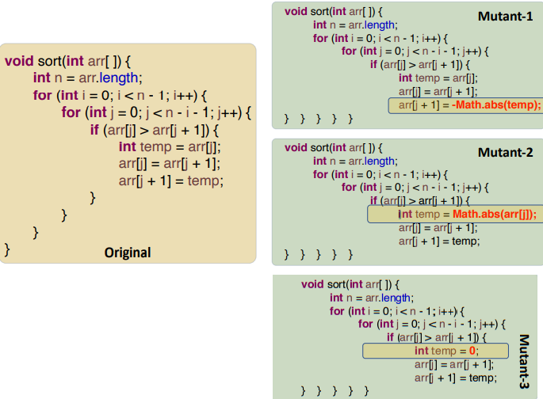
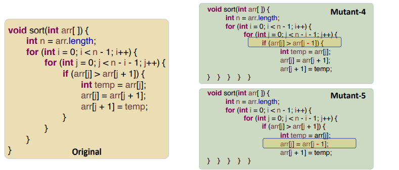
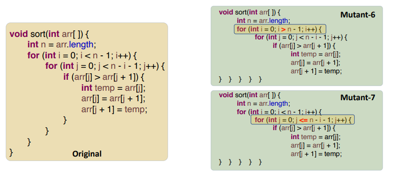
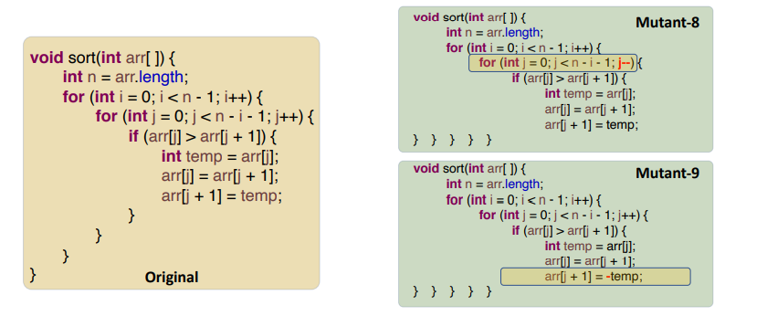
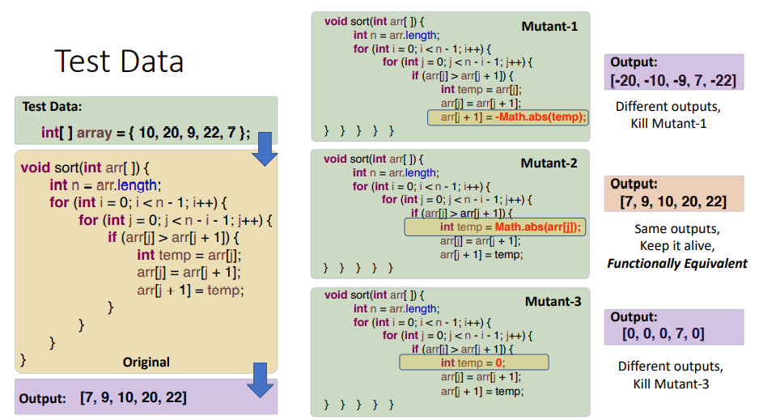
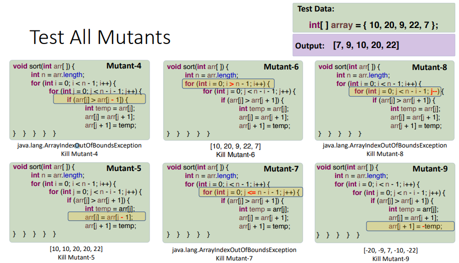
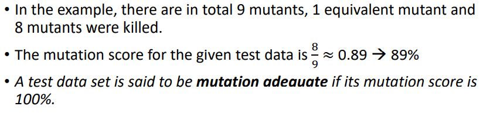

## 一、Mutation Testing变异测试内容

1，In mutation testing, faults are intentionally introduced into a program.有意的引入程序
The faulty programs are called **mutants** of the original program.
一个mutation operator 视为一个 rule
Mutation operators为设计为代表 程序中中常常犯的错
2，A Version of Mutation Operators for FORTRAN—77

<table>
<colgroup>
<col style="width: 9%" />
<col style="width: 11%" />
<col style="width: 10%" />
<col style="width: 68%" />
</colgroup>
<thead>
<tr class="header">
<th>Mutation Operator</th>
<th>Description</th>
<th>Example</th>
<th></th>
</tr>
</thead>
<tbody>
<tr class="odd">
<td>ABS</td>
<td>
forces each arithmetic expression to take on a zero value,

a positive value, and a negative value;
</td>
<td>Change a value x to be -ABS(x), ABS(x), and 0</td>
<td>

</td>
</tr>
<tr class="even">
<td>AOR</td>
<td>replace each arithmetic operator with every syntactically legal operator;</td>
<td>Change an operator from {+, -, *, /, %} to be each of the other operators.</td>
<td>

</td>
</tr>
<tr class="odd">
<td>LCR</td>
<td>Replaces <strong>each logical connector</strong> (AND and OR) with several kinds of logical connectors;</td>
<td>Chane a <strong>logical expression</strong> (x op y) to be (x || y), (x &amp;&amp; y),(x), (y), (x op true), (x op false), (true op y), (false op y). (op is the operator)</td>
<td></td>
</tr>
<tr class="even">
<td>ROR</td>
<td>Replaces relational operators with <strong>other relational operators;</strong></td>
<td>Change <strong>a relational expression</strong> (x op y) to be (x &lt; y), (x &lt;=y), (x &gt; y), (x &gt;= y), (x != y), (x == y), (y), (true), (false).</td>
<td>

</td>
</tr>
<tr class="odd">
<td>UOI</td>
<td>Inserts unary operators in expressions在表达式中插入一元运算符</td>
<td>Insert each of { !, -, ++, --} as a <strong>prefix operator</strong> before an expression and both of { ++, --} after an expression as a postfix operator.</td>
<td></td>
</tr>
</tbody>
</table>

3,The Coupling Effect耦合关系
The coupling effect has been supported through experimental studies and
theoretical analysis.

二、测试步骤
1，**制造mutants**，Construct mutants of a program under testing
Each mutant is a version of the original program

每个mutant只有一个错误
2，**Generate test case and test data**
目前没有很好的方法来生成广泛的数据

One method is to start from looking at the variables that will cause the mutation operator to be triggered.
3，**Feed the test data to the original program**
• If the output is incorrect, the program must be fixed and the process restart.

• If the output is correct, proceed to the next step.
4，**Test data 要根据每一个mutant进行测试**
5，**Compare the output** from each mutant with the output from the
original program:
1\. If the outputs are different, the mutant will be killed by the test data.

2\. If they are the same, we call the mutant is functionally equivalent to the

original program.

1\. The test data cannot kill the mutant, because

1\) the mutation operator is noteffective,

2\) the test data is inadequate,

3\) the program contains some faluts.

6\. The goal is to kill all the mutants after execution of all test cases.
7\. There are many mutation testing tools to automate the process

三、案例

四、
1，Mutation Score
用mutant score 来衡量mutant test的效率
• The mutation score for a set of test data is the percentage of **nonequivalent mutants killed by that data.**杀死的非等效突变的百分比。

2，Identifying Fault Targets

五、summary
• Mutation testing is a form of fault-insertion testing.

• Inserting faults into mutants’ source code is often referred to as Strong Mutation.

• Mutation testing can be used to:
• Show that some particular faults inserted do NOT exist in the original program’s source code;

• Verify the validity of the test cases created (measured by mutation score and

mutation adequate test data).

• The goal is to achieve full coverage of the possible mutations identified.
• To the computational complexity of the test, we often consider using the selective mutations, i.e., the offutt’s 5 sufficient mutation.

• The effectiveness of mutation testing depends on how well the
selected mutation operators reflect actual patterns of faults in the
source code.

• It shows the absence of particular faults.

• It provides an assessment of the quality of the data data.

• It is costly to execute and time consuming to identify test data.

