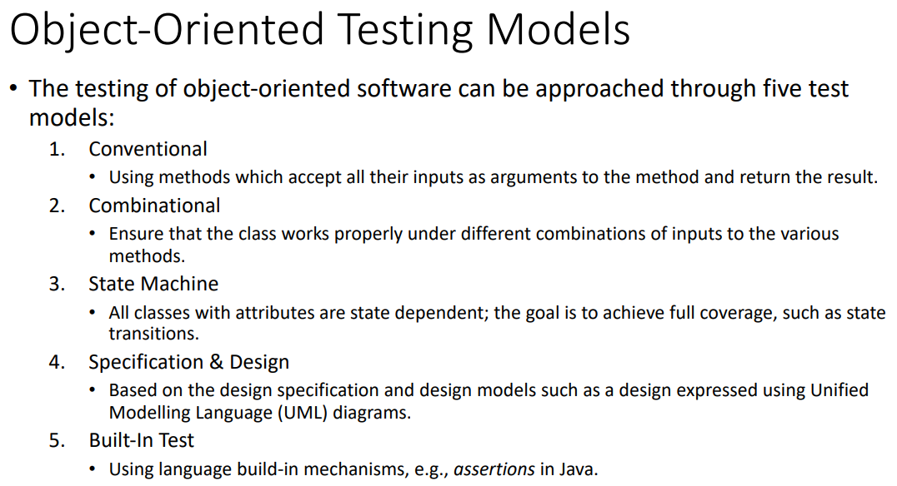
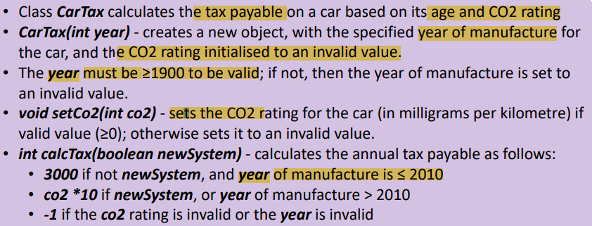
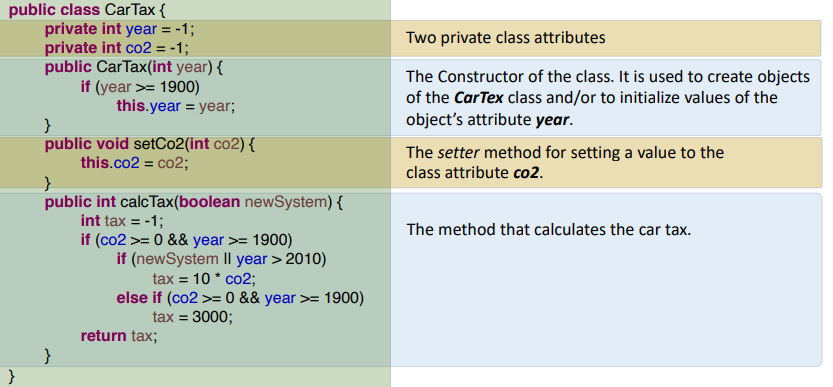
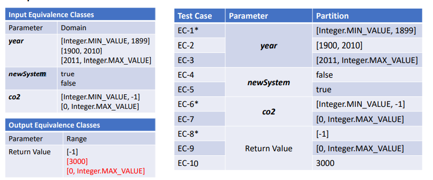
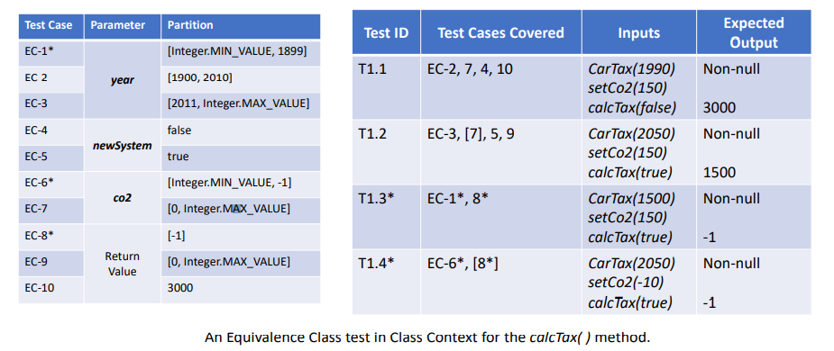
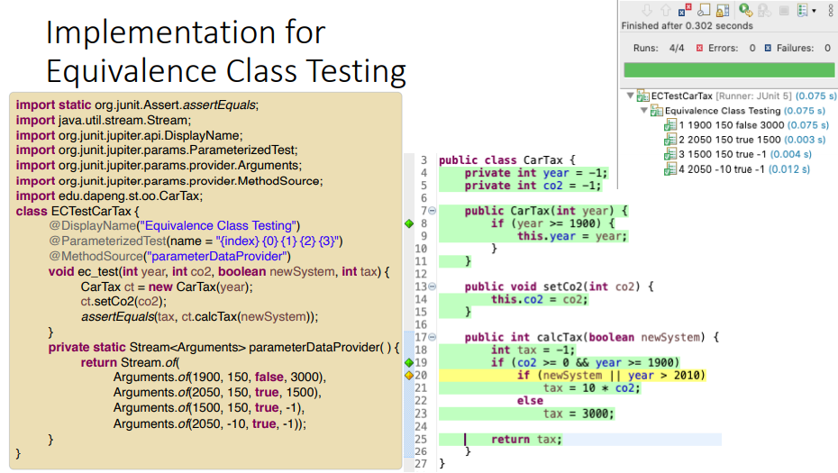
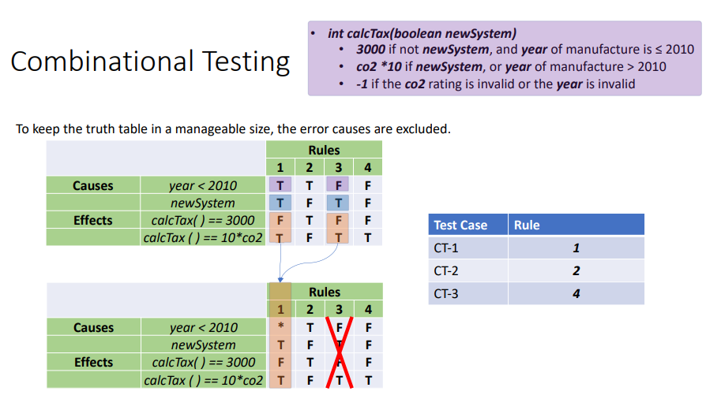
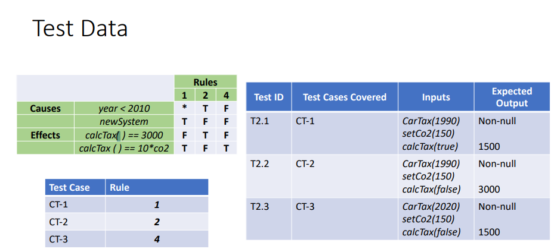
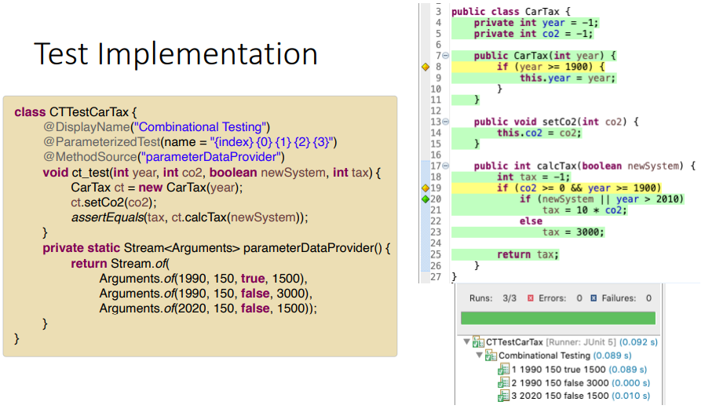
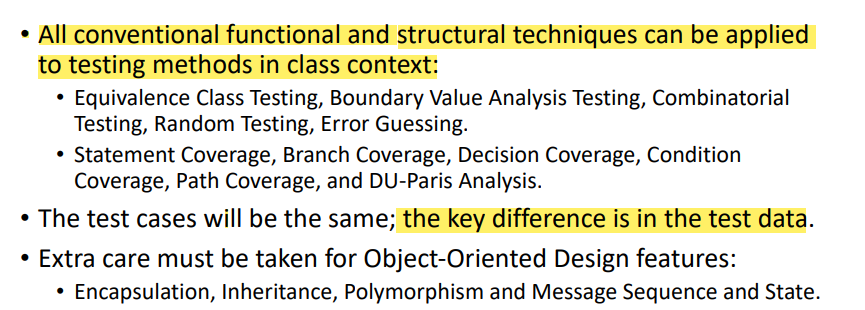

## 一、内容

1，Object-oriented design is centered around the concepts of c**lasses,**
**inheritance, and messages.类、接口、方法**

| Classes     | objects preserve state; state control is typically distributed over an entire program. State control errors are likely to occur         |
|-------------|-----------------------------------------------------------------------------------------------------------------------------------------|
| Inheritance | dynamic binding & complex inheritance structures are prone to faults.                                                                   |
| Message     | object-oriented programs typically have many small components and therefore more interfaces. Interface errors are more likely to occur. |

## 二、步骤

1，列出input，output的范围
重叠的分区，但是根据规范，它们应该被视为独立的类。
2，组合test data
3，测试

## 三、案例

题目：

源代码

1，列出input，output的范围
重叠的分区，但是根据规范，它们应该被视为独立的类。
Overlapped partitions, but based on the specification, they should be treated as separate classes.

2，组合test data

3，测试

## 四、Combinational Testing

用组合测试来处理该类问题

## 五、Summary

