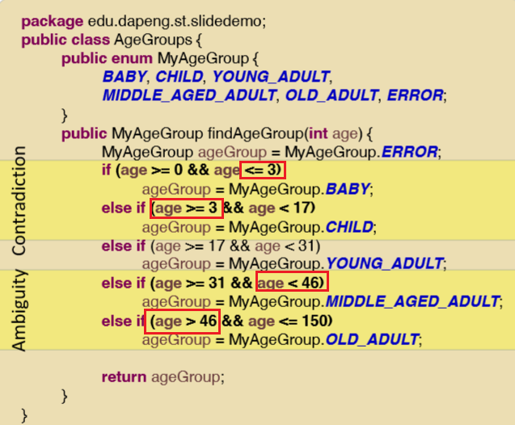
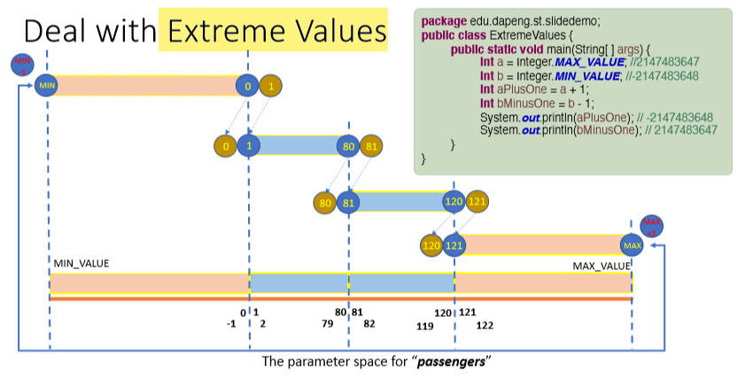
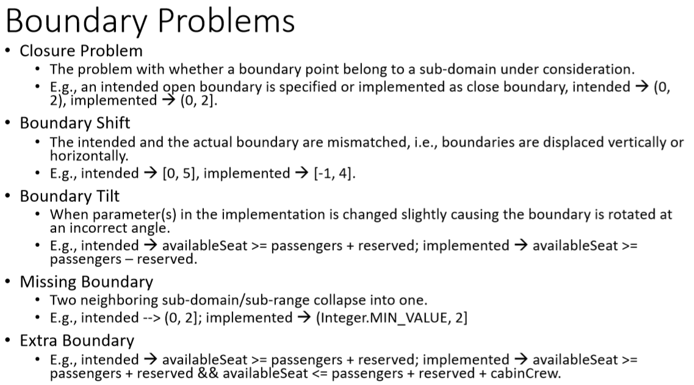

# 4-Boundary Value Testing 边界测试
## 一，基础知识

1，问题

定义域定义模糊，存在漏洞，under-defined processing.；
自相矛盾the over-defined processing.

2，Boundary Value Testing
许多缺陷隐藏在边界处

## 二，步骤

<table>
<colgroup>
<col style="width: 100%" />
</colgroup>
<thead>
<tr class="header">
<th>
1，根据题目，确定input和output的个数，写出input的取值范围和output的所有可能性

2，<strong>取值范围的边界值</strong>作为测试案例，列出test case【可以先列出各种范围，易于找到边界】

3,写出Test data，在这里边界值作为测试数据

注意：先列出合法的案例，覆盖所有可能性

非法的放在最后一起测试，

4，测试

5，修改
</th>
</tr>
</thead>
<tbody>
</tbody>
</table>

案例

1，根据题目，确定input和output的个数，写出input的取值范围和output的所有可能性

2，取值范围的边界值作为测试案例，列出test case【可以先列出各种范围，易于找到边界】

3,写出Test data，在这里边界值作为测试数据

4，测试

5，修改错误

案例2

1，根据题目，确定input和output的个数，写出input的取值范围和output的所有可能性

2，取值范围的边界值作为测试案例，列出test case【可以先列出各种范围，易于找到边界】
3,写出Test data，在这里边界值作为测试数据

3，测试

4，根据错误的测试案例找到错误

5，修改

## 三，补充

1，“Create test cases for each boundary value by choosing one point on the boundary, one point just below the boundary, and one point just above the boundary.”
要判断断点的前或后，对其测试

2，对极限的数，会循环回开头

3， Need to cover all the equivalence classes

5，常见的边界值问题

经常发生！

