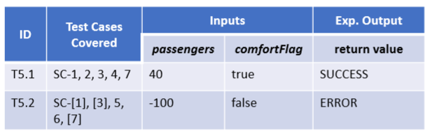

## 一，介绍

1，Structural testing 结构测试，通常在functional testing后使用
1，Structural testing 【又名 white-box testing】：基于实现的测试或**基于代码的测试。**
3，测试被设计用来评估程序代码的特定方面，如语句或决策。
4，提供实现的覆盖范围，但不提供规范的覆盖范围。

## 二，分析

1，Structured Programming Constructs

在图中标出Branch ID，Line numbers， T（只要正确的标出就好啦）， Node numbers

2，Decision vs. Condition
<table>
<colgroup>
<col style="width: 100%" />
</colgroup>
<thead>
<tr class="header">
<th>
Condition :单个判断，组成了decision

Decision ：if()里的一行
</th>
</tr>
</thead>
<tbody>
</tbody>
</table>

3，Each statement in the source code is a test case.
Each node in the control flow graph is a test case.

## 三，实现步骤

1，根据代码，画出节点图
2，确定test cases，每个node为一个节点
3，find paths，出现的node都要被path覆盖，path数量要最小的，
4，列出test data
5，测试，找出错误，修正

案例
1，根据代码，画出节点图

2，确定test cases，每个node为一个节点

3，find paths，path数量要最小的，**所有的node都要被path覆盖**
Find minimum numbers of path that cover all nodes in the graph.
每一条path是一个test

4，列出test data

5，测试，找出错误，修正

测试方法不唯一

## 四，Coverage Criteria

指已通过测试的组件的百分比。
例如，100%的语句覆盖率意味着程序中的所有源代码行在测试期间至少执行了一次

## 五，总结

1， There is no differentiation between error and non-error cases for structural testing.
**2，语句覆盖通常在function testing后使用。**
•在实践中，应消除重复的测试用例。
5，必须执行每一行源代码；通过在测试期间执行源代码中的所有语句，它提供了最低级别的覆盖率。
6，语句覆盖率通常用于少量的测试。

·
