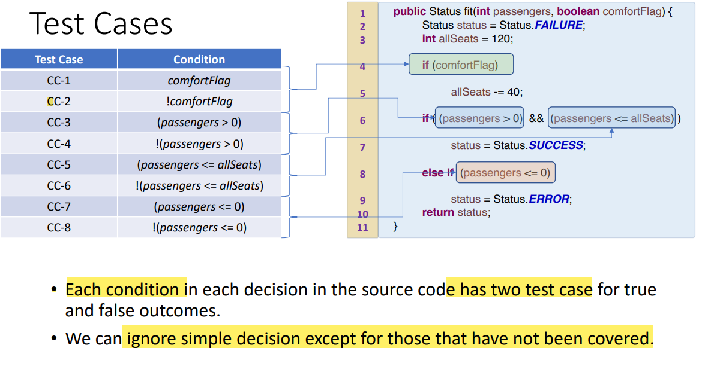
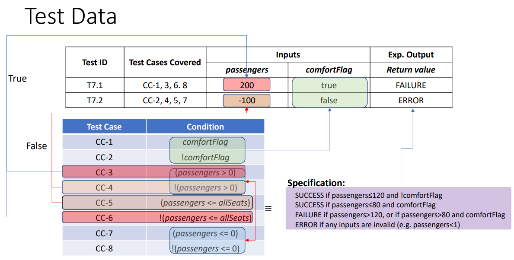
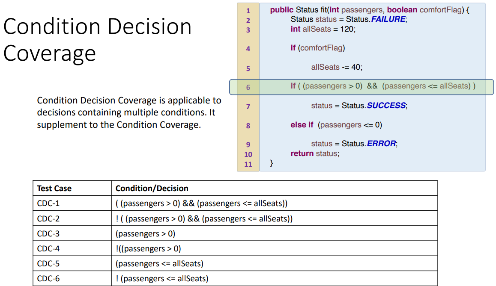
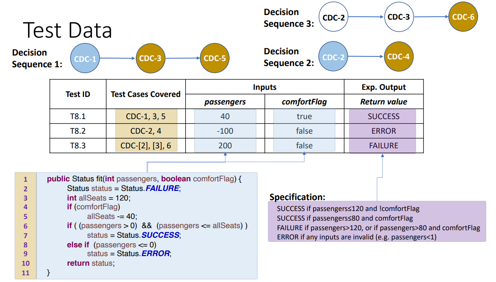
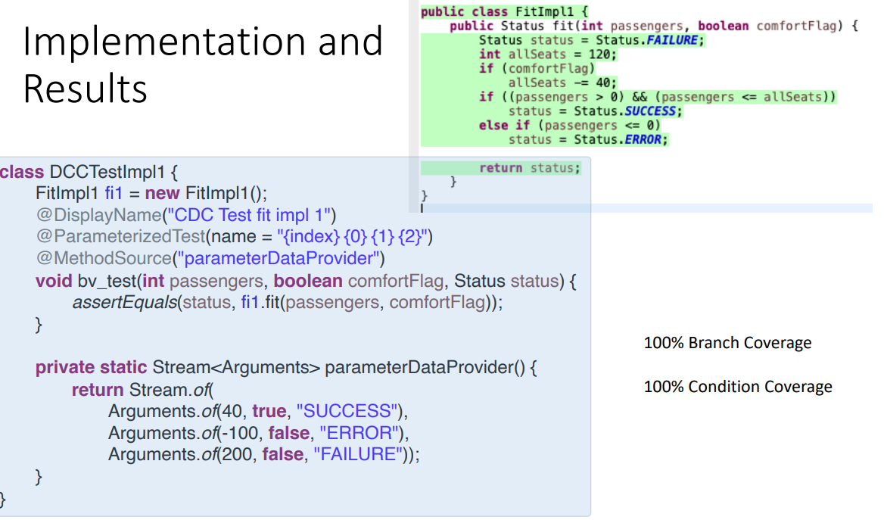
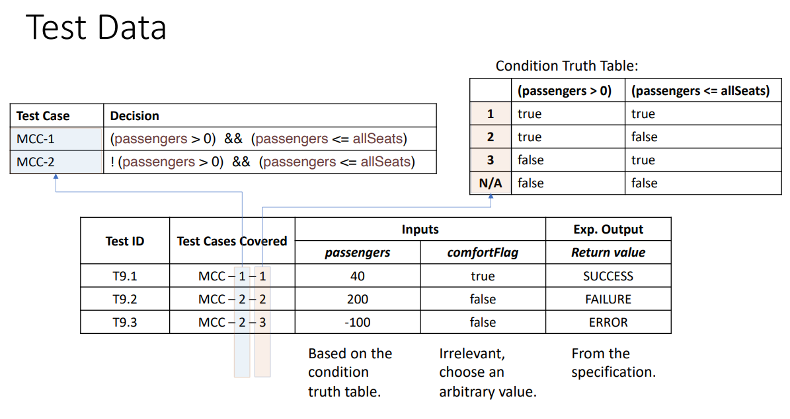

| **Condition Coverage**          | **if条件的判断是单个的**   | **每个if的括号的取正负**                     |
|---------------------------------|----------------------------|----------------------------------------------|
| **Condition Decision Coverage** | **if条件里的判断是多个的** | **对于多个的，取正负，再对其中单独的取正负** |

## 一、Condition Coverage

1,内容
1),条件覆盖的目标是为每个决定中的每个条件取true和false值。
2),决策必须在每个条件的两个可能值下执行\[true,false\]。
3),建议不考虑语言特有的特性。例如，短路

2，Condition Coverage【CC】步骤：
1，列出所有的input【是if条件里面的一段判断，有多个就拆分开】，每个input的true和false作为不同的两个case
2，列出test case ,每个input的true和false作为不同的两个case
3，Test data ，要覆盖所有情况
4，测试

## 案例

1，列出所有的input【是if条件里面的一段判断，一条if可能含有多个】，
2，列出test case ,每个input的true和false作为不同的两个case

如果单个的decision已经被覆盖了，我们可以忽略它

3，Test data ，要覆盖所有情况

4，测试

**二、Condition Decision Coverage【CDC】**
1，
条件决策覆盖适用于包含**多个条件的决策**。
它是对条件承保范围的补充。
2，
步骤重点：
1，找有多个语句组合而成的if语句进行分析
2，列出decision sequence
3，test case，test data
4，测试
案例
1，找有多个语句组合而成的if语句进行分析

2，列出decision sequence

3，test case，test data

4，测试

三，Multiple Condition Coverage【MCC】
多个条件覆盖适用于包含多个条件的决策。

N/A:不符合实际情况

四、
注意if 后面的else if，关注if中的条件

