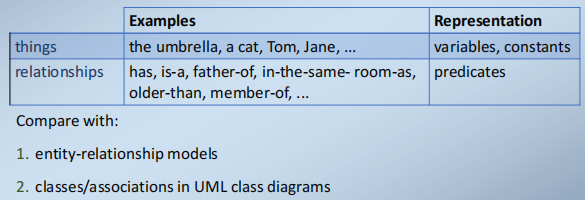
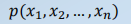
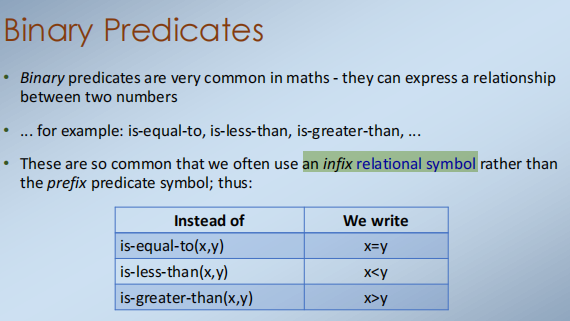
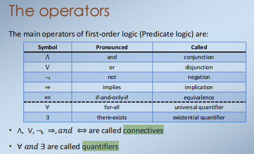
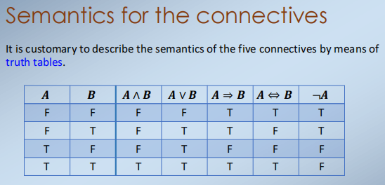
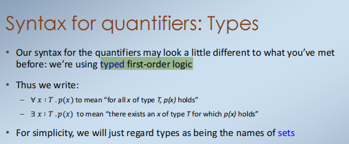
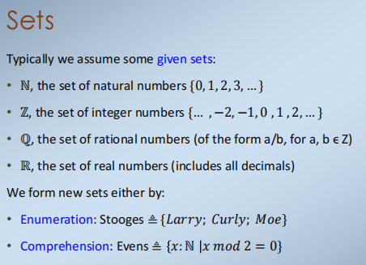
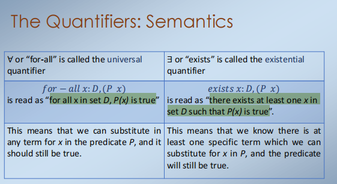
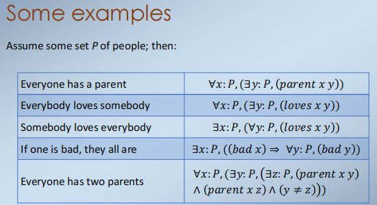

1，Predicate logic

Predicate logic is the logic for discussing things and relationships between things.

1）基本单元

2）这是一个布尔类型的表达，返回true，当且仅当如果用p表示的关系为其参数𝑥1，𝑥2，……，𝑥𝑛。
3）参数在任何给定的谓词中的数量（上例中的n）都是固定的，并称为该谓词的集合arity。
4）Specific examples of arities include: **nullary, unary, binary, ternary, ..., “n-ary”**

Unary Predicates
一元谓词在数学和其他地方中也很常见
... for example: is-even, is-positive, is-prime, is-human, .
值得注意的是，每个一元谓词都直接对应于一个集合
所有偶数的集合，所有正数，所有质数的集合等等
Such a predicate is called the characteristic predicate of the set

Nullary Predicates
是“琐碎”的情况。
因为没有参数，在逻辑中我们经常省略为它们写括号；因此我们写p，q，r，……而不是p()，q()，r()，..。
这些计算结果为真或假，而不参考其他任何东西——它们对应于布尔变量
在逻辑学中，这些命题通常被称为命题proposition
一个命题只是一个谓词的一种特殊情况，它不需要任何论证。

2，operators

1）

2）

