1，Terms
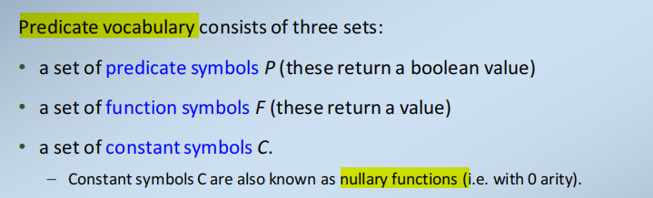
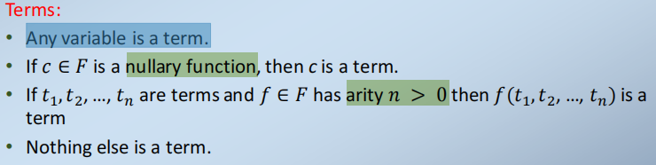
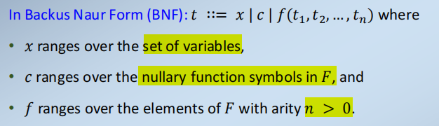
==例子==
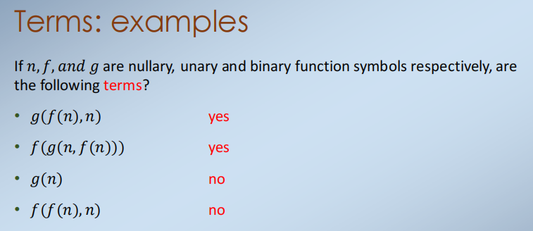

2，**Formulae** of Predicate Logic
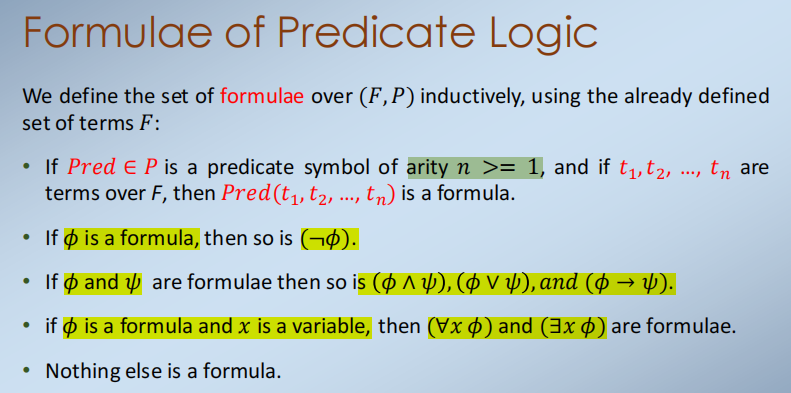

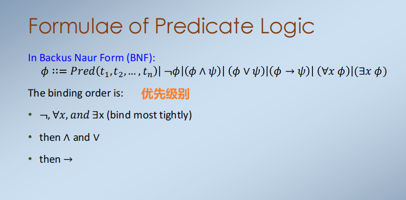

3，parse trees
用来表示predicate logic formulae
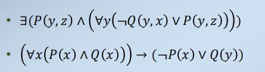

==不懂==
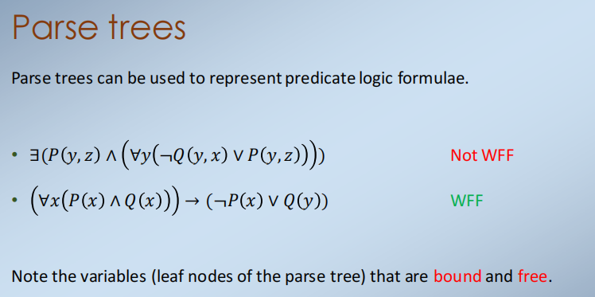

4，Scope
量词∀和∃的证明规则涉及到操作变量。
这里重要的是确保不会导致变量不适当地更改其作用域。
我们编写𝑖∶𝑆来表示在证明的一部分中引入了一个𝑆类型的变量𝑖。

在书面证明中，我们还在我们使用变量𝑖的行周围放置了一个方框，这样我们就可以跟踪它的范围。

==5，Free and Bound variables==

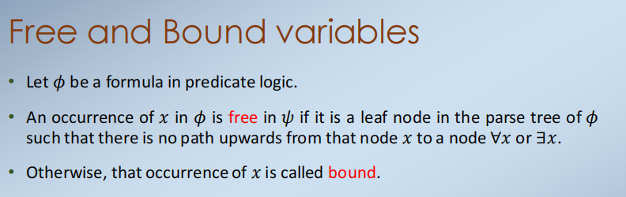
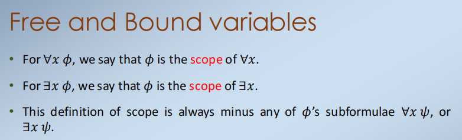

==6，substitution==

替换：给定一个变量𝑥、术语𝑡和公式𝜙，我们将𝜙\[𝑡/𝑥\]定义为用𝑡将𝜙中变量𝑥自由出现的每次替换得到的公式。
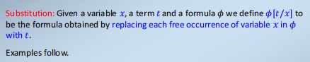

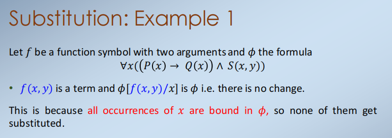

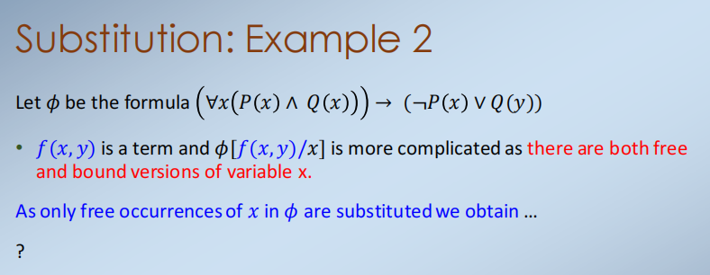

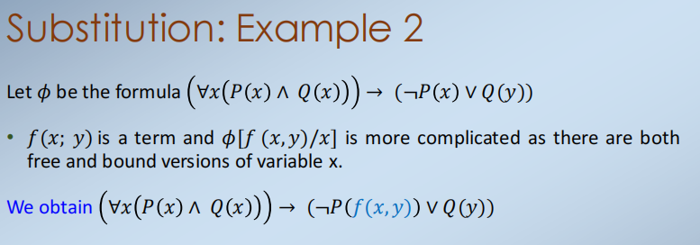

7,Natural Deduction Proof Rules for Predicate Logic
证据与命题逻辑的证据相似
添加了证明规则来处理量词（引入和消除规则）和相等符号。
我们超载了先前建立的命题连接词∧，∨，...的证明规则，因此任何命题逻辑的证明规则对于谓词逻辑的逻辑公式仍然有效

8,Natural Deduction Proof Rules: Equality
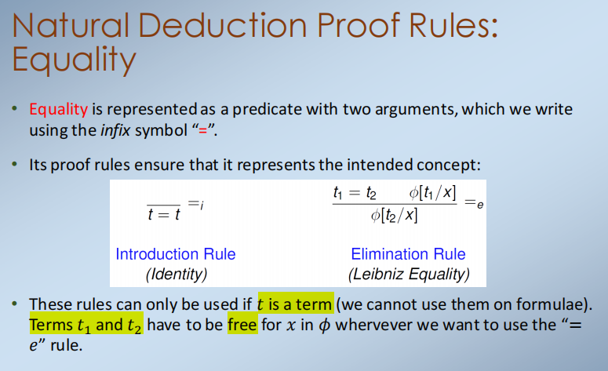

9,Proof rules for forall
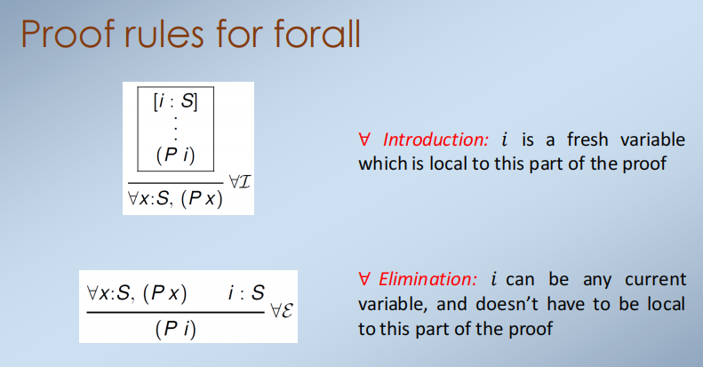

10, Proof rules for exists

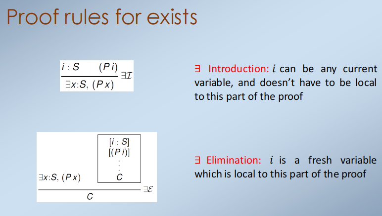

