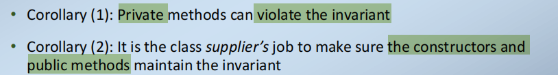
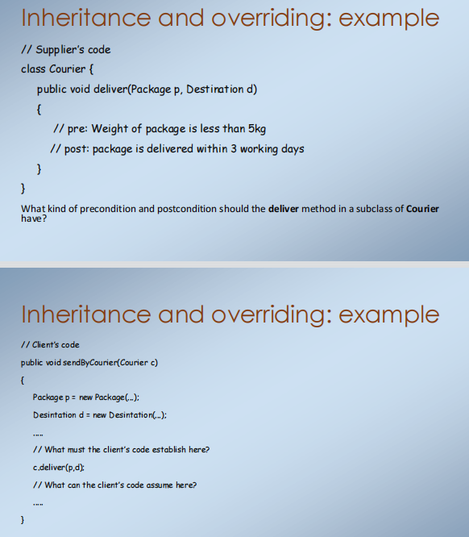

1，Design by Contract
与OO设计基本相关联
2，每个类都有两个与之相关的“角色”：
<table>
<colgroup>
<col style="width: 16%" />
<col style="width: 83%" />
</colgroup>
<thead>
<tr class="header">
<th>supplier</th>
<th>编写类代码，编写文档，维护它，了解类的实现，发布类接口</th>
</tr>
</thead>
<tbody>
<tr class="odd">
<td>client</td>
<td>
在它们自己的代码中使用该类，读取文档（大概），

了解该类接口，对该实现一无所知
</td>
</tr>
</tbody>
</table>

3，使用“传统”方法可能存在的陷阱
无DBC时
客户机可能不理解在哪种情况下可以使用一种方法

客户端可能无法完全理解运行一个方法的后果

当supplier更改实施时，他们如何确保保留接口？（大规则：不要破坏client的旧代码）

4，Main principles of DbC:
每一种公共方法都有一个先决条件precondition和一个后置条件postcondition
该先决条件表示了该方法将正常工作的约束条件
后置条件表示当一个方法正确执行时将会发生什么

先决条件和后置条件是布尔值表达式，即它们的求值为真/假

5，定义先决条件和后置条件，建立一个从supplier到client的合同：
如果client在满足先决条件的情况下运行该方法
然后，supplier将确保方法的执行将始终提供一个满足后置条件的状态

6，
|         | precondition                                           | poscondition                               |
|----------|--------------------------------------------------------|--------------------------------------------|
| client   | 责任：在调用该方法之前，我必须确保该前提条件是正确的   | 好处：我保证假设条件                       |
| supplier | 好处：我可以假设，在编写该方法时，这个前提条件是正确的 | 责任：我必须确保在编写该方法时满足后置条件 |

7，Preconditions: the supplier’s benefit
非冗余原则：一种方法的主体不得检查该前提条件是否成立
这一DBC原则与防御性编程相反
DBC降低了这些额外检查的开销和复杂性
另外：也许客户已经检查了前提条件（为了其他目的）-我们需要检查多少次？

8，Precondition Availability
先决条件可用性规则：在例程的前提条件下出现的每个特性都必须对例程可用的每个客户端可用
这是一个合理的要求，因为客户端必须在调用方法之前建立先决条件。
因此，例如，方法前提条件不应该引用类的私有属性。
编译器可以检查此规则是否成立。
后置条件也并非如此——它可能涉及私有属性（为什么？）

9， Important: Violating an Assertion
What happens if an assertion (pre- or post-condition) is not satisfied?

然后，当运行代码时，将违反了断言。这意味着在代码中有一个错误
应该抛出异常，告诉用户已经违反了什么断言（即它在何处），以及它是如何被违反的

如果违反了前提条件，那么该错误就在client的代码中
如果违反了后置条件，那么该错误就在supplier的代码中

1）What assertions aren’t
断言并不是一种输入检查机制
断言是从软件到软件的合同。
它们不是软件对用户的检查，或软件对设备的检查。
来自设备/用户的错误输入应该通过编写适当的代码来处理。

断言不是控制结构
一个可以正常工作、无bug的软件不应该抛出断言。
您的代码不会试图捕获断言异常并修复某些问题。
• (compare: exceptions are not a control structure)

10，Class Invariants
A class invariant is just an assertion involving the (class and) instance variables

类的所有对象必须在所有稳定时间内满足不变量，即
-在执行任何一个构造函数之后
-在执行每个公共方法之前和之后

推论（1）：私有方法可以违反不变变量
推论（2）：类供应商的工作是确保构造函数和公共方法保持不变

Consequences of the class invariant
如果不定义构造函数，则默认构造函数（或类初始化代码）必须建立不变量
对每种公共方法的前提和后置条件进行了有效的处理。
编写公共方法时对供应商的后果：
-好处：可以假设该不变量在该方法的开始时成立

-义务：必须确保该不变量在方法的结束时成立

11，DBC and Inheritance

1）Inheritance
假设A是B的一个超类
B继承了从A中获得的所有（非私有）方法和实例变量。
B可能会添加更多这样的内容（扩展类），或者更改某些方法的实现（覆盖方法）
如果我们在程序代码中（静态）中允许a对象，那么在运行时我们可以使用a对象，或者来自A的任何子类的对象
因此，b对象必须能够做a对象能做的任何事情；也就是说，它必须能够和a对象完全一样

当A是B的一个超类时。
请记住：客户必须满足该先决条件
…但是客户端不知道对象的运行时类型

因此：B中方法的先决条件不能要求超过A中方法的先决条件。（他们可能要求更低）

从逻辑术语来说，a方法的先决条件必须意味着B中该方法的任何覆盖版本的先决条件

当A是B的一个超类时。
供应商必须确保每种方法都能确定其后置条件
因此，每个覆盖A方法的B方法都必须（至少）建立A方法的后置条件
它可以建立更多的属性（例如，与类中的新变量相关的属性）

在逻辑术语中，b方法的后条件必须暗示a中该方法的任何被覆盖版本的后条件

