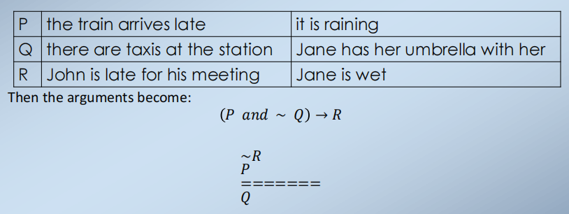
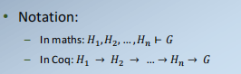
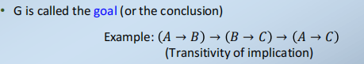
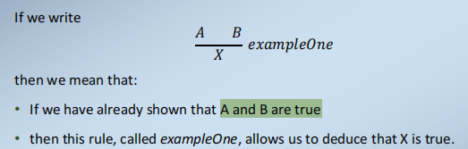
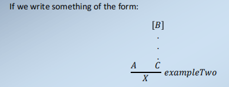
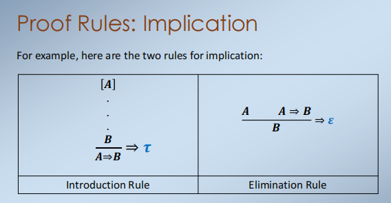
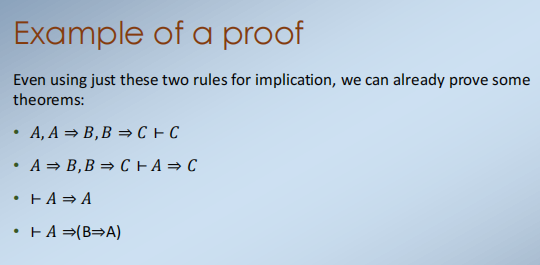
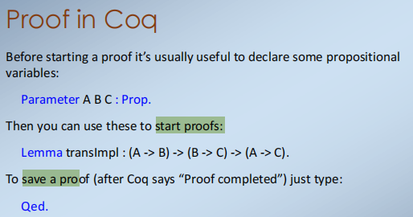
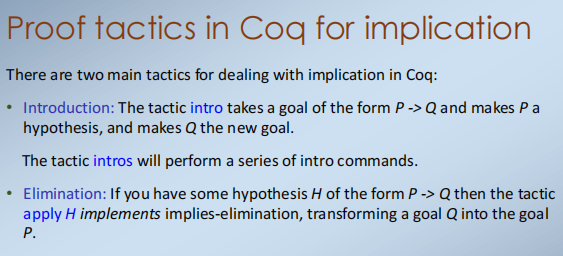

Outline
1\. Introduction and History of Logic
2\. Propositional Logic
3\. Natural Deduction Rules
4\. Introduction to Coq Proof Assistant

一. Introduction and History of Logic
1，逻辑是研究由一套精确和定义的规则控制的系统
一种逻辑就像一种编程语言，因为它是形式化的和精确的。
它与编程语言不同，因为它不是专门针对计算机的
编程语言描述了如何“做”一些事情。他们给计算机提供一步一步的指令。另一方面，逻辑学通过陈述事物的属性来描述事物。它还提供了制定有关事物的新事实的规则，并给出了一些起始信息。

2，自然语言可能是模棱两可的ambiguous。
也就是说，给定一个特定的句子，我们可以用许多不同的方式（或者根本不解释），这取决于我们知道的多少：

3，Logic is unambiguous清楚的
逻辑是一种描述情况的明确语言
因此，在某些情况下，我们可以将它作为自然语言描述的替代品。这在以下情况下是有用的：
比如
我们希望正式与他人协商一致（例如，合同）
我们在数学或一些科学领域工作，在那里我们需要精确的证明等

二. Propositional Logic
1，
如果火车迟到了，而且车站没有出租车，那么约翰开会就迟到了。
约翰见面还不迟到。火车确实迟到了。因此，在车站里有出租车。

如果下雨了，简没有带伞，那么她就会被弄湿的。
简不湿。下雨了。因此，简随身带着一把伞。

2，Formalising these arguments
这两者都可以转化为同一个论点；让

Proof: Notation and Terminology

意思：只要所有的𝐻1，𝐻2…𝐻𝑛是真，那么G也是真的
每个𝐻𝑖都被称为一个假设hypothesis（或一个前提premise）
G is called the goal (or the conclusion)

==三. Natural Deduction Rules==
1，Natural Deduction
你可以一步一步地操纵假设和目标的结构，使它们最终相互匹配。
我们使用elimination rules来打破这个假设
我们使用 introduction rules来形成目标

我们对每个连接词和量词都有一个introduction和elimination规则

2，Format of the Proof Rules

-如果我们已经证明了A是对的，如果我们证明了当我们假设B时，C也是正确的
-那么这个规则，称为示例2，允许我们推断出X是真的。
这里，B是一个局部或暂时的假设，当我们应用规则时它就被解除。

3，Proof Rules: Implication

记住--------------------------------------------------------------

4，Assumptions in natural deduction
证明构造的最重要的方面之一是跟踪假设。

为了处理特定的情况，我们在证明期间的某些阶段做出假设——假设帮助我们调制一个证明。
所有假设均应在证明结束时解除：
由于只有一些规则允许您解除假设，因此您只能在决定使用这些规则之一后才引入一个假设。

四. Introduction to Coq Proof Assistant
1，Proof in Coq
在开始证明之前，声明一些命题变量通常很有用：

2，Proof tactics in Coq for implication

Introduction: 使P为假设，并使Q为新目标。
==elimination：应用H实现了隐含消除，将目标Q转化为目标P。？==

