1，Natural deduction proof rules for AND
1）==看不懂==
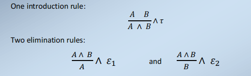

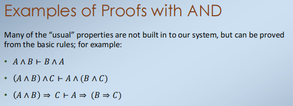

2）Proof tactics in Coq for conjunction (AND)
至于implication，我们有两种处理Coq中的结合的证明策略：
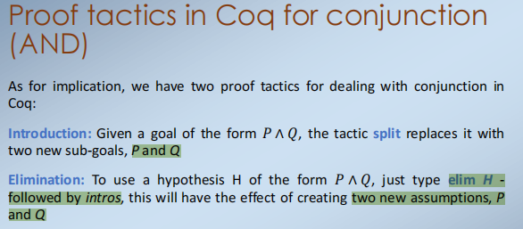

2，Natural deduction proof rules for EQUIVALENCE
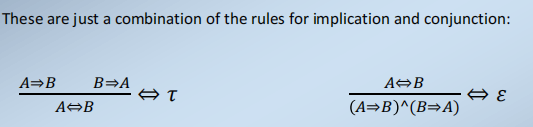

3，Natural deduction proof rules for OR
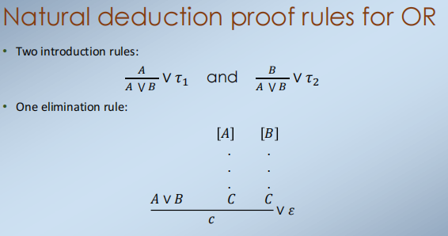

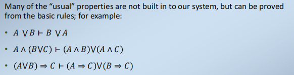

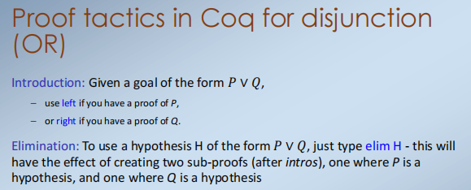

4，Natural deduction proof rules for negation
2种
Constructive logic构造逻辑认为**~P**只是**P-\>False**的缩写——也就是说，如果我们曾经要证明P，那么我们将证明一些不可能是真的东西（即假的）

Classical logic经典逻辑有一个“更强”的版本，它本身对待否定，允许通过矛盾来证明
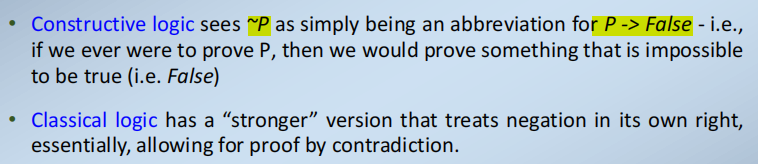

5，Natural deduction proof rules for False
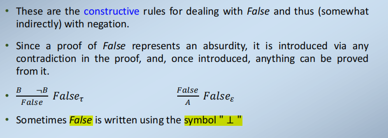

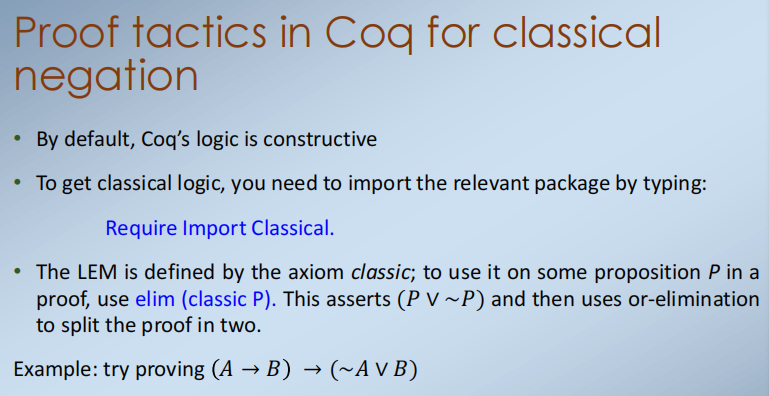
6，Proof tactics in Coq for False
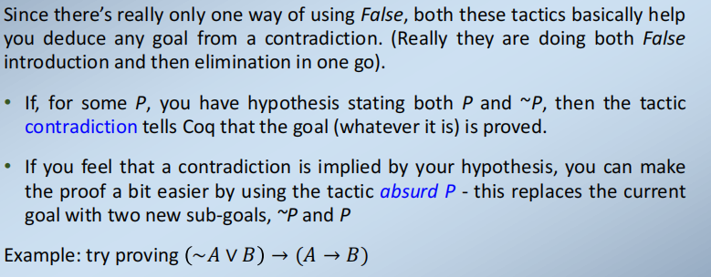

7，classical logic
在经典逻辑中，我们假设每个命题都是对的或假的，即使我们不能单独证明这两者。

The core rule for classical logic is the Law of the Excluded Middle
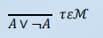

经典逻辑是建设性逻辑的扩展：如果一个经典的证明不使用LEM（或它的结果），那么它就是“建设性的”。

==8，Consequences of LEM==
一旦我们进入经典逻辑(当我们假设LEM时)，其他“非建设性”结果自然会随之而来。
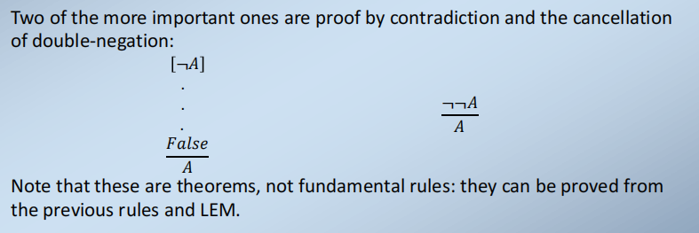

==9，WFF Well Formed Formulae==
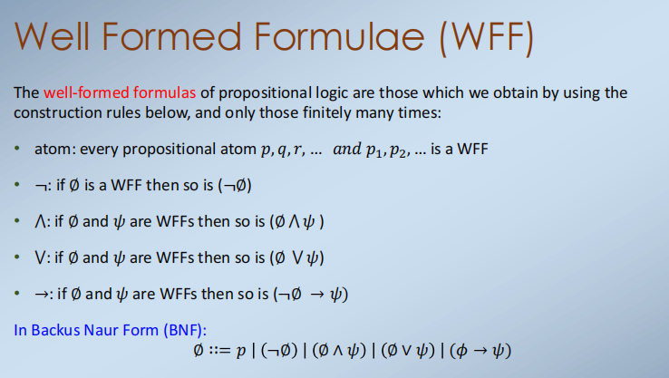

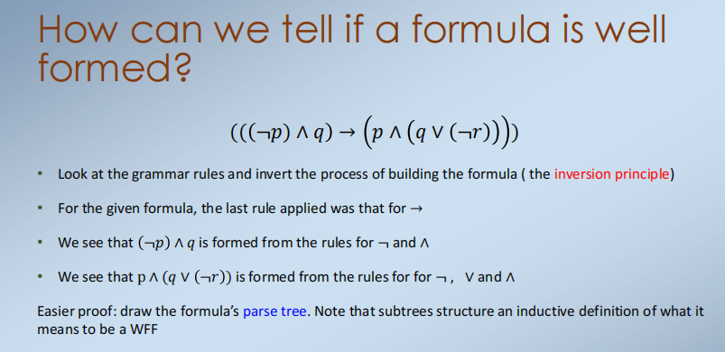

看看语法规则，反转构建公式的过程（反演原理）

