L8-9-Formal Proof in Logic
2021年12月22日
9:46

• Models in Propositional Logic
• Models in Predicate Logic
• Theorem Proving

1,Models in Propositional Logic
定义：命题逻辑中一个公式的估值或模型是对公式中每个变量的真赋值或假赋值
Definition: A valuation or model of a formula in propositional logic is an assignment of either true or false to each variable in the formula

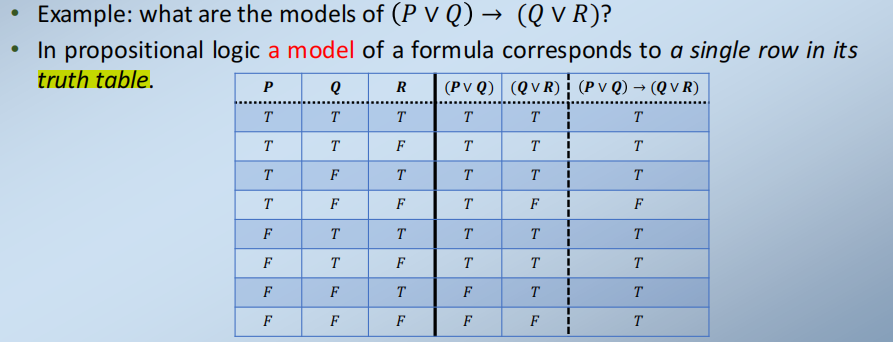

在命题逻辑中，一个公式的model对应于其真值表中的一行
给定命题逻辑中的一个公式及其一个模型，整个公式在该模型中计算为真或假。

2,Validity and satisfiability
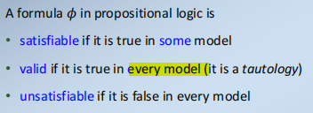

| satisfiable   | model里有真的就好                |
|---------------|----------------------------------|
| valid         | 每一个model都是真的【tautology】 |
| unsatisfiable | 每一分行(model)都是错误          |

1）satisfiable:至少一行是真的
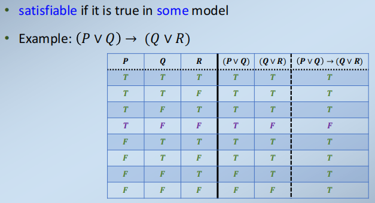

2）validity(全是真的tautology)
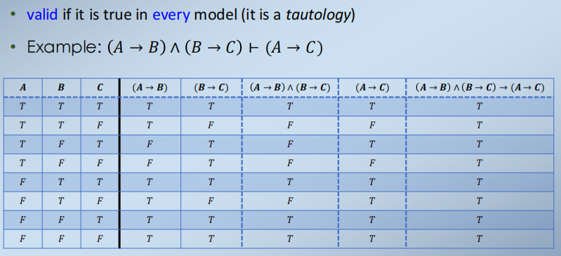

3）Unsatisfiable
（全错）
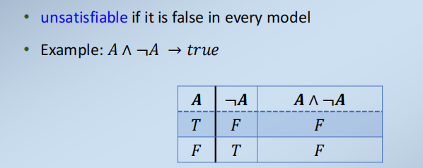

4）Validity and satisfiability
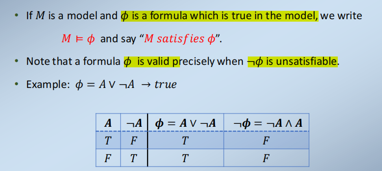

3，Semantics of Propositional Logic
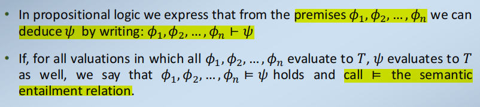
这意味着我们可以通过使用自然演绎或使用估值来证明命题逻辑中的公式

==4，CNF==
CNF中的公式允许简单地检查有效性，避免其原子数的时间指数
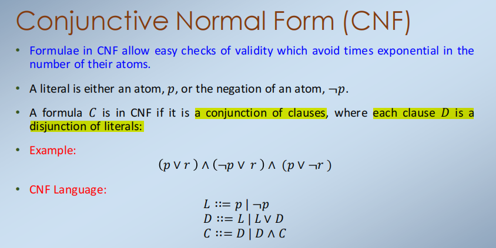

5，Horn Clauses
将一个命题逻辑公式转换为CNF可能是很昂贵的
CNF中的公式可以很容易地从语法上检查其有效性，但测试可满足性是困难的
Horn clauses是公式的一个子类，它们有更有效的方法来决定它们的可满足性
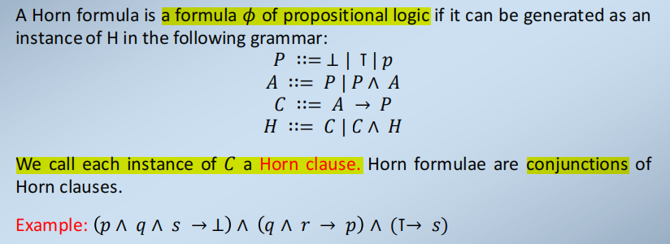

6,Semantics of Propositional Logic

一组公式{𝐻1，𝐻2，...，𝐻𝑛}，如果它们至少有一个model，则说是consistent一致的，如果它们没有模型，则说是不一致或矛盾的。

7,Models as counter-examples
要么你应该能够证明演绎𝐻1，𝐻2，……，𝐻𝑛⊢𝐺是有效的（使用自然演绎证明系统）

或者你不应该找到一个𝐻1，𝐻2，…，𝐻𝑛都是真的，但𝐺不是真的。

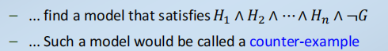

8,soundness and completeness
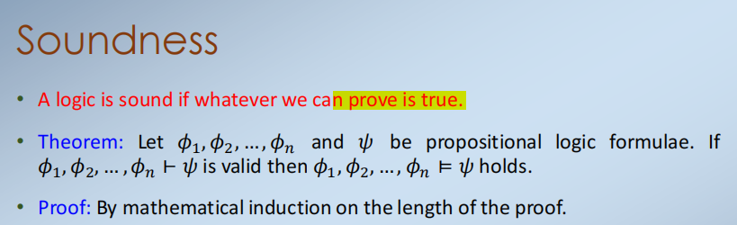

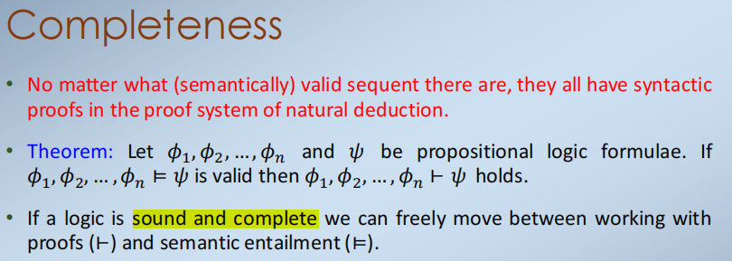

9,Models in Predicate Logic

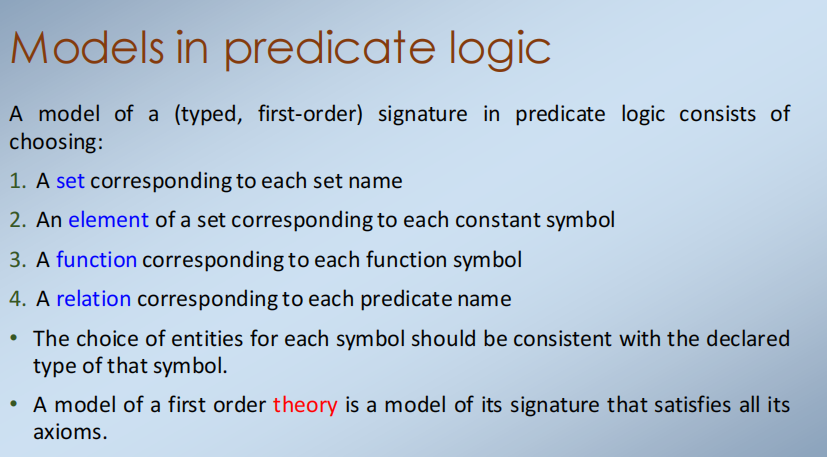

10,Theorem Proving

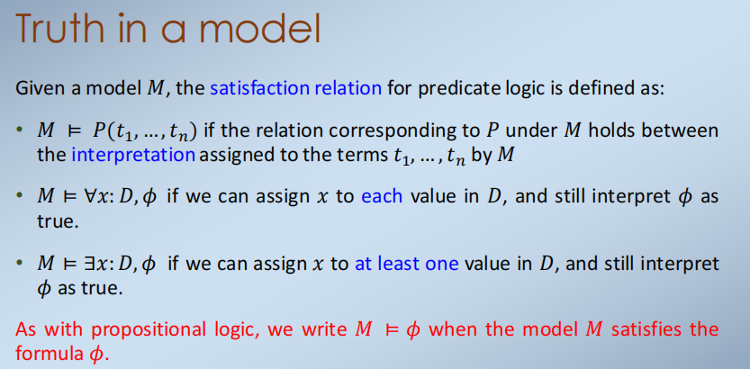

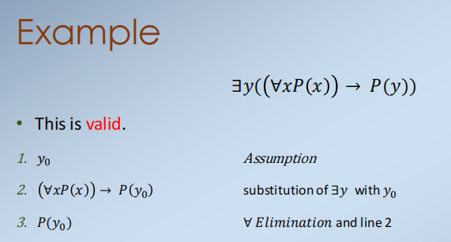

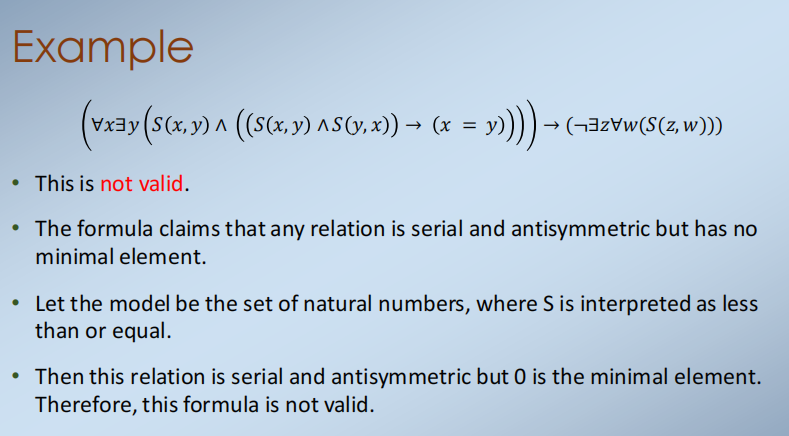

