## 一、Representing relations using an adjacency matrix
### 1、Adjacency Matrix
One way of representing a (finite) binary relation is as an adjacency matrix.
Each entry in the adjacency matrix is a ==boolean value.==
For any (a,b) ∈ (A×B) we set the entry MR for row a and column b to true iff (a,b) ∈ R
2.The relational operations map quite nicely to matrix operations:
<table>
<colgroup>
<col style="width: 35%" />
<col style="width: 64%" />
</colgroup>
<thead>
<tr class="header">
<th><strong>relational application:</strong></th>
<th><strong>matrix multiplication</strong></th>
</tr>
</thead>
<tbody>
<tr class="odd">
<td><strong>relational composition:</strong></td>
<td><strong>matrix multiplication</strong></td>
</tr>
<tr class="even">
<td><strong>relational inverse</strong></td>
<td><strong>transpose of a matrix</strong></td>
</tr>
<tr class="odd">
<td>relational union: (point-wise)</td>
<td>disjunction of the matrices addition is disjunction</td>
</tr>
<tr class="even">
<td>relational intersection:</td>
<td>
(point-wise) conjunction of the matrices

multiplication is conjunction
</td>
</tr>
</tbody>
</table>
use 1 and 0 with the rule that 1 + 1 = 1
## 二．Classifying Relations
### 1. identity relation
If A is a set, then the relation ==I = {a ∈ A•(a,a)}== is called the identity relation on A.
That is, the identity relation just ==maps every object to itself.==
### 2、Reflexive
Any binary relation R that has the property that ==I ⊆ R== called a reflexive relation.
All ==maps every object to itself, 都有自环==
### 3、irrefiexive
Any binary relation R that has the property that I ∩R = ∅ called an irreflexive relation.
==never maps any object to itself.都无自环==
### 4、symmetric
Any binary relation R that has the property that R−1 ⊆ R
pair ==(a,b)== it also contains the pair ==(b,a).==
任何一对节点，要么有方向相反的两条边，要么无边
### 5、antisymmetric
An antisymmetric relation is a binary relation with the property that if it ever contains both (a,b) and (b,a) then
we must have a = b.
任何一对节点之间至多只有一条边
### 6、asymmetric.
A relation that is both ==antisymmetric== and also ==irreflexive== is called asymmetric.
Transitive Relations
Any binary relation R that has the property that
whenever (x,y) ∈ R and (y,z) ∈ R then (x,z) ∈ R is called transitive.
### 7、partial order and total order
1\) partial order
| Any binary relation that is ==reflexive, transitive== and also ==antisymmetric== is called a partial order (==no cycles==) |
|---------------------------------------------------------------------------------------------------------------------------------------------------------------------------------------------|
2\) total order
| for every two objects x, y we have either (x,y) ∈ R or (y,x) ∈ R, then we call it a total order. ==(a chain)== |
|--------------------------------------------------------------------------------------------------------------------------------------|
8．equivalence relation.
| Any binary relation that is ==reflexive, transitive== and also ==symmetric i==s called an equivalence relation. |
|------------------------------------------------------------------------------------------------------------------------------------------------------------|
Eg.
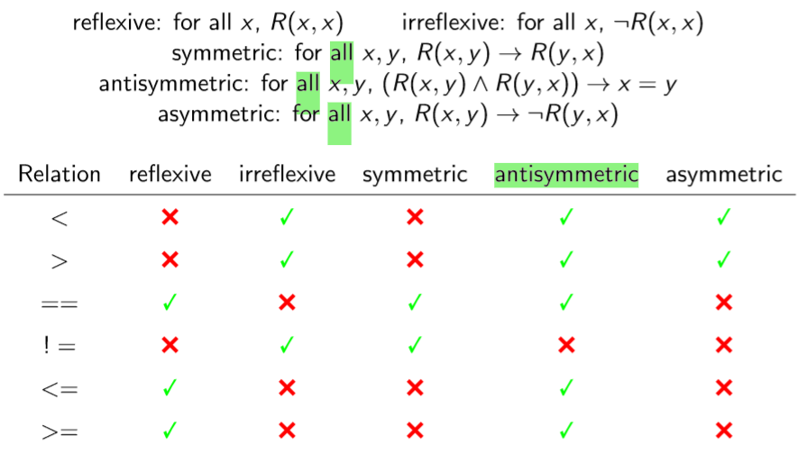
## 三．Equivalence relations and partitions
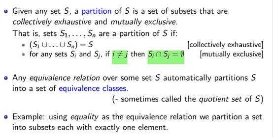

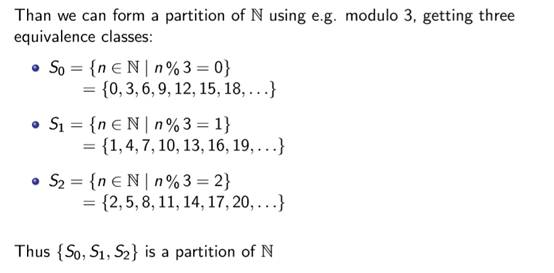

## 补充-关系性质 
设 R 是集合 A 上的关系
### 一、自反性和反自反性
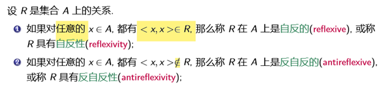

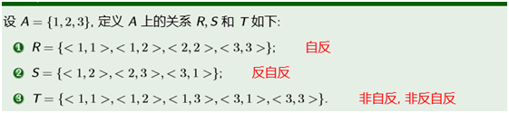

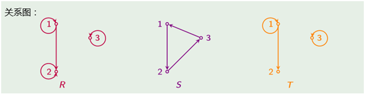

关系R是自反的当且仅当R的关系图中**每个节点都有自环，反自反的每个节点都无自环**

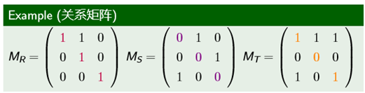

自反的当且仅当主对角线全1，反自反的当且仅当主对角线全0

### 二、对称和反对称

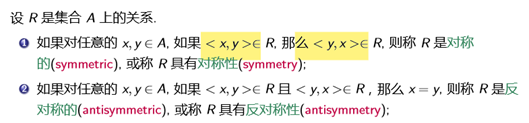

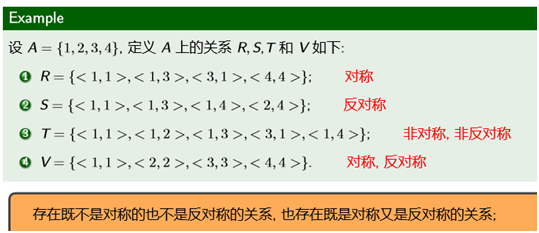

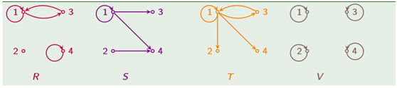
对称：**任何一对节点，要么有方向相反的两条边，要么无边**
反对称：任何一对节点之间**至多只有一条边**

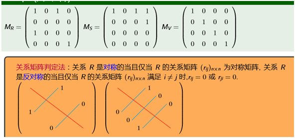

### 三、transitive传递
1\. 设 R 是集合 A 上的关系. 对任意的 x,y,z∈A, 如果 \< x,y \>∈R 且 \< y,z \>∈R, 那么 \< x,z \>∈R, 则称 R 是传递的(transitive), 或称 R 具有传递性(transitivity
2\. 设 A = {1,2,3}, 定义 A 上的关系 R,S,T 和 V 如下:
<table>
<colgroup>
<col style="width: 100%" />
</colgroup>
<thead>
<tr class="header">
<th>
1、 R = {&lt; 1,1 &gt;,&lt; 1,2 &gt;,&lt; 2,3 &gt;,&lt; 1,3 &gt;}; 传递

2、 <mark>S = {&lt; 1,2 &gt;}; 传递</mark>

3 、T = {&lt; 1,1 &gt;,&lt; 1,2 &gt;,&lt; 2,3 &gt;}; 非传递

4 、V = {&lt; 1,2 &gt;,&lt; 2,3 &gt;,&lt; 1,3 &gt;,&lt; 2,1 &gt;}. 非传递
</th>
</tr>
</thead>
<tbody>
</tbody>
</table>

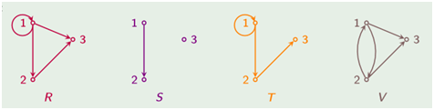

任何三个不同结点 x,y,z 之间, 若从 x 到 y 有一条边存在, 从 y 到 z 有一条边存在, 则从 x 到 z 一定有一条边存在;

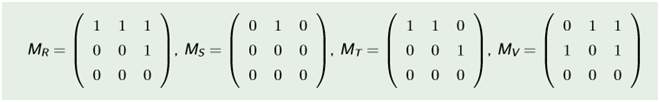
关系 R 是传递的当且仅当在 R 的关系矩阵中, 对任意 i,j,k∈{1,2,··· ,n}，若 rij = 1 且 rjk = 1，必有 rik = 1.
