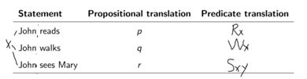
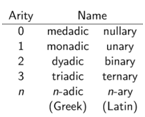
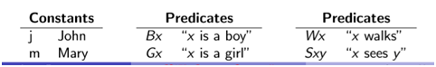
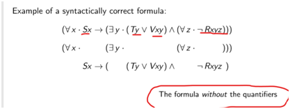
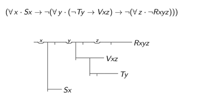
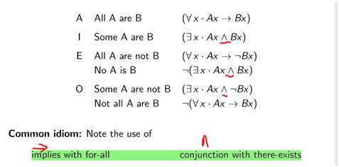

## 一、Induction
1 use predicates to represent properties and relations.

Propositional logic misses that these are all statements have something in common: they all concern John.
2\. **Every predicate symbol has an ==arity==**, which is the number of operands it takes
a\) Example: if L has an arity of 2, then it takes 2 arguments, Lxy
b\) so that “L/2” is different from “L/1” (a kind of overloading)
c\)

d\) in predicate logic we write Lxy to state that “relationship L holds between x and y”.
3\.
<table>
<colgroup>
<col style="width: 55%" />
<col style="width: 44%" />
</colgroup>
<thead>
<tr class="header">
<th>a)Symbols for <strong>constants</strong>:</th>
<th>a,b,c,...</th>
</tr>
</thead>
<tbody>
<tr class="odd">
<td>b)Symbols for <strong>variables</strong>:</td>
<td>x,y,z,...</td>
</tr>
<tr class="even">
<td>c)Symbols for <strong>predicates</strong>:</td>
<td>A,B,C,... or P,Q,R,...</td>
</tr>
<tr class="odd">
<td>d) The 5 propositional operators:</td>
<td>∧,∨,¬,→,↔︎</td>
</tr>
<tr class="even">
<td>e) Two quantifiers:</td>
<td>
<mark>(∀x ····) “for all x ···”</mark>

<mark>(∃x ····) “there exists an x ·</mark>
</td>
</tr>
</tbody>
</table>
Eg.

## 
## 二、Building up a syntactically correct formula
1，you introduce (and quantify) the variables using for-all/there-exists and join them up using the (propositional) operators

### 2.Scpoe of a variable
--Identify the scope of x, y and z
--Any variable under the scope of a quantifier is bound
--Any variable with no matching quantifier is free

### 3. syllogistic statements

