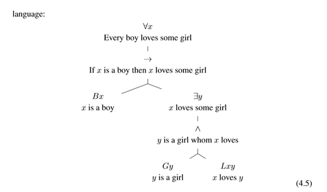

## 一、The predicate language: more formally
1\. The formal language of predicate logic is built in two steps:
<table>
<colgroup>
<col style="width: 100%" />
</colgroup>
<thead>
<tr class="header">
<th>
1. A term t is a <strong>variable (x,y,z,...)</strong> or a <strong>constant (a,b,c,...)</strong>.

2. A formula is built via the following rules:
</th>
</tr>
</thead>
<tbody>
</tbody>
</table>
<table>
<colgroup>
<col style="width: 100%" />
</colgroup>
<thead>
<tr class="header">
<th>
(a) If t1,...,tn are terms and <strong>P is a predicate symbo</strong>l, then Pt1 ...tn is a formula.

(b) If φ and ψ are formulas, then so are each of: ¬φ, φ∨ψ, φ∧ψ, φ → ψ, φ ↔︎ ψ.

(c) If φ is a formula and x is a variable, then both (∀x ·φ) and (∃x ·φ) are formulas.
</th>
</tr>
</thead>
<tbody>
</tbody>
</table>
Eg(∀x ·(∃y ·Lxy → (∃z ·Lzx)))、(∀x ·Ljx)、Lxx ∧¬Lmx
## 二、Translating English sentences into predicate logic.
1.Steps
Step 1: identify the constants and properties/relations in the sentence, and ==define symbols to represent them==
Step 2: break down the English sentence, and build it up again in predicate logic.
<table>
<colgroup>
<col style="width: 100%" />
</colgroup>
<thead>
<tr class="header">
<th><blockquote>

<strong>确定模板</strong>

<strong>确定成员具体形式</strong>

</blockquote></th>
</tr>
</thead>
<tbody>
</tbody>
</table>
| Eg. Every boy loves a girl | ∀x(Bx →∃y (Gy∧Lxy)) |
|----------------------------|---------------------|
1）To begin with we ==translate the pattern== for “All B are ...”:
∀x(Bx → ϕ(x)) ==确定模板==
2）确定成员成分
Here B is a unary predicate to represent ‘boy’,
ϕ(x) stands for the property that we want to assign to all the boys x: “x loves a girl”. This part of the sentence is the form “Some C are D”, where C represents the class of girls and D the class of those objects which are loved by x. The predicate logical translation of ϕ(x) therefore looks as follows: ∃y (Gy∧Lxy)
with Gy for“y is a girl”and Lxy for“x loves y”.
组合 ∀x(Bx →∃y (Gy∧Lxy))

| Eg. “Every boy loves Mary.”                                  | ∀x(Bx → Lxm),                       |
|--------------------------------------------------------------|-------------------------------------|
| eg. “Every girl who loves all boys does not love every girl” | ∀x((Gx∧∀y(By → Lxy)) →∃z(Gz∧¬Lxz)), |

2\. Translation: options.
we translate: “x does not love every girl” ... as:
¬(∀z ·Gz → Lxz) or: (∀z ·Gz →¬Lxz)
