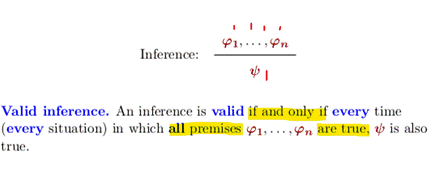
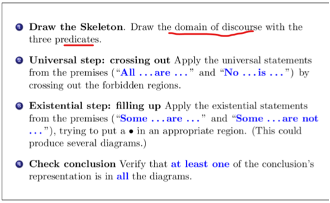
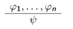
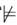
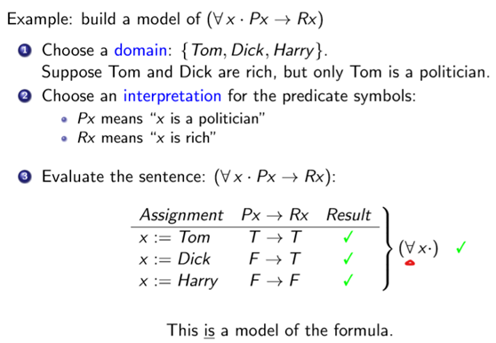
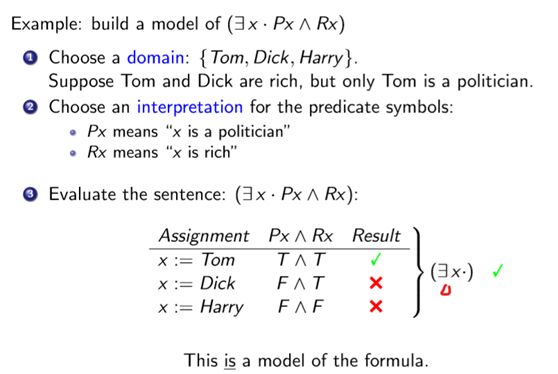
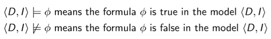
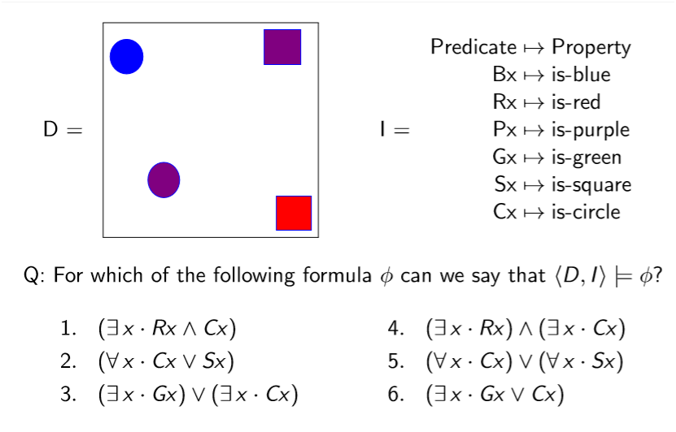
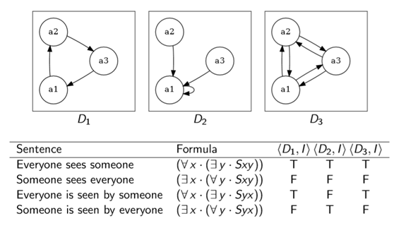

## 一、Valid inference 
### 1. Valid inference in propositional logic

### 2. Valid inference in syllogisms

### 3.Valid inference: predicate logic
An inference in predicate logic of the form

is **valid** if, for every model M for which we have M \|= ϕ1 and ... and M \|= ϕn, then we also have M \|= ψ.
In such case we will “overload” the \|= operator and write ϕ1,...,ϕn \|= ψ.
### 4.valuation
| in **propositional logic** | a model was **a single line in the truth table**                                              |
|----------------------------|-----------------------------------------------------------------------------------------------|
| in syllogistic logic       | a model is **a Venn diagram with some information filled in** (crossing-out or adding a ‘•’). |

5\. Classification of formulas according to their behaviour
A formula ϕ in predicate logic is:
a tautology if, for every model M, we have M \|= ϕ. In this case we often simply write “\|= ϕ”.
a contradiction if there is no model M for which M \|= ϕ. In this case we often simply write “

ϕ”.
satisfiable if there is at least one model M for which M \|= ϕ.
## 二、Models in predicate logic
1 build a model of some predicate logic formula ϕ
Define some **non-empty set D** called the **domain**
Provide an interpretation I that shows how each constant/predicate symbol used in
ϕ is mapped to an object/relation in the domain

Check that the formula ϕ is actually true for this domain and interpretation.
Reminder: A model consists of two things: - a domain D (sets and relations) - some interpretation I mapping symbols into D.
Only after we have been given (or have chosen) a model can we can evaluate a formula to either “true” or “false”.2.

3\. Notation

4\.

