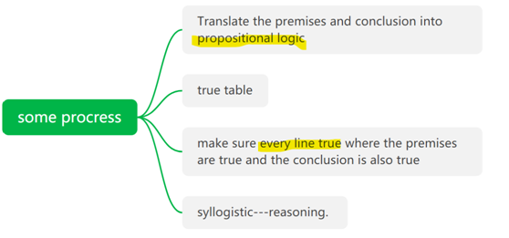
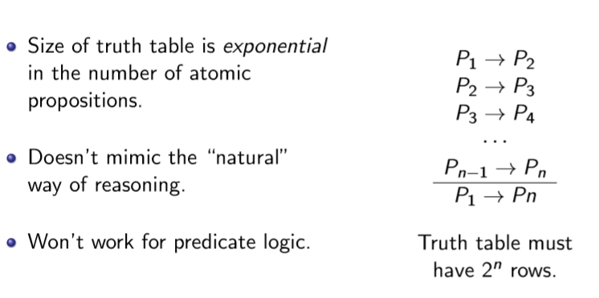
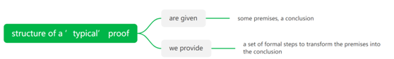
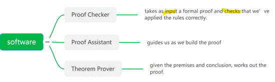
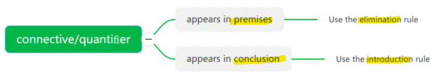
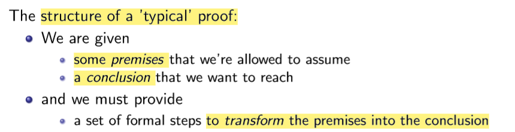
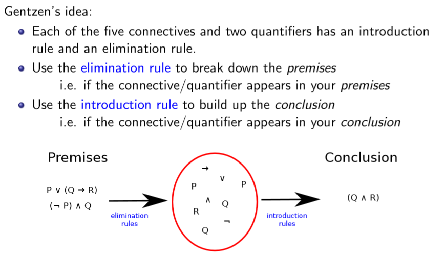
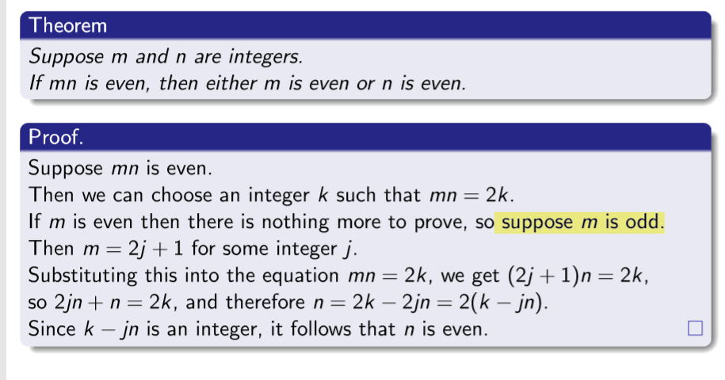
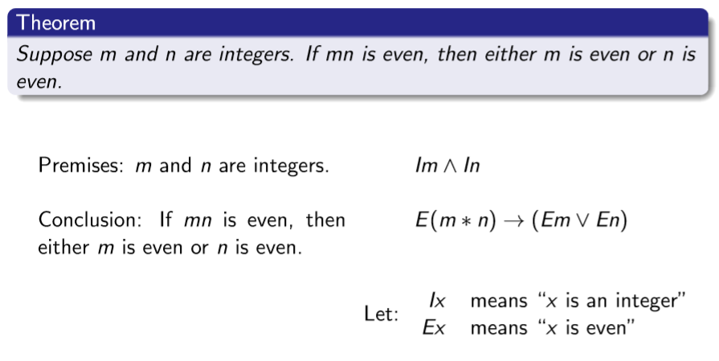
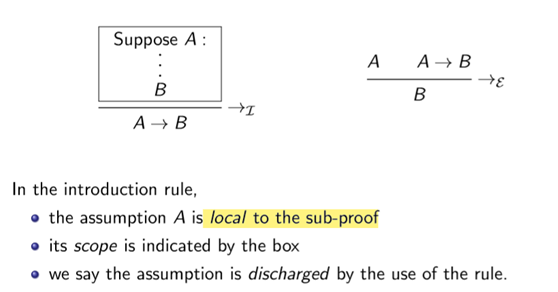

## 一、Deciding if an inference is valid
1，if an inference using propositional logic is valid

2，Problems with true tables
--Size of truth table is exponential in the number of atomic propositions.

--Doesn’t mimic the “natural” way of reasoning.
--Won’t work for predicate logic
## 二、Gentzen’s “natural” deduction
（study the natural deduction proof system for ==predicate logic==.）,
1，The structure of a ’typical’ proof

2，build software

3，General structure of a natural deduction proof
Each of the five connectives and two quantifiers has an introduction rule and an elimination rule.

4\. Examining that theorem

5.Introducing ‘implies’
1）If you want to prove a conclusion of the form P → Q then
---Assume that P is true ...

---and go on to prove that Q is true

Here P is called a local assumption. It is only assumed temporarily, for part of the proof.
6\. Formal proof rules for ‘implies’

