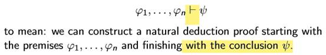
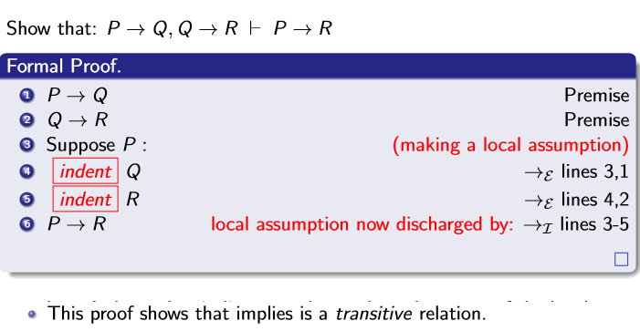
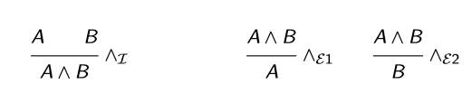
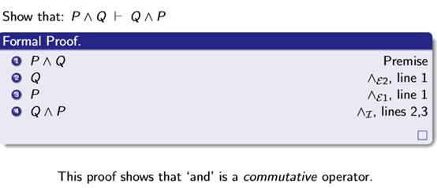
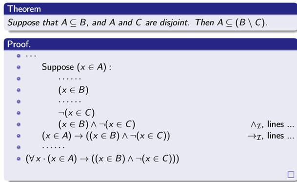
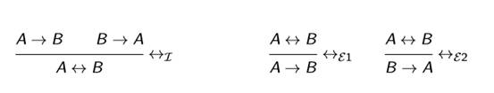
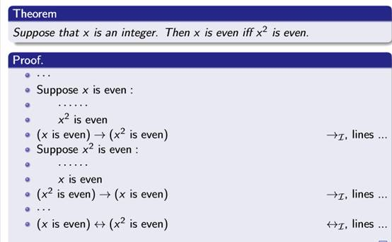

## 一、Notation
| 1，ϕ1,...,ϕn \|= ψ: | in any model where **ϕ1,...,ϕn are all true, then so is ψ.** |
|---------------------|--------------------------------------------------------------|
2\.

3.eg
This proof shows that implies is a transitive relation

## 二．Proofs using ‘and’
**1. Introduction**
| To prove A∧B | you must prove A and you must also prove B. |
|--------------|---------------------------------------------|
**2. Elimination:**
If you know A∧B: then you can deduce that A is true, also you can deduce that B is true (you can deduce both, if you like).

**3. Example of a proof using ‘and’ and ‘implies’**

## 三、Proofs using equivalence (‘iff’)
**1、Introduction:**
| To prove A ↔ B | you must prove A → B ，and you must also prove B → A. |
|----------------|-------------------------------------------------------|
**2、Elimination**
If you know A ↔ B: then you can deduce
that A → B is true, also that B → A is true
(you can deduce both, if you like).

**3、Suppose that x is an integer. Then x is even iff x2 is even.**

