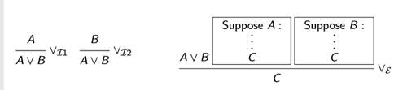
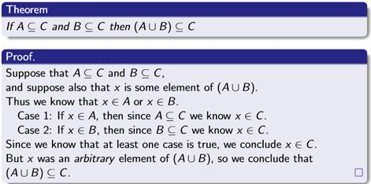
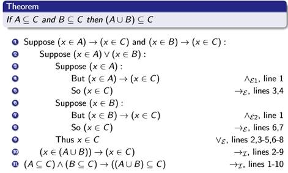
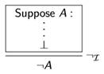
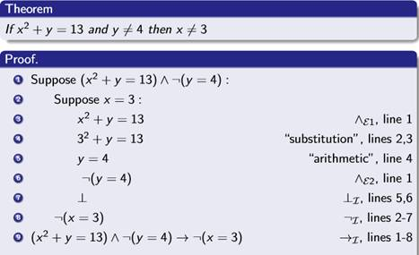
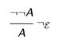
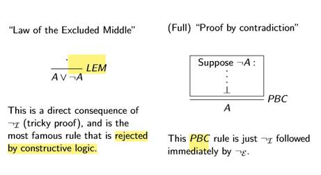
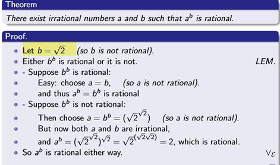
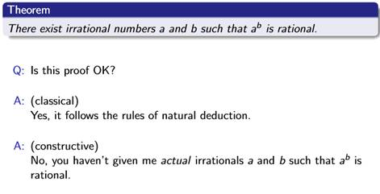

## 一、Proofs using ‘or’
1、Introduction:
| To prove A∨B | you must prove A, or you must prove B |
|--------------|---------------------------------------|
2、Elimination:
If you know A∨B:，you must prove the theorem both
\- for the case where A is true
\- and also for the case where B is true (Proof by cases).

3、Example

4、Duality between ‘and’ and ’or’
Note that the introduction/elimination rules for ‘and’ and ’or’ seem to refiect each other:
The introduction rule for ‘or’ and the elimination rule for ‘and’ give you the choice (which to prove/use).

The elimination rule for ‘or’ and the introduction rule for ‘and’ inist you deal with both possibilities.

The connectives ‘and’ and ’or’ are not exactly logical opposites: instead we say that are dual to each other.
## 二、Negation
To assert “¬A” must be the same as saying “A is false”, but we only have rules to prove things that are true.
1、Introduction:
The introduction rule for contradiction is also a sort of elimination rule for negation: If you have a premise of the form ¬B, try to prove B, and then deduce a contradiction.
2、Elimination:
The usual approach is to work by means of a contradiction: if we assume A and derive a contradiction, then it must have been wrong to assume A, so deduce ¬A We use the symbol ⊥ to denote “contradiction”.

It’s rarely useful to deduce just “anything” from ⊥. Typically this rule is used to tidy up impossible cases in a proof.

3、Example

the elimination rule for negation as it is not accepted in all kinds of logic.

However, it is accepted in classical logic.

## 三、Brouwer’s Intuitionism

