## 一、Functions
A function is a special kind of relation.
1 Definition:
==A binary relation R is a function== if whenever (a,b) ∈ R and (a,c) ∈ R then we must have that b = c.
2 Notation:
In general, a relation of arity n is a function if whenever (a1,a2,...an−1,b) ∈ R and (a1,a2,...an−1,c) ∈ R then we must have that b = c.
Notation: Since a function has this special property, we often use a special notation for being an element of a function. For example, if f is a binary relation that is a function, then instead of writing (a,b) ∈ f ==we usually write f (a) = b==
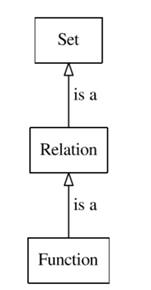
3 Functions, Relations and Sets
A relation is a special kind of set.
A function is a special kind of relation.
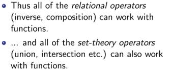

4example
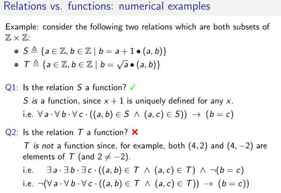
一一对应关系
5 lambda notation
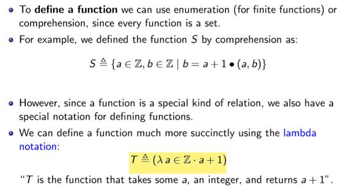

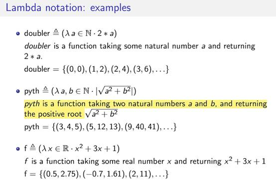
History
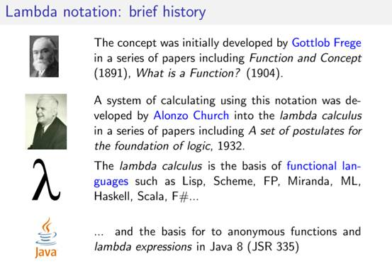

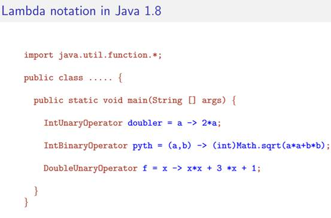
Functions – classifying
1 Domain, codomain and image: definition
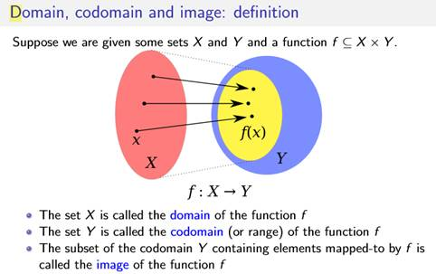

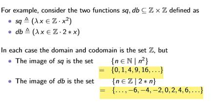
Injective and Surjective Functions
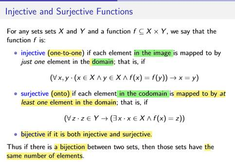
Injective===X,Y一对一
Surjective==Y中都被选中
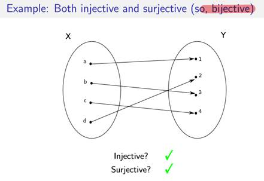

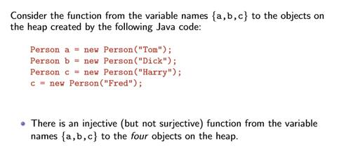
