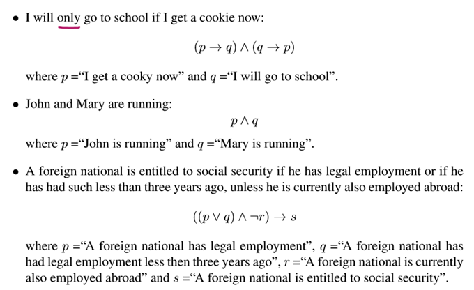

# 一、Validity of an inference
The validity of an inference can be stated in one of two ways:
1，An inference is valid if: whenever **all premises are true**, then the **conclusion is true**.,
2，An inference is valid if: whenever the **conclusion is false**, then **at least one premise is fals**e.
**前提全对，结论对。**
**结论是错的，前提至少有一个是错的。**
# 二、Stiuc Logic
Five indemonstrable statement forms:
| 1\. If the first, \[then\] the second.                                                  | The first. ==Therefore,== the second.                                   |
|-----------------------------------------------------------------------------------------|-----------------------------------------------------------------------------------------------|
| 2\. If the first, \[then\] the second.                                                  | ==Not== the second. Therefore, ==not== the first. |
| 3\. ==Not both t==he first and the second.                        | The first. Therefore, ==not== the second.                               |
| 4\. ==Either the== first ==or== the second. | The first. Therefore, ==not== the second.                               |
| 5\. Either the first or the second.                                                     | ==Not== the first. Therefore, the second                                |

## 三、Boole's notation
1.All the operations of Language, as an instrument of reasoning, may be conducted by a system of signs composed of the following elements,
<table>
<colgroup>
<col style="width: 100%" />
</colgroup>
<thead>
<tr class="header">
<th>
1st. <strong>Literal symbols</strong>,as <strong>x, y</strong> etc., representing things as subjects of our conceptions.

2nd. <strong>Signs of operation</strong>, as +,−,×, standing for those operations

3rd. <strong>The sign of identity</strong>, =.
</th>
</tr>
</thead>
<tbody>
</tbody>
</table>

## 四、Ingredients of the propositional language 
1、Basic statements (atomic **propositions**): p,q,r,…
**Every proposition letter (p,q,r,...) is a formula.**
### 2. Operators to build more statements
| **negation**    | **“not ...”**         | **¬...**      |
|-----------------|-----------------------|---------------|
| **conjunction** | **“... and ...”**     | **...∧...**   |
| **disjunction** | **“... or ...”**      | **...∨...**   |
| **implication** | **“if ... then ...”** | **... → ...** |
| **equivalence** | **if and only if**    | **↔**         |
### 3，Backus Naur Form
The formal language of propositional logic
Let P be a set of proposition letters and let p ∈ P.
Then we define a formula in propositional logic φ as follows:
| ϕ ::= p \|¬ϕ \| (ϕ∧ϕ) \| (ϕ∨ϕ) \| (ϕ → ϕ) \| (ϕ ↔ ϕ) |
|------------------------------------------------------|
This notation is called ==Backus Naur Form(BNF)==

## 五、命题逻辑和logic tree 练习
Eg1

eg.2

