## 一、Domain, codomain and image
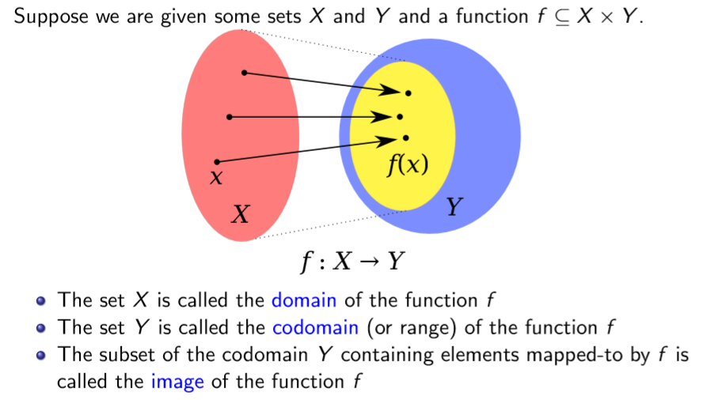

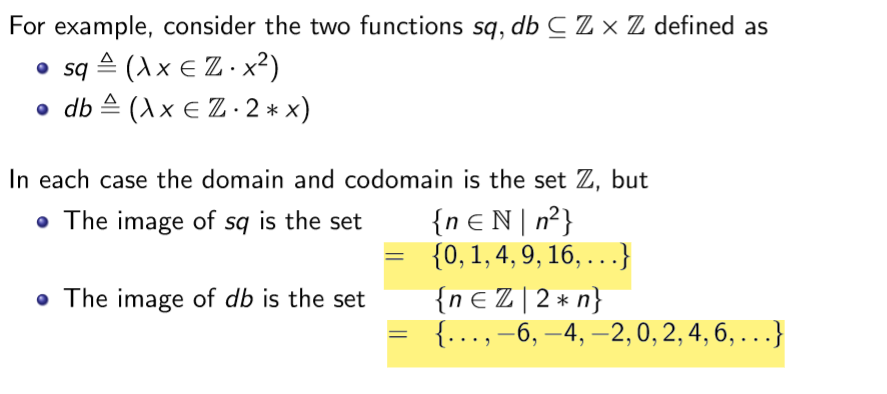

## 二、Injective and Surjective Functions
For any sets sets X and Y and a function f ⊆ X ×Y, we say that the function f is:
<table>
<colgroup>
<col style="width: 13%" />
<col style="width: 86%" />
</colgroup>
<thead>
<tr class="header">
<th>Injective</th>
<th>
(one-to-one) if each element in the image is mapped to by just one element in the domain; that is, if(∀x,y ·(x ∈ X ∧y ∈ X ∧f (x) = f (y)) → x = y)

Eg.Hash Tables
</th>
</tr>
</thead>
<tbody>
<tr class="odd">
<td>surjective</td>
<td>
(onto) if each element in the codomain is mapped to by at least one element in the domain; that is, if (∀z ·z ∈ Y → (∃x ·x ∈ X ∧f (x) = z))

<strong>For a surjective function the image is the whole codomain</strong>
</td>
</tr>
<tr class="even">
<td>bijective</td>
<td>
if it is both injective and surjective.

Thus if there is a bijection between two sets, then those sets have the same number of elements.
</td>
</tr>
</tbody>
</table>

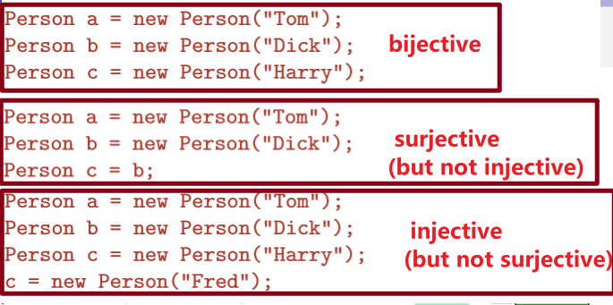

## 三、Total vs. Partial Functions
1，Paritial Functions:不一定得到结果
Total function:输入一定返回结果

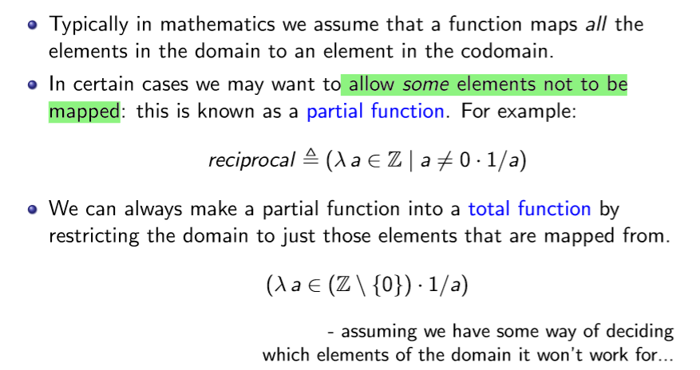

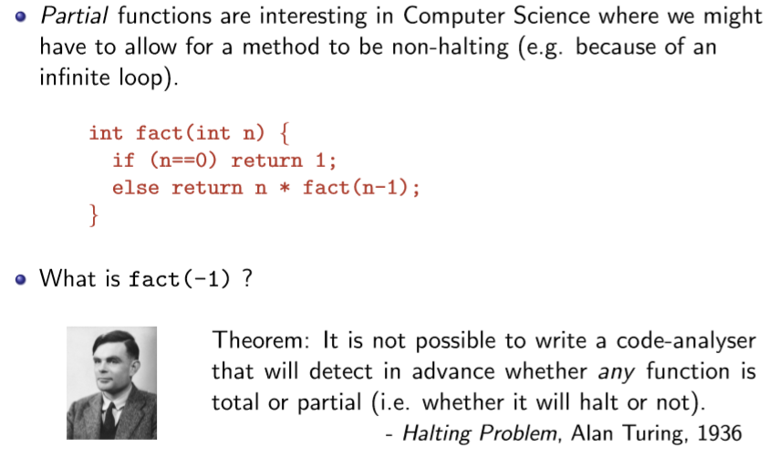
Eg.classifying functions
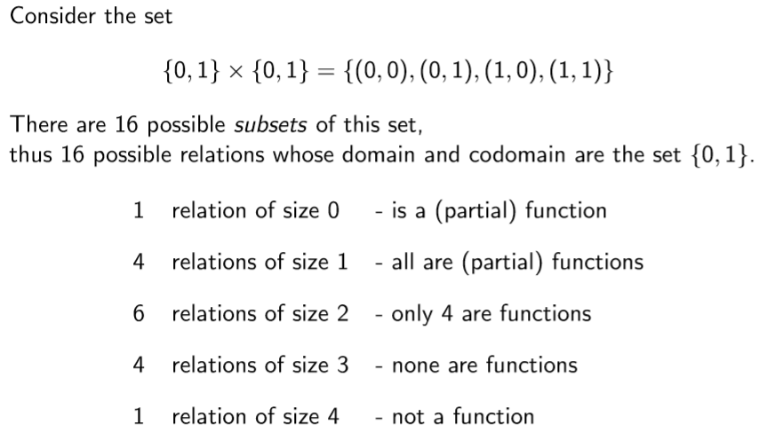

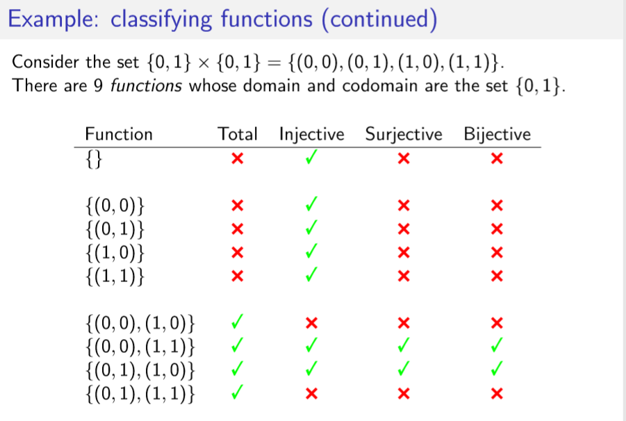

## 四、Sets, bags, and sequences
| A set is a collection of objects |                                                      |
|----------------------------------|-------------------------------------------------------|
| A bag is like a set,             | but we also remember how many times an object occurs. |
| A sequence is like a set,        | but we also remember where an object occurs.          |
1，Bags
A bag (or multiset) is like a set except that members are allowed to occur many times.
The number of times an element occurs in a bag is called the multiplicity of that element.
For example: \[\[a,a,b,b,b,c\]\] is the bag where a occurs twice, b occurs thrice and c occurs once.
Notes: The notation \[\[···\]\] is not very standard.
The order of elements in a bag doesn’t matter.
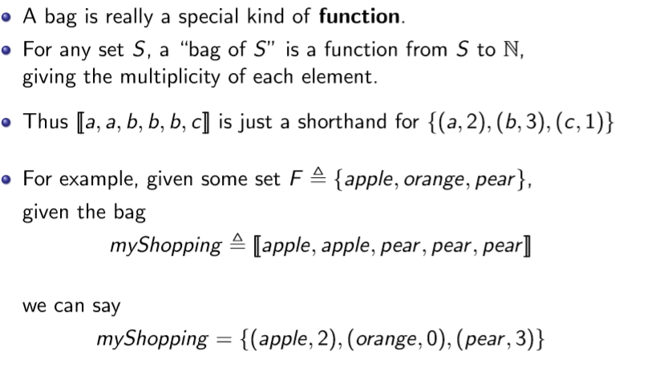

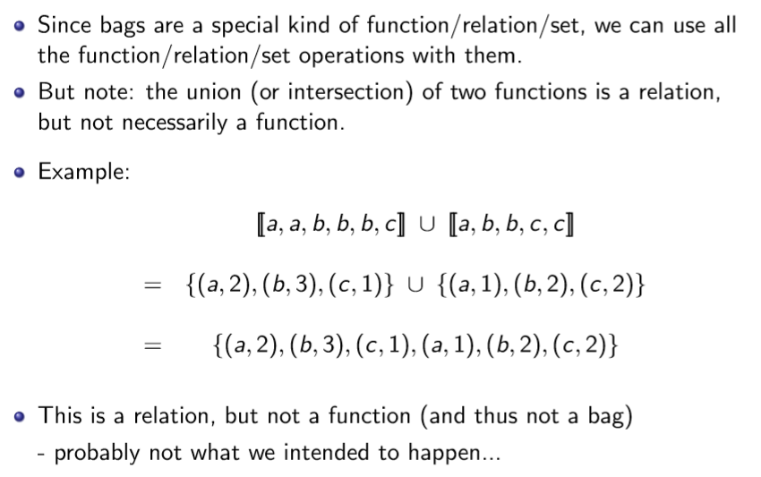

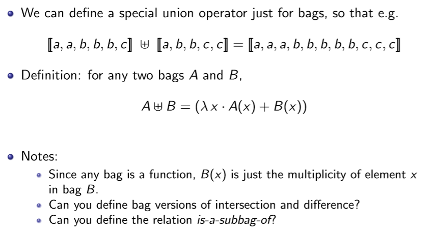
2、Sequence
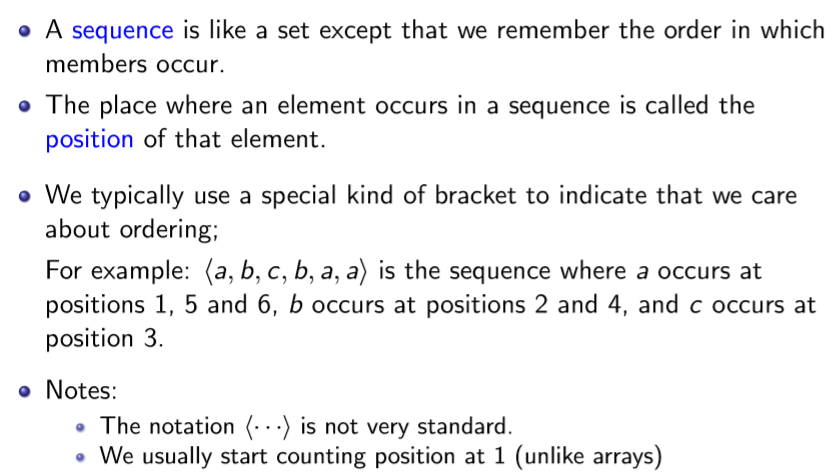

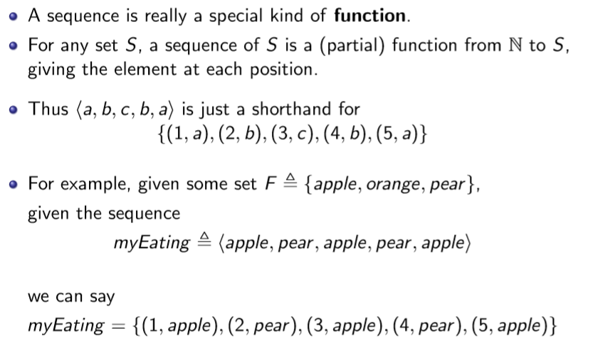

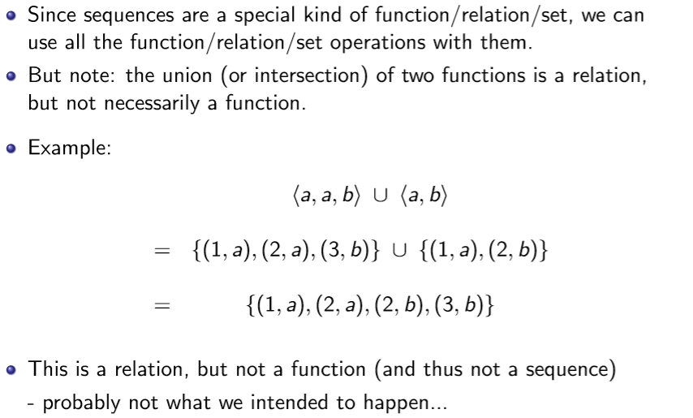

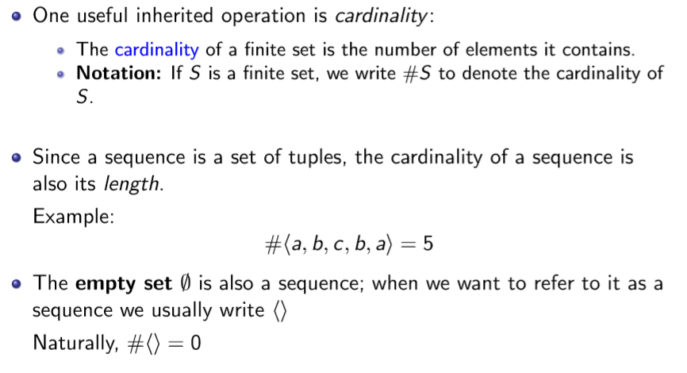

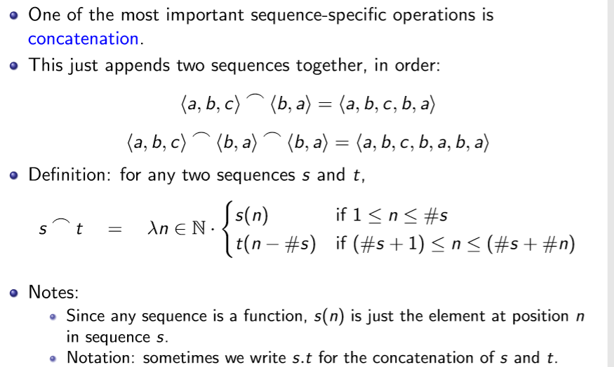

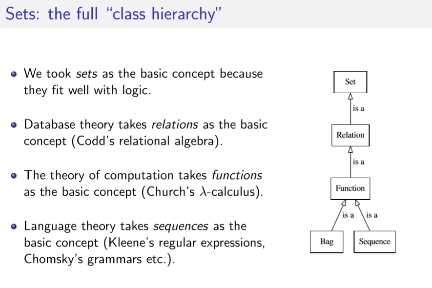

