一、The cardinality of a finite set
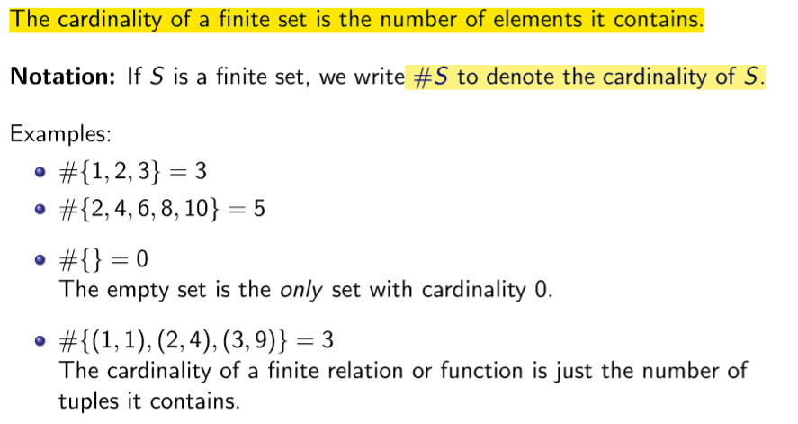
Properties of cardinality
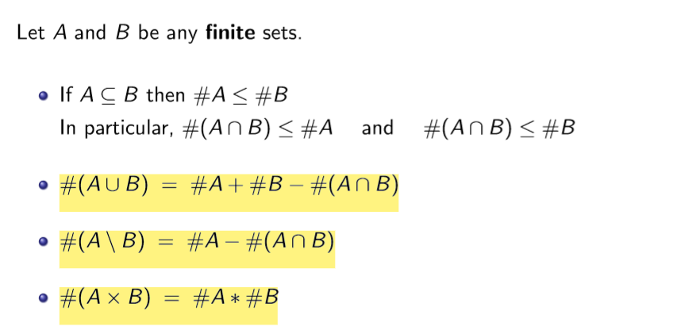
Functions and cardinality
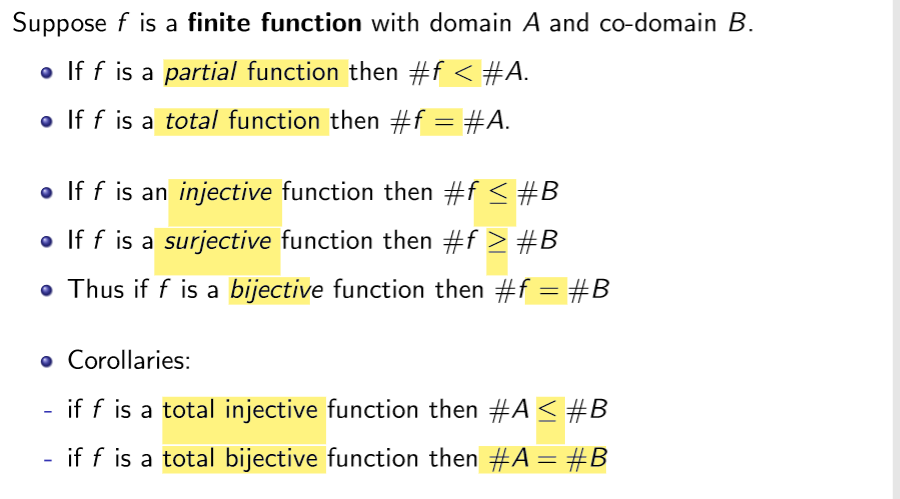
二、The number of functions
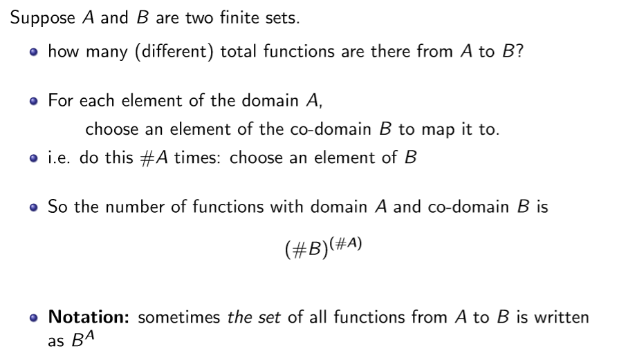

三、The power set of a set
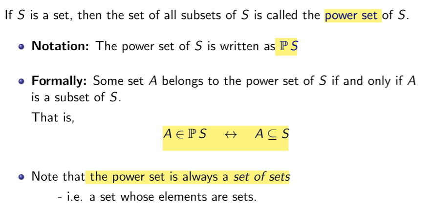

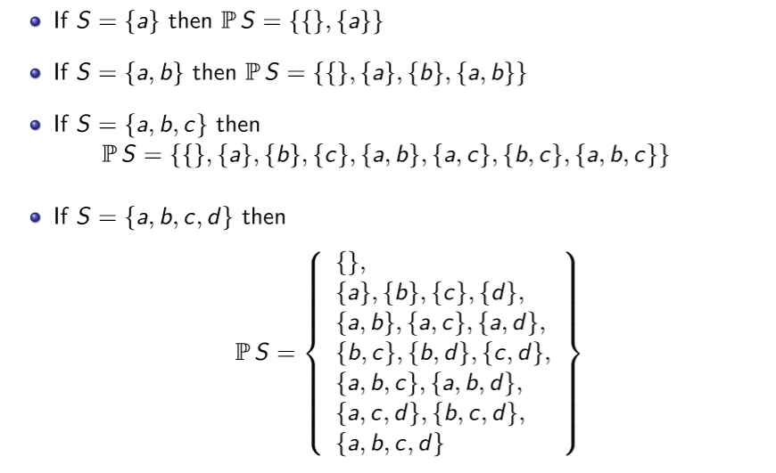

Cardinality of the power set
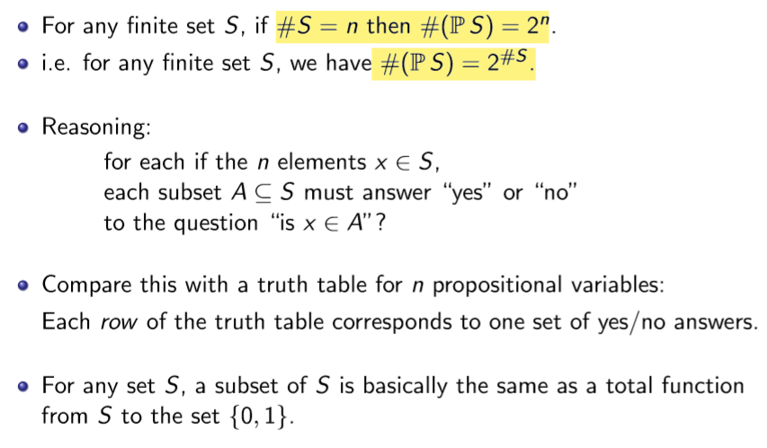

Counting the number of sequences (repetitions allowed)
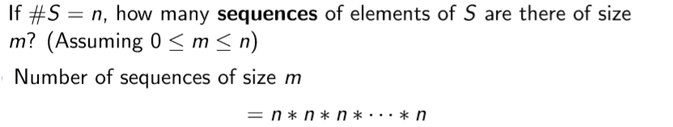

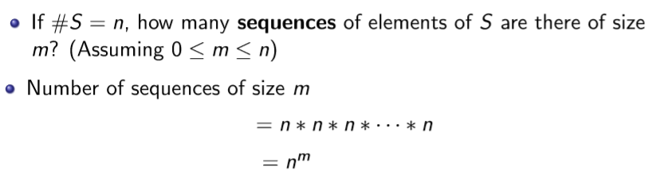

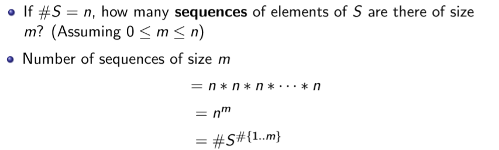

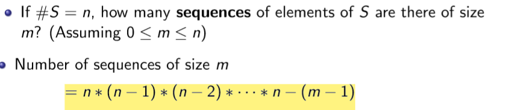

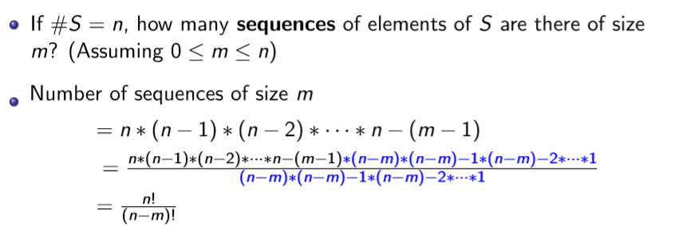

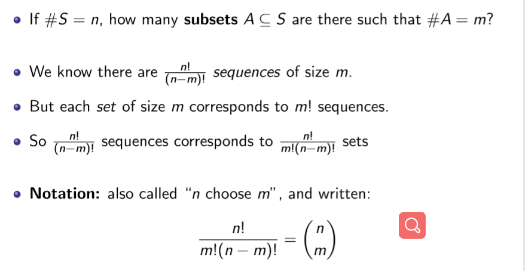

Number of subsets of given size: Pascal’s triangle
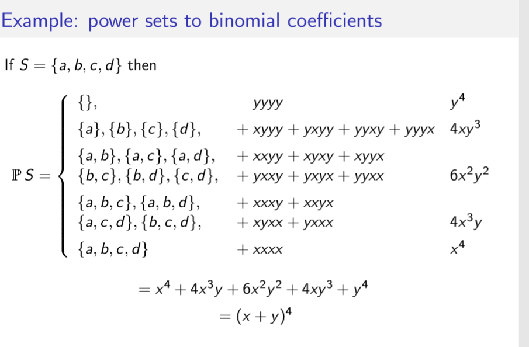

