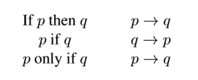
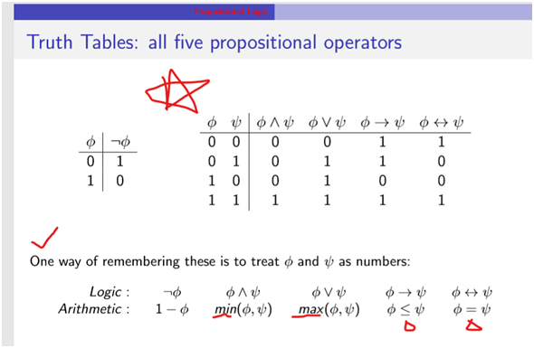
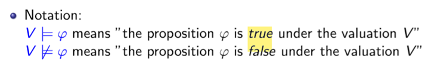
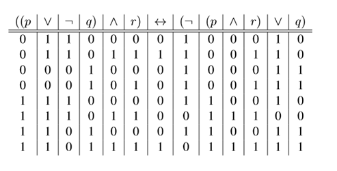

## 一、Truth Tables: 
1，basic
Truth tables **define the semantics** of the propositional operators
注：‘if and only if（简写iff）for an equivalence.

**注意：当左推右，左≤右；则正确；互推左右相等才正确**

## 二、Valuations
In propositional logic, a valuation corresponds to ==a single row in the truth table.==

## 三、true table 练习
eg.1

