# 一、Definition of valid inference 
1\.
1）valuation ：In propositional logic, **a valuation corresponds to ==a single row== in the truth table.**
2）We call these functions V valuations;
<table>
<colgroup>
<col style="width: 100%" />
</colgroup>
<thead>
<tr class="header">
<th>
<strong>V (ϕ) = 1</strong> says that the formula ϕ is <strong>true</strong> in the situation (represented by) V,

<strong>V (ϕ) = 0</strong> says that the formula ϕ is <strong>false</strong> in the situation V.
</th>
</tr>
</thead>
<tbody>
</tbody>
</table>
3）
<table>
<colgroup>
<col style="width: 100%" />
</colgroup>
<thead>
<tr class="header">
<th>
For <strong>V (ϕ) = 1</strong> we also write <strong>V |= ϕ</strong> and for <strong>V (ϕ) = 0</strong> we also write <strong>V /|= ϕ</strong>.

One can read <strong>V |= ϕ</strong> as “V makes true ϕ”, or as “<strong>V satisfies ϕ</strong>” or “<strong>V is a model of ϕ</strong>”
</th>
</tr>
</thead>
<tbody>
</tbody>
</table>
2.The inference from a **finite** set of premises ϕ1,...,ϕk to a conclusion ψ is a valid consequence, something for which we write
==ϕ1,...,ϕk \|= ψ, if each valuation V with V (ϕ1) = ... = V (ϕk) = 1 also has V (ψ) = 1.==
3.(Logical equivalence) If ϕ \|= ψ and ψ \|= ϕ we say that ϕ and ψ are logically equivalent.
## 二、well-known valid interface forms
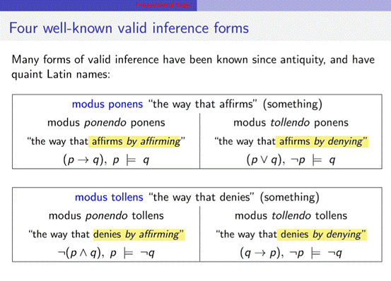

## 三、logical “laws”
### \*De Morgan:
<table>
<colgroup>
<col style="width: 100%" />
</colgroup>
<thead>
<tr class="header">
<th>
1.bar all

2.bar each term

3.change the sign (*and +)
</th>
</tr>
</thead>
<tbody>
</tbody>
</table>
注意**identity，absorption**
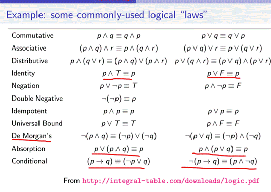
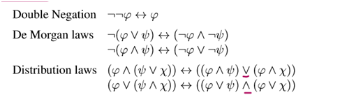
## 四、Classifying formulas
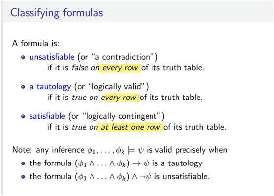

-- **satisfiability**
A set of formulas X (say, ϕ1,...,ϕk) is satisfiable if there is ==a valuation== that makes all formulas ==in X true==.
it doe==s **not say that all formulas in X are actually true**==,
-- **consistency**
A set of formulas that does **not lead to a contradiction** （每一行都错）is called a consistent formula set.
--**Tautologies**
A formula ψ that gets the **==value 1 in every valuation==** is called a tautology.
ϕ1,...,ϕk \|= ψ if and only if (ϕ1 ∧...∧ϕk) → ψ is a tautology
\*Satisfiable versus Consistent
---for a set of formulas is consistent iff the set is satisfiable.
---Satisfiability gives the semantic perspective on consistency.
---Satisfiability (consistency) is ==not the same as truth: it does not say that all formulas in X are actually true==, but that they could be true in some situation.
## 五、Information update
1.The information content of a formula is the set of its models, that is, the valuations that assign the formula the truth-value 1.
2\. An update with new information reduces the current set of models to the overlap or intersection of the existing models and the models of . Any existing valuations that assign the value 0 to are eliminated.
More information =) fewer models
\(a\) the argument “==**from if-p-then-q and not-p to not-q**” was invalid,==
whereas
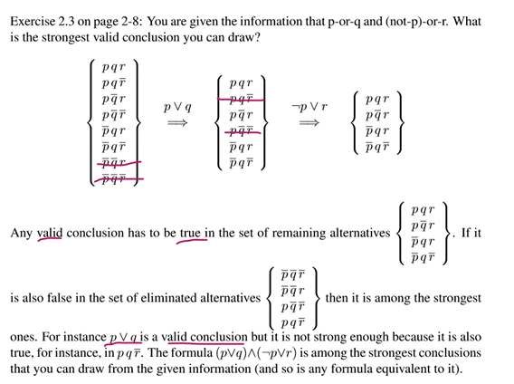

\(b\) the argument ==“from if-p-then-q, not-q to not-p” was valid==
## 六．补充
System properties: soundness and completeness
--If all theorems of an axiomatic system ==are valid==, the system is called ==sound==
--The above ==system is sound==, as you can see by noting that ==all axioms are tautologies==
--while Modus Ponens always takes tautologies to tautologies, that is,
if ϕ and ϕ → ψ are tautologies, then ψ is also a tautology
==--if all valid formulas are provable theorems, the logic is called comple==
## 七、练习
1\.
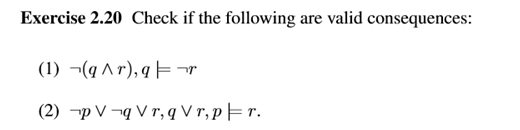

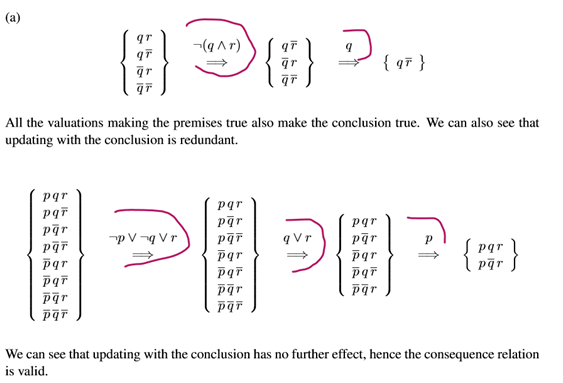

2\.
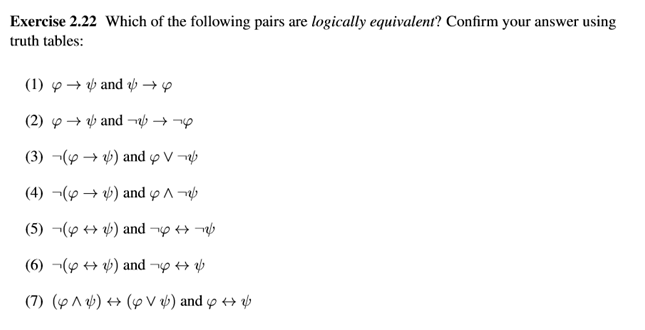

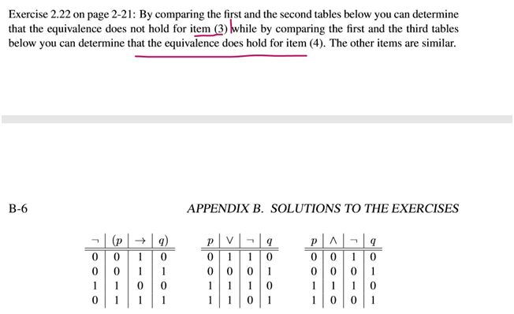

3
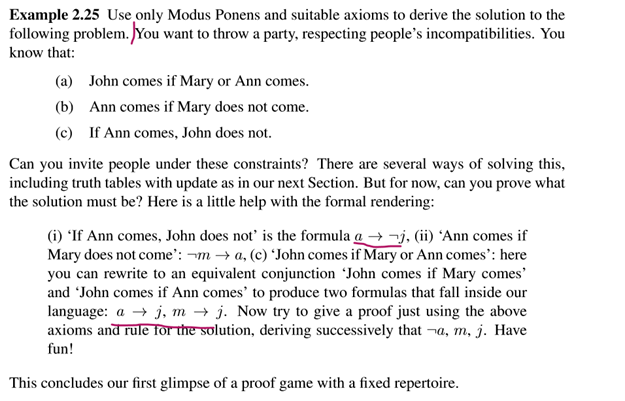

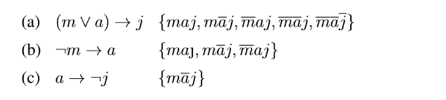

