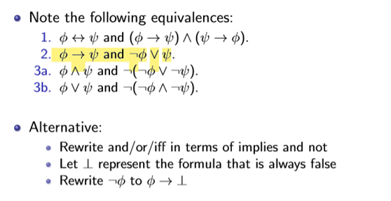
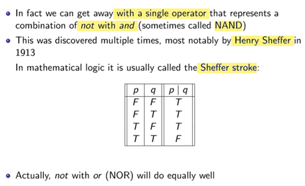
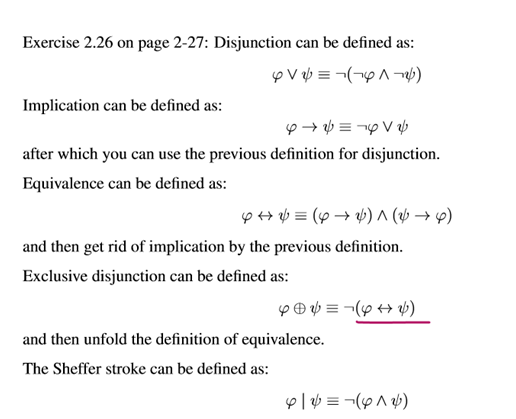
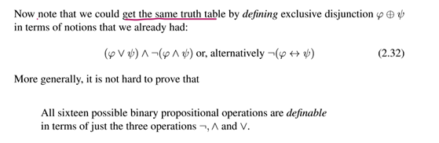
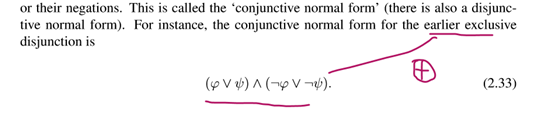
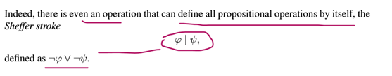

## 一、Expressiveness
1，

2\. **\|**（NAND）

（NOR异或：不同为true，同为false）
3\. In total, there are sixteen possible Boolean operations (truth value as signments) with two arguments:
the implication **ϕ → ψ** has the same truth table
As **¬ϕ∨ψ** and as**¬(ϕ∧¬ψ)**.

