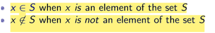
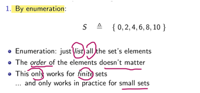
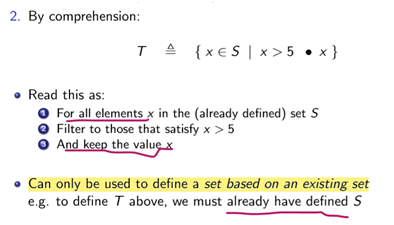
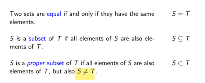
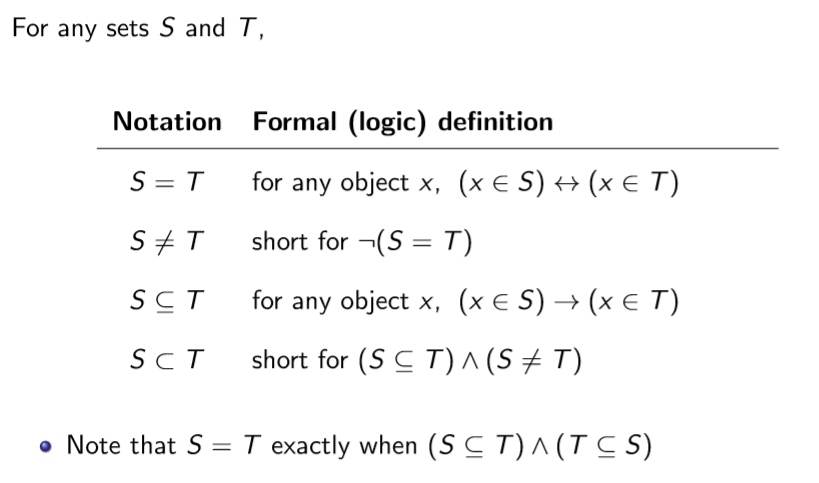
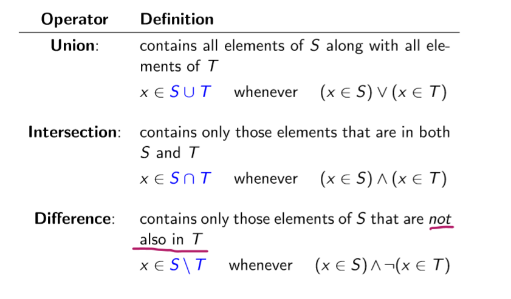
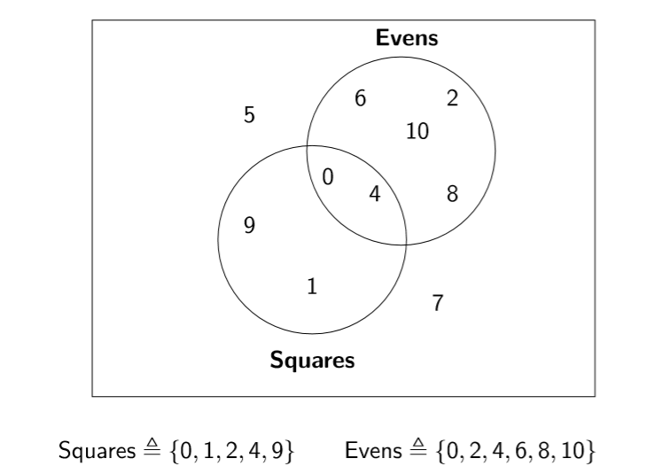
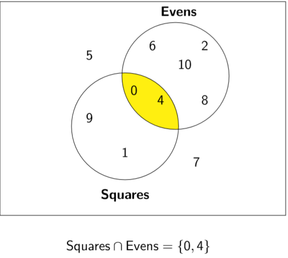

## 一、Set
1、Set :A set is a **collection** of definite, distinct objects
2、The basic operation on a set: element-of

3、There are two main ways of defining sets

4、Set in Java
## 二．Sth about sets
1\. Pre-Defined Sets
N 自然数（0，1,2,3,。。。）
Z 整数
Q 有理数
R 实数
2\. Comparing Sets

3\. **The empty set**
--The empty set is the set with **no elements**
--Usually named ∅, and enumerated as {}
--Properties: for any set S we can show that:
∅⊆ S
S ∪∅ = S
S ∩∅ = ∅
S \\ = S

Venn and his diagrams

