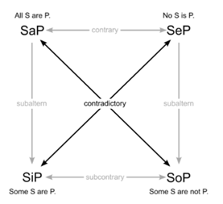
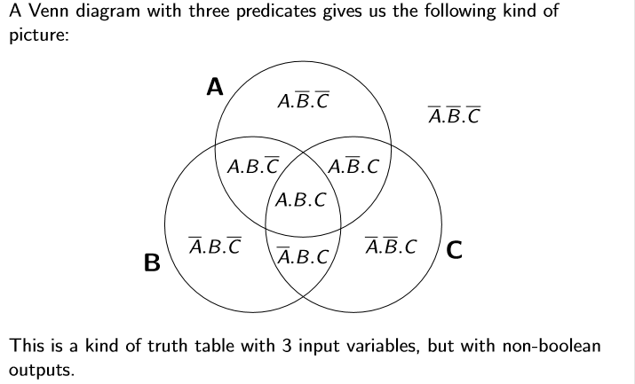
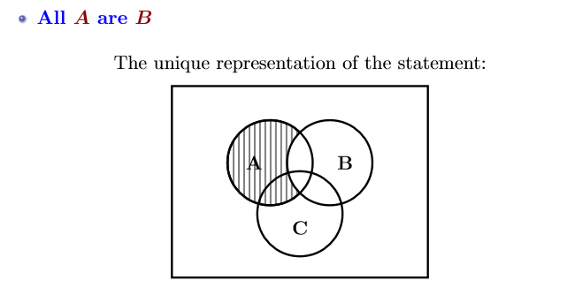
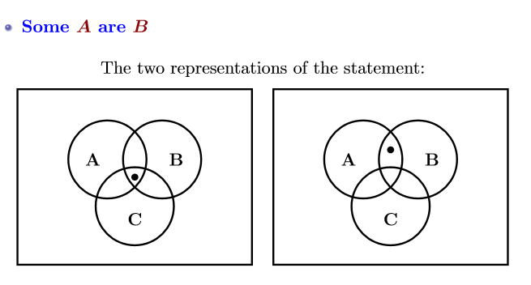
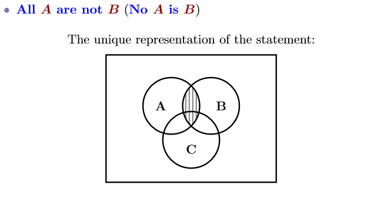
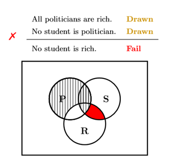
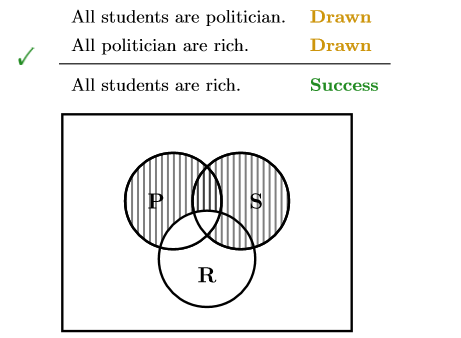
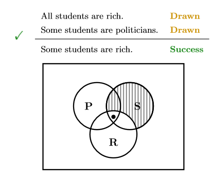

## 一、Aristotle’s Syllogisms
Collected in a book known as Prior Analytics
## 二．Syllogisms
1.definition：A syllogism is a inference with specific characteristics:**Just two premises**

2.Syllogistic reasoning allows us to check the validity of a given syllogistic inference.

We ==use Venn diagrams== to help us represent the reasoning process.

## 三、图形结合

## 四、Validity Checking for Syllogistic Forms 
1.Draw the Skeleton: ==Start with an empty Venn diagram== for the three properties, representing all eight combinations.

2 Process the premises:
1.  Crossing out - Universal step. A premise that starts with all/no means you cross out certain ‘forbidden’ regions in the diagram.
2.  ii\. Marking in - Existential step. A premise that starts with some/not-all means you mark certain areas as inhabited (if they haven’t been crossed out). You may need to copy the diagram to represent the alternatives here.
3 Check Conclusion: All resulting diagrams must insist on the conclusion: a universal conclusion means the area must be crossed out, an existential conclusion means the area must be marked in.

