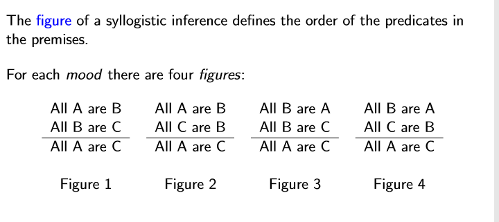
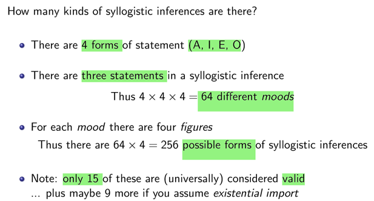
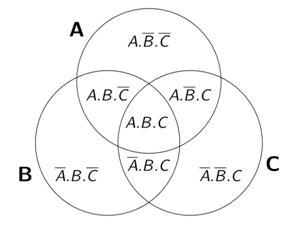
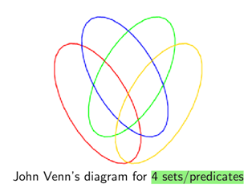
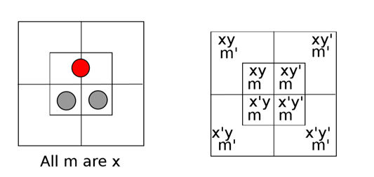
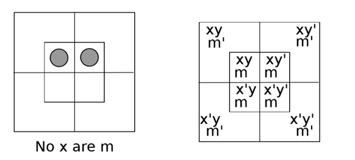
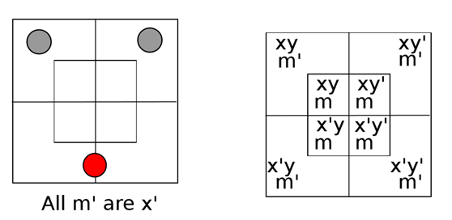
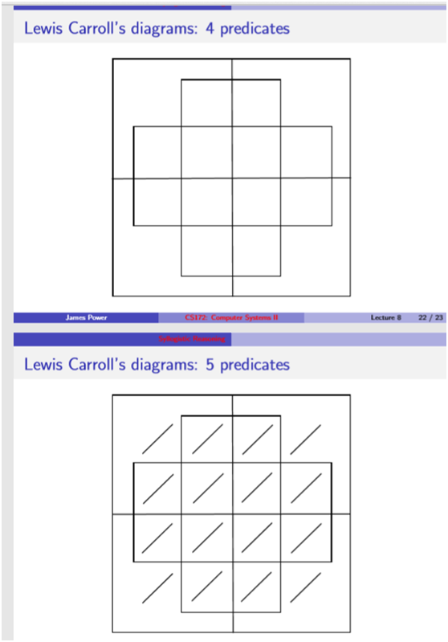

# 一、Counting Syllogistic Forms: Moods

1、The mood of a syllogistic inference is a label based on the forms of the two premises and conclusion.
| **A** | All A are B      | universal affirmative  |
|-------|------------------|----------------------|
| **I** | Some A are B     | particular affirmative |
| **E** | All A are not B  | universal negative   |
| **O** | Some A are not B | particular negative  |
Suppose we choose a particular mood, e.g. A-A-A.

2.The figure of a syllogistic inference defines the order of the predicates in the premises.
For each mood there are four figures:
3\.

## 
## 二、Extending Syllogistic Reasoning: more premises
1\.

2\. Lewis Carroll’s diagrams

