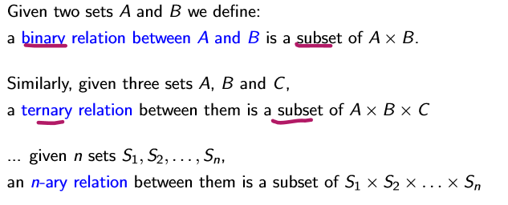
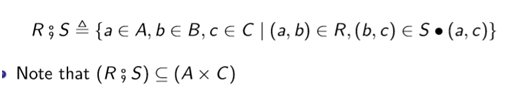
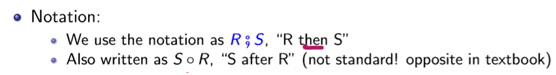
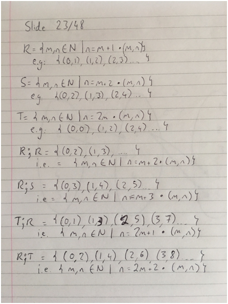
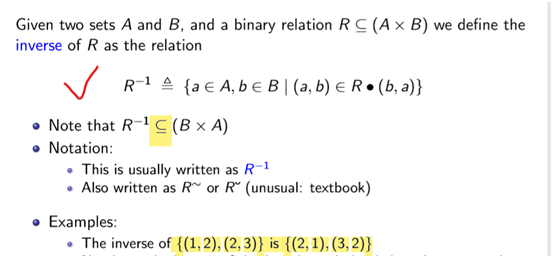

## 一、The relation
### 1、Ordered Pairs
--An **==ordered==** pair is an object of the form (a,b) where a and b are some already-existing objects.
--For a given pair (a,b) we refer to a and b respectively as the first and second elements of the pair.
in general, **(a,b) is different from (b,a**).有序的
2\. We can generalize this by defining an ==n-tuple== as being a sequence of n objects of the form (x1,x2,...,==xn)==
3\. get at an element of an ==n-tuple== by using a projection function ==πi==(x1,x2,...,xn) , xi for i ∈{1,...,n}
Eg.π1(a,b) = a；π2(a,b) = b

## 二、Cartesian Product
1、The Cartesian Product of two sets A and B is the set of ==all pairs== of the form (a,b), for every a ∈ A and b ∈ B.
the Cartesian product A×B , {a ∈ A, b ∈ B •(a,b)}

2.We can take the Cartesian product of a set with itself Example: {1,2}×{1,2} = {(1,1),(1,2),(2,1),(2,2)} For any set A, we often refer to A×A as （写成A的平方形式）, and refer to A×A×A as A3, ... and so on

3.We can take the Cartesian product of infinite sets too. Example: N×N is the set of all pairs of the form (a,b) for all a ∈N and b ∈N.
{1,2}×{1,2} = {(1,1),(1,2),(2,1),(2,2)}
4.Defining a relation in terms of sets
an n-ary relation is a set of n-tuples.

## 
## 三、Relational Operators
### 1. composition 
Given three sets A, B and C, and two binary relations R ⊆ (A×B) and S ⊆ (B ×C) we define the composition of R and S as the relation

Eg. R = {m,n ∈N\| n = m + 1•(m,n)}
S = {m,n ∈N\| n = m + 2•(m,n)}

T = {m,n ∈N\| n = 2m•(m,n)}

### 2. The inverse of a relation调换顺序

