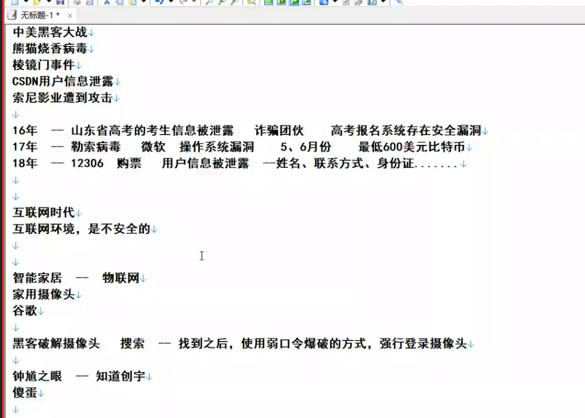
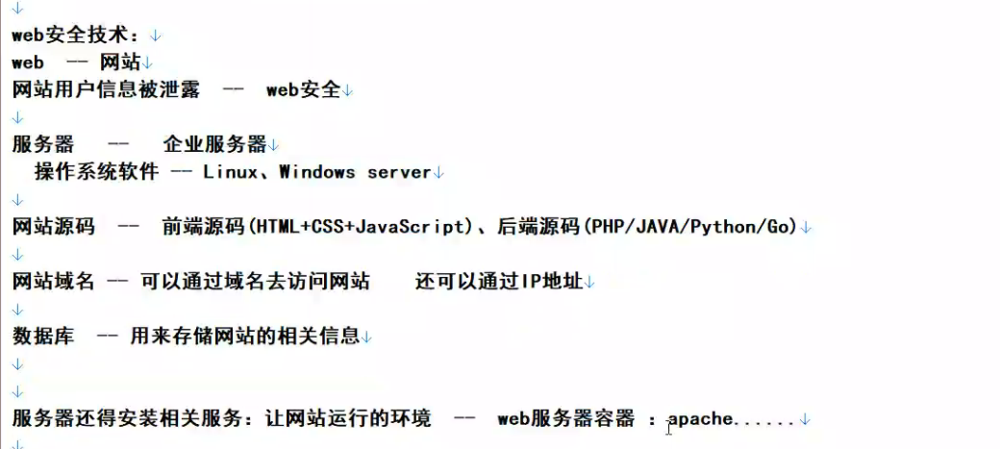
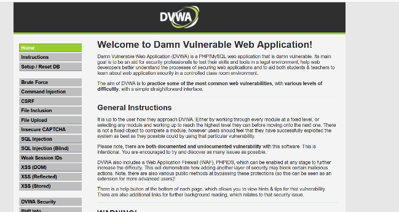
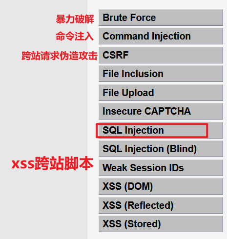

## 一、基本介绍
1，

2，
信息安全
web安全
web安全测试环境--基础
服务器安全

## 二、登入DVWA
1、打开phpstudy，把DVWA-master放到phpstudy的**WWW**文件下
2、登入
| <http://127.0.0.1/DVWA-master>               |
|----------------------------------------------|
| <http://192.168.2.166/DVWA-master/index.php> |
<table>
<colgroup>
<col style="width: 100%" />
</colgroup>
<thead>
<tr class="header">
<th>
账号：admin

密码：password
</th>
</tr>
</thead>
<tbody>
</tbody>
</table>
进入

3、介绍
（1）安全漏洞

可以通过这几个方面测试安全性（漏洞很多，这只是几种）

