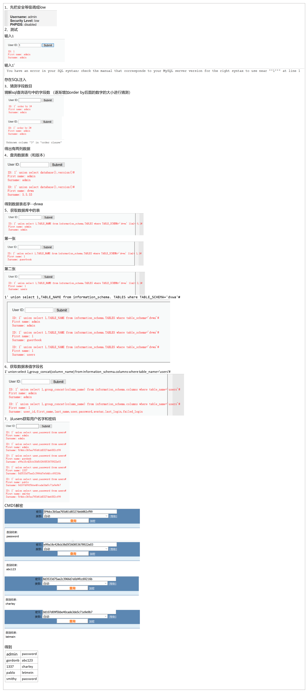
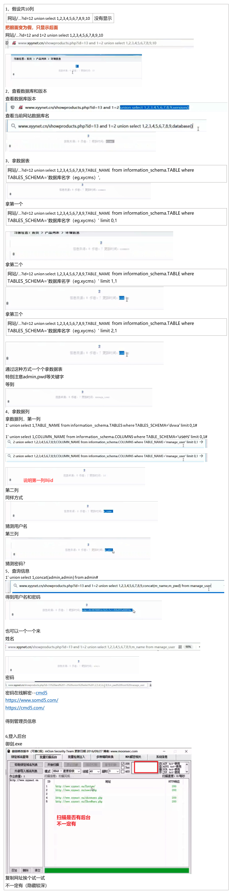

## 一、基本了解
1，
<table>
<colgroup>
<col style="width: 100%" />
</colgroup>
<thead>
<tr class="header">
<th>
SQL注入-高危漏洞

危害：网站的数据库-拖库行为
</th>
</tr>
</thead>
<tbody>
</tbody>
</table>
<table>
<colgroup>
<col style="width: 100%" />
</colgroup>
<thead>
<tr class="header">
<th>
xx网站用户信息被泄露--SQL注入漏洞

数据库里面存放的是网站信息（包括网站用户信息）
</th>
</tr>
</thead>
<tbody>
</tbody>
</table>
<table>
<colgroup>
<col style="width: 100%" />
</colgroup>
<thead>
<tr class="header">
<th>
DVWA--SQL注入--用户信息

不是所有的网站都有SQL注入

漏扫软件--AWVS（慎用）
</th>
</tr>
</thead>
<tbody>
</tbody>
</table>
注（NISP一级和二级 校园版的CISP 证书可以当成项目的资质）
2，SQL注入的判断方法（and语句，true，false的判断）
| ?id=13和?id=13 and 1=1 | 得到结果是一样的   |
|------------------------|--------------------|
| ?id=13和?id=13 and 1=2 | 得到结果是不一样的 |
利用方式-sqlmap, 啊D，穿山甲--工具注入
手工注入--联合注入union--联合查询
联合注入之前--需要知道网站的数据表有几列

## 二、dvwa的low等级sql工具注入

## 三、网站案例

