## 一、基本介绍
1，SQL注入--攻击的是网站的数据库
XSS--跨站脚本攻击--攻击用户,
2，文件上传漏洞--后台 网站基本都有文件上传功能
SQL注入和文件上传漏洞联合使用
web网站的功能--开发工程师开发的
开发工程师在开放功能的生活，没有考虑到安全性--功能引起漏洞
3，文件上传功能--本身是合法的，正常的
<table>
<colgroup>
<col style="width: 100%" />
</colgroup>
<thead>
<tr class="header">
<th>
上传正常文件：图片、文档、视频、音频

上传非正常文件：木马

木马--具有攻击性的脚本文件

Php/jsp/asp/aspx…

php木马：就是由php语言写出来的，具有攻击性的脚本文件
</th>
</tr>
</thead>
<tbody>
</tbody>
</table>
4，木马：
大马：脚本量比较大，一般是经过了多次编译后的脚本文件
小马：一句话木马--脚本量比较小，只有一句话
| \<?php @eval(\$\_POST\['1'\]);?\> |
|-----------------------------------|
图片马：把木马隐藏在图片里
把木马放进图片里，得到822.png
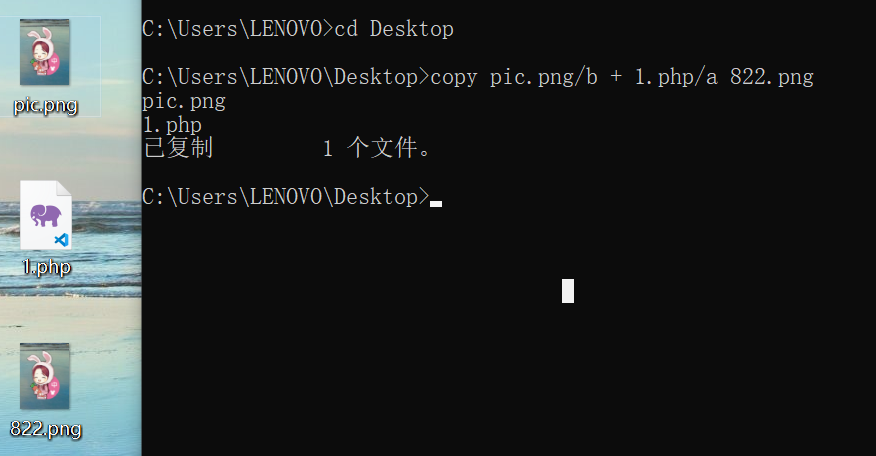

## 二、DVWA中low安全等级的文件上传
1、准备图片pic.png、木马1.php、文档1.txt

2、上传测试
正常图片上传成功
<http://192.168.2.166/DVWA-master/hackable/uploads/pic.png>
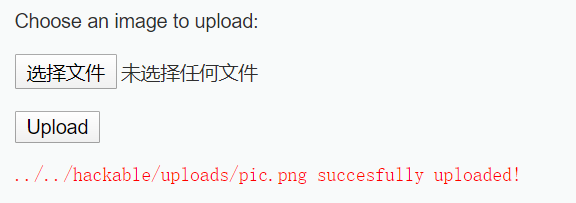
../../hackable/uploads/pic.png是路径，可以直接访问

*而文本上也传成功*
<http://192.168.2.166/DVWA-master/hackable/uploads/test.txt>
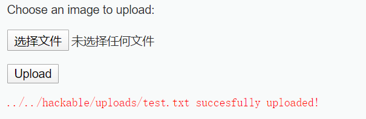
带木马的图片上传成功
<http://192.168.2.166/DVWA-master/hackable/uploads/822.png>
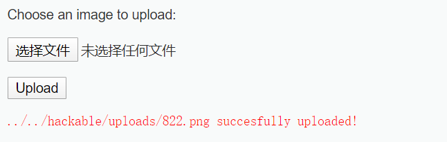
上传木马
<http://192.168.2.166/DVWA-master/hackable/uploads/1.php>
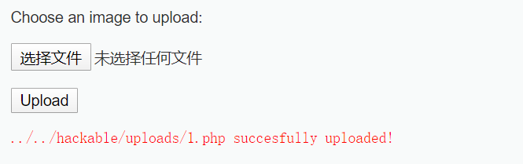

如果木马文件可以上传，说明这个网站有存在文件上传漏洞
利用木马
通过工具来利用--工具：中国菜刀--连接木马文件
3、中国菜刀的使用
把一句话木马文件的路径添加到中国菜刀中
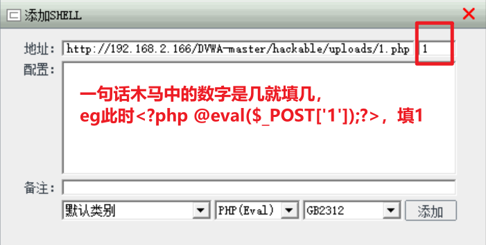
点击进入文件管理
此时是用菜刀借助木马连接了服务器
可以操作里面的文件
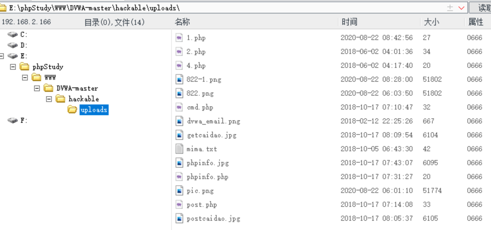
留下木马，作为【后门】，下一次再借助这个木马进入服务器

## 三、DVWA中medium安全等级的文件上传
中安全等级，虽然在上传时有了条件限制，在要求上传图片的条件下无法上传木马，但是依旧不安全。（例如，可以上传带木马的图片）
利用BurpSuite
1、上传木马
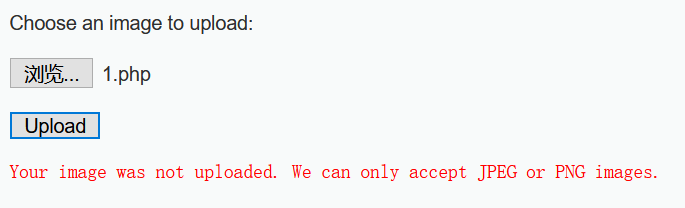
2、用BurpSuite
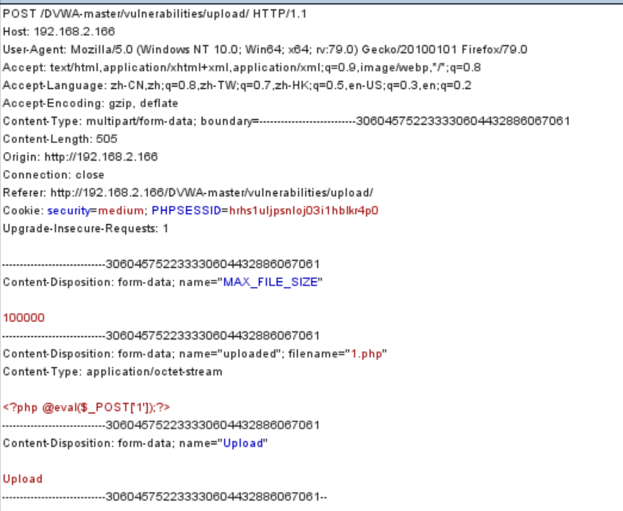
点击action
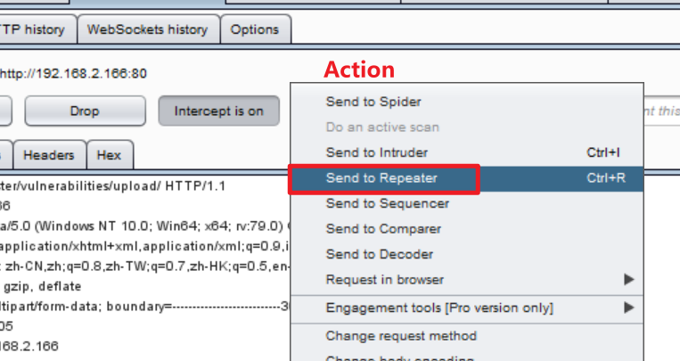
点击Go，模拟过程把数据包发送给客户端
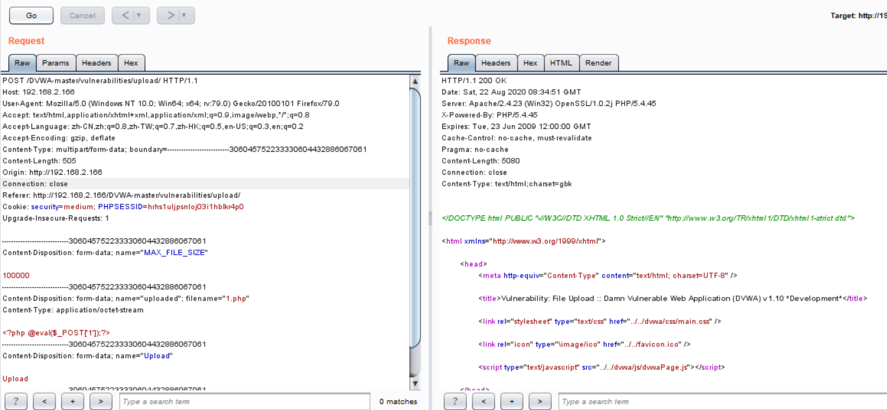
可以理解为：左边客户端，右边服务端
3、解决方法
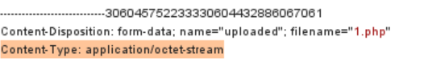
对此处进行修改
<table>
<colgroup>
<col style="width: 100%" />
</colgroup>
<thead>
<tr class="header">
<th>
Content-Type: application/octet-stream--脚本文件的MIME类型

Content-Type: image/jpeg图片的MIME类型

服务器会检测MIME类型
</th>
</tr>
</thead>
<tbody>
</tbody>
</table>
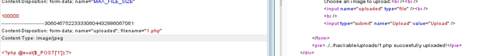

回到intercept
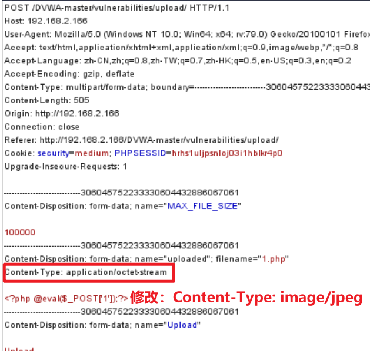
forward一下
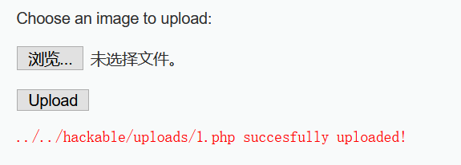
上传成功
