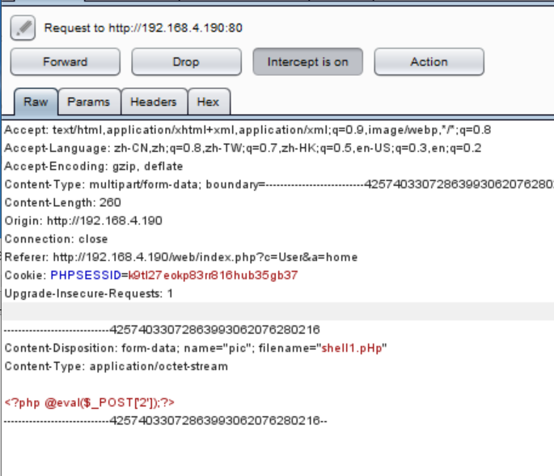

## 一、黑白名单
1，上传木马
有些网站--会过滤
尽可能绕过过滤
2，服务器端可能会对MIME类型做过滤
图片的MIME类型：image/jpeg
3，文件的后缀做过滤
黑白名单
图片的后缀：.jpg/.jpeg/.png/.gif
黑名单：.php
白名单：.jpg/.jpeg/.png,
<table>
<colgroup>
<col style="width: 100%" />
</colgroup>
<thead>
<tr class="header">
<th>
黑名单绕过方法

大小写绕过

<table>
<colgroup>
<col style="width: 28%" />
<col style="width: 71%" />
</colgroup>
<thead>
<tr class="header">
<th>.php</th>
<th>.PhP/.pHp/.PHp/.PHP</th>
</tr>
</thead>
<tbody>
</tbody>
</table>

特殊的解析方法

<table>
<colgroup>
<col style="width: 24%" />
<col style="width: 75%" />
</colgroup>
<thead>
<tr class="header">
<th>.php</th>
<th>.php3/.php4/.php5/phtml</th>
</tr>
</thead>
<tbody>
</tbody>
</table></th>
</tr>
</thead>
<tbody>
</tbody>
</table>
## 二、文件上传漏洞案例
安全实验室<http://192.168.4.217/>

## 三、学生会案例

**一般的网站上传后不会告诉你路径**
**图片可以查看**
**那上传的木马怎么看？**
**解决：**
**可以先上传图片，如何根据路径的相似格式推理出木马文件的路径**

1，上传图片

<http://192.168.4.190/web/upload/1_123.jpg>

上传第二张图片1234.jpg
<http://192.168.4.190/web/upload/1_1234.jpg>

推理出如果上传木马，可能的路径是：
<http://192.168.4.190/web/upload/1_shell1.php>

2，利用burp上传木马

到Reapeater进行尝试

**得到方法--修改大小写**

3，根据推理出的地址到菜刀里面连接
<http://192.168.4.190/web/upload/1_shell1.php>

