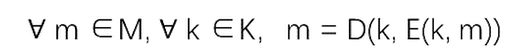
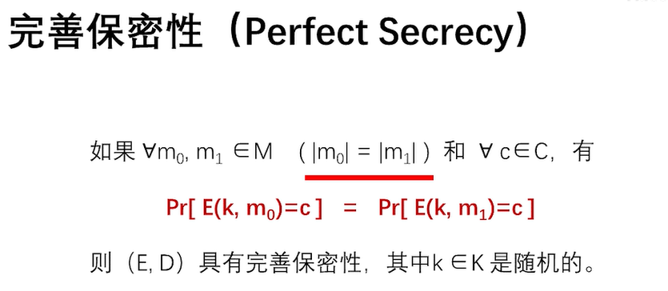
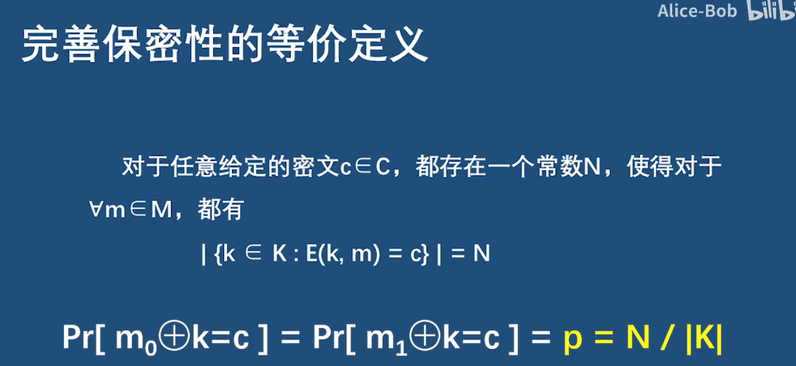
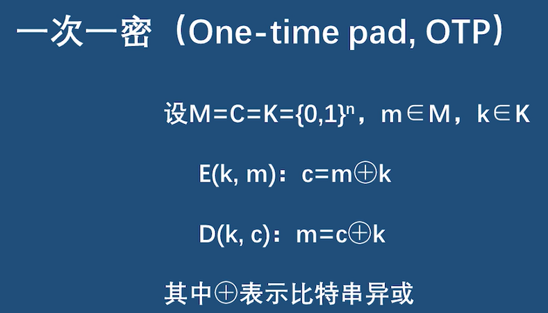
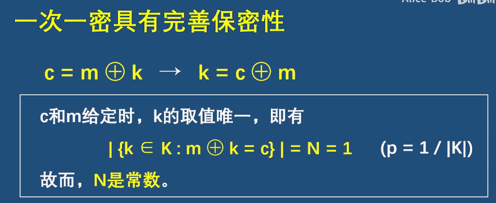
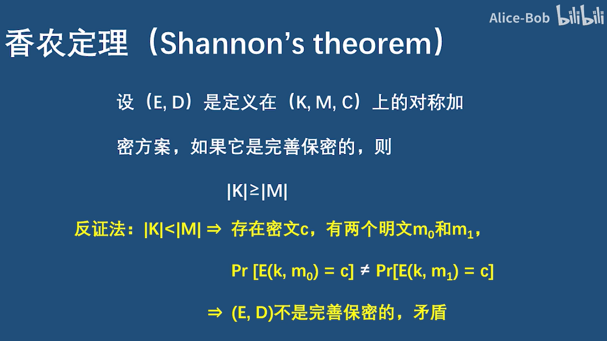
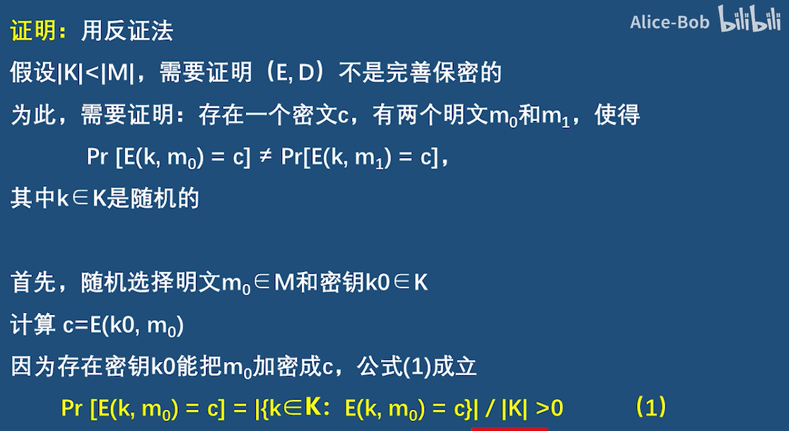
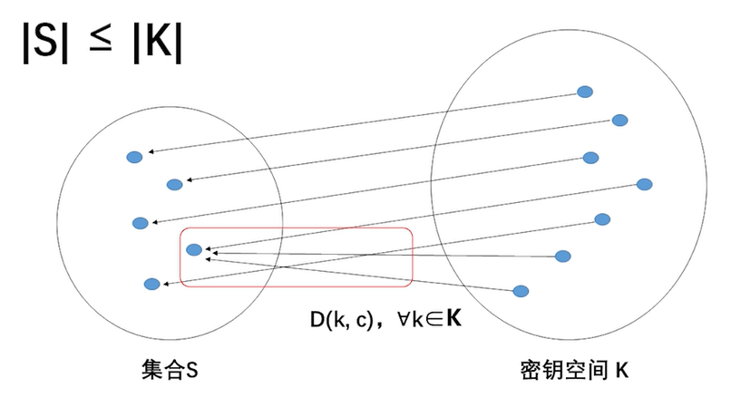
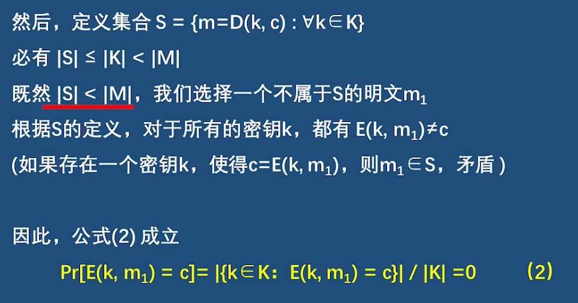
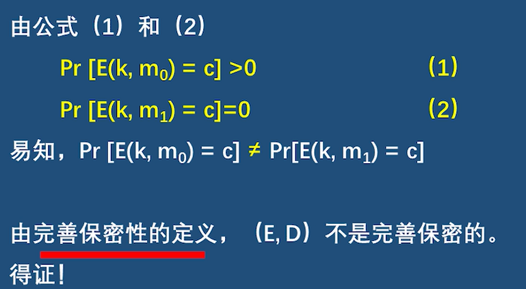

## Modern cryptography

### Core principles

1. **Formal definitions**：
   - 这包括对安全性的精确数学模型和定义，以及安全性意味着什么的定义。
2. **Assumptions**：
   - 假设是明确陈述且无歧义的。
3. **Proofs of security**：
   - 这意味着摆脱了设计-破解-修复循环。

## Crypto definitions

- Security guarantee/goal：我们想要阻止攻击者实现的目标

- Threat model：攻击者被认为具有什么（现实世界）的能力

  -  唯密文攻击（Ciphertext-only attack）:攻击者只知道一些密文

  -  已知明文攻击（known-plaintext attack）:攻击者不但知道一些密文，还知道密文所对应的明文
  -  选择明文攻击（chosen-plaintext attack, CPA）:攻击者可以自己选择一些明文，并获得对应的密文
  -  选择密文攻击（chosen-ciphertext attack, CCA）:攻击者可以自己选择一些密文，并获得相应的明文

完善保密性:唯密文攻击下的定义

语义安全性:选择明文攻击下的定义

CPA 攻击比唯密文攻击牛逼得多，因为攻击者的攻击更灵活，可以获得更多的信息。 

在考虑CPA攻击的情况下给出对称加密方案安全性的第二个定义：语义安全性（semantic security）。 

## Defining secure encryption

### Definition

无论攻击者先前有关于明文的任何信息，密文都不应该泄露关于明文的其他信息

## Secure encryption

- 如何定义消息空间M上的加密方案（Gen，Enc，Dec）的安全含义？– Against a (single) ciphertext-only attack

- attacker不可能知道key

  - 密钥是达到目的的手段，而不是目的本身

  - 在某种程度上是必要的，但并不足够

  - 很容易设计一个完全隐藏密钥但不安全的加密方案

  - 可以设计方案，其中大部分密钥被泄露，但方案仍然是安全的

- 攻击者无法从密文中学习明文
- 攻击者无法从密文中学习明文的任何字符

## Perfect secrecy

香农给出的定义是针对**对称加密方案**的

- **对称加密方案**：：通信双方需要**使用相同的密钥**
- **公钥密码**：通信双方使用**不同的密钥**（**非对称密码）。**

### **对称密码Symmetric Encryption**

设（E,D）是对称加密方案，E是加密算法，D是解密算法。

- 加密：E(k,m)=c，输入密钥k和明文m，输出密文c

- 解密：D(k,c)=m，输入密钥k和密文c，输出明文m

(E,D)是定义在（K,M,C）上的对称加密方案，保证了

- m属于M（明文）
- k属于K（密钥）
- c属于C（密文）

**密钥是安全性的构建**

为什么需要密钥？密钥匙安全性的关键

我们希望，即使攻击者知道了密码系统的全部运作细节，只要密码没有泄露，系统仍是安全的。

所以在分析安全性时，总是假设攻击者知道了密码系统的全部运作细节，但不知道密钥

### 完善保密性Perfect Secrey

#### **定义**

如果任意两个明文m0,m1∈M（m0和m1等长），给定任意一个密文c，如果**每个明文被加密成c的概率时相等的**（明文空间中所有明文被加密成该密文的概率是一样的），则（E,D）具有完善保密性，其中k属于K是随机的。

- 如果一个方案满足完善保密性，那么**密文不会泄露明文的任何信息**
- 攻击者窃听到任意一个密文后，该密文到底是加密哪个明文得来的呢？既然每个明文加密成该密文的概率一样，那么攻击者不知道该密文对应哪个明文。如果攻击者关于明文=攻击者的信息知道M的分布
- **一个对称加密方案是完善保密的，那就是安全的**
- 完全保密：观察密文不应改变攻击者对M的分布的认识

**注意事项**

- 完善保密性考虑的是唯密文攻击，也即攻击者手里只有窃听到的密文。所以，**如果一个对称加密方案满足完善保密性，唯密文攻击对它是无效的**。也就是说，即使攻击者拥有无限计算资源，想从窃听到的一大堆密文中分析出点什么，那是白费心机。 需要注意的是，对称加密方案满足完善保密性，只说明它在唯密文攻击下是安全的，在其他类型的攻击下未必安全。 

- 任何信息指的是明文内容，不包括明文长度和发送时间

#### **等价定义**

给定任意密文c，对于明文空间中所有明文，如果把每个明文加密成c的密钥数量是相等的，都是N，那么加密方案就算完善保密的

案例

## One-time pad

### 定义

 在一次一密中，要求**明文、密文和密钥**都是**长度相等的比特串**。

 加密时，明文和密钥逐比特**异或**即得密文。

 解密时，密文和密钥逐比特**异或**即得明文。 

### OTP满足完善保密性

The one-time pad is perfectly secret 

如果一次一密是完善保密的，对于任何密文，明文空间中所有明文被加密成该密文的概率一样。

也就是要满足

需要证明，给定任意密文c，把每个明文加密成c的密钥的数量都是相等的

根据一次一密的加密算法c=m⊕k，很容易知道k=c⊕m。所以当c和m给定的情况下，k的取值是唯一的。   也即给定任意密文，对于明文空间中的每个明文，只有一个密钥能把该明文加密成该密文，也即N=1。（p=1/|K|）既然密钥数量都是相等的，一次一密必然具有完善保密性。

另一种证明：

### 一次一密不实用

如果一个加密方案具有**完善保密性**，那么密钥**至少要和明文一样长**（由此可知，满足完善保密性的加密方案不实用）

为什么一次一密不实用？

- **密钥至少和明文一样长**，密钥空间至少和明文空间一样大
- **密钥不能重复使用，意味着每次加密使用不同密钥**，麻烦（所以叫一次一密hh
- 密钥必须是随机的，而计算机本身不能产生随机序列，如何多快好省地获得随机序列也是个现实的问题。

> Drawbacks
>
> – Key as long the message
>
> – Only secure if each key is used to encrypt *once*
>
> – Trivially broken by a known-plaintext attack

基于以上种种原因，一次一密虽然满足完善保密性，密文不会泄露明文的任何信息，但要达到这样的安全性，需要付出巨大的代价，因此它在商业上根本无法使用。 

### 香农定理证明

小于等于

### Optimality

定理：如果具有消息空间M的（Gen，Enc，Dec）是完全秘密的，则|K|≥|M|

给定任何密文，尝试在K中的每个可能的密钥下解密

思考

- 给定任何密文，尝试在K中的每个可能的密钥下解密
- 这给出了一个高达|K|可能的消息的列表
- 如果|K| < |M|，有些消息不在列表中

证明

### 改造一次一密

**思考**

完善保密性 →具有无限计算资源也无法获得明文的任何信息(无条件安全性)

香农定理 →密钥不能短于明文(不实用)

**一次一密的优点**

加解密简单，计算速度快

是否存在某种方法，可以把一次一密改造成实用的加密方案，同时又能保证安全性呢？ 

**改造一次一密:**

- 更加实用:可以用短密钥加密长消息（短消息无法满足香农定理，会泄露明文信息，难以保证安全性）
- 保证安全性

**思考攻击方式**

完善保密性：无限计算资源攻击者

实际应用：有限计算资源得到攻击者（所以构建’计算上安全‘的密码方案就好）

**思考设计**

只要加密方案在这个定义下是安全的 那么有限计算资源的攻击者就拿它没办法

设计一种加密方案，可以用**短密钥加密长消息**，在面对实际的攻击者时(计算资源有限)，没必要达到完善保密性，即**使密文泄露了明文的信息，只要这些信息对攻击者的帮助是可忽略就没关系。**

做两件事

1. 定义新的安全性:语义安全性
2. 改造一次一密:流密码

## 补充

### Probability

1. *Random variable*：随机变量是一种可以取（离散）值且具有一定概率的变量。
   - 随机变量的概率分布给出了变量取每个可能值的概率。
   - 每个概率值必须介于0和1之间，且所有概率值的总和必须等于1。
2. **Event**：某个实验中的特定发生。
   - 例如，随机变量X取值为x的事件。
   - 记为Pr[E]，表示事件E发生的概率。
3. **Conditional probability**：给定某一事件发生的情况下，另一个事件发生的概率。
   - – Pr[A | B] = Pr[A and B]/Pr[B]
4. **独立性**：如果对于所有的x，y，随机变量X和Y独立，则Pr[X=x | Y=y] = Pr[X=x]。
5. **全概率公式Law of total probability**：假设E1，…，En是所有可能性的一个分割。则对于任何A：
   - Pr[A] = Σi Pr[A 和 Ei] = Σi Pr[A | Ei] · Pr[Ei]。

符号表示：

- K（密钥空间）：所有可能密钥的集合。
- C（密文空间）：所有可能的密文的集合。

Probability distributions：

- 让M表示消息的随机变量。
  - M的取值范围为M，取决于上下文！
  - 反映了在给定攻击者先验知识的情况下发送不同消息的可能性。
  - 例如，Pr[M = “attack today”] = 0.7，Pr[M = “don't attack”] = 0.3。
- 让K表示密钥的随机变量。
  - K的取值范围为K。
- 固定某个加密方案（Gen、Enc、Dec）：
  - Gen为K定义了密钥的概率分布：Pr[K = k] = Pr[Gen输出密钥k]。
  - 通常为均匀分布，但并非总是如此。
- 假设随机变量M和K是独立的：
  - 即，参与方不会基于消息选择密钥，或者基于密钥选择消息。
  - 一般情况下，这一假设成立。
  - 如果不成立，可能会引发问题。
- 固定某个加密方案（Gen、Enc、Dec）和某个M的分布：
  - 考虑以下（随机化的）实验：
    1. 使用Gen生成密钥k。
    2. 根据给定的分布选择消息m。
    3. 计算c ¬ Enck(m)。
  - 这定义了密文的分布！
  - 让C表示在此实验中密文的值的随机变量。

案例

### Bayes’s theorem

TODO

• Pr[A | B] = Pr[B | A] · Pr[A]/Pr[B]

