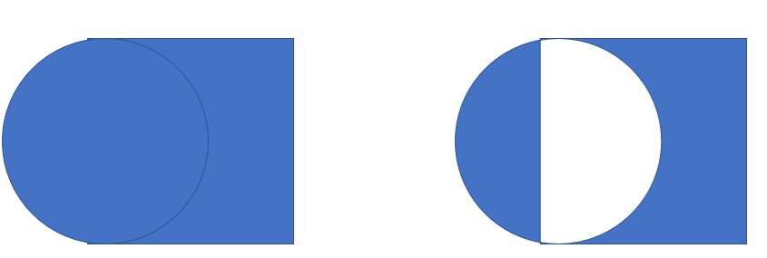
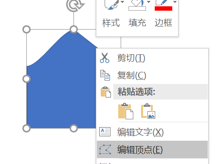
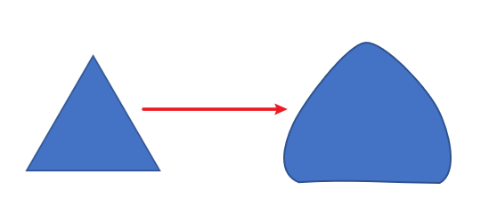
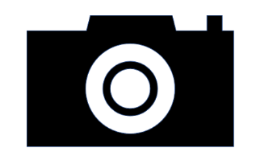
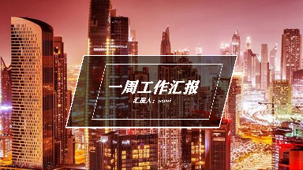
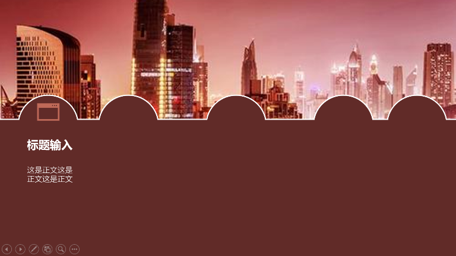
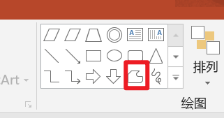
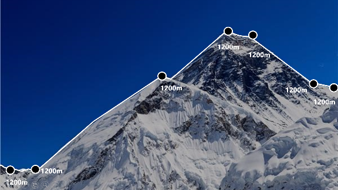
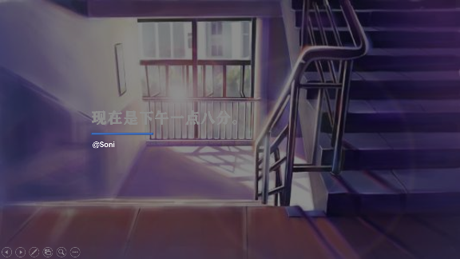

3.1 shift放大
ctrl等比例放大
3.2 用PPT留下强有力的印象
3.3 用形状冲击视觉
3.4 特殊的形状：可以两个以上图像结合，格式-合并形状-进行组合

3.5 编辑顶点

3.6 素材下载
[阿里巴巴矢量图标库](http://iconfont.cn)--<http://iconfont.cn>
3.7封面制作

3.8流程制作

3.9 任意图像选取

镂空文件

3.10 案例：荷包蛋

注意：
可以添加阴影，朝向正下
