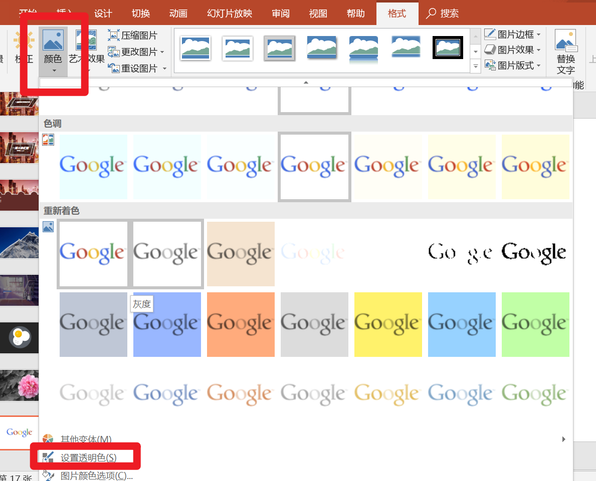

1、图片高清无码：800\*600
百度找图找大尺寸或者特大尺寸，如果已经有模糊图片，用百度搜图
尽量不破坏原比例，可以剪裁
素材
可以中文搜索：<https://pixabay.com>
只支持英文搜索：<https://www.pexels.com>
(整合多数图片库网址)：<http://thestocks.im>
2、相册功能
3、裁剪
4，PPT抠图
如果背景简单，可以选择点击设置透明色

如果背景复杂，用删除背景

**

自带的艺术效果
例子
虚化效果
先复制，虚化后再把清晰的放上去

图片填充（重点
防止图片变形：将图片平铺
矩形

所用图片大于矩形

尽量用必应和英文搜索
关键字的配图要联系事例
搜索关键词要具体，联系事物
单图像展示
左右，上下，容器（图像放在电脑里）

多图像
1，图片墙

2，多图蒙版

3、多圆形排列
